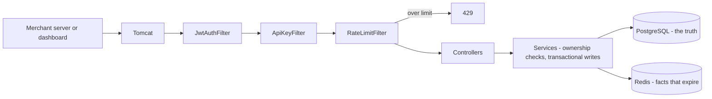

# Transakt

**A payment gateway built from scratch in Java.** Online businesses accept payments through one
API instead of integrating with banks directly. The bank is simulated — no real money moves.

[](https://github.com/ARV0007/transakt/actions/workflows/ci.yml)

**Live:** https://transakt.onrender.com · **API:** `/api/v1`

> Running on a free tier that sleeps after 15 minutes idle. The first request can take up to two
> minutes to wake the instance. Every request after that is immediate.

```bash
curl -s https://transakt.onrender.com/api/v1/health
# {"status":"UP","service":"transakt"}
```

---

## What's in it

| | |
|---|---|
| **Double-entry ledger** | Every payment appends two balancing rows. Balances are the sum of entries, never stored, never edited. Append-only, so the trail is tamper-evident. |
| **Two authentication doors** | API keys for machines, JWTs for humans. Keys cost one indexed lookup; tokens verify against an HMAC in memory with no database hit. |
| **Hashed API keys** | Stored as a public lookup prefix plus a SHA-256 hash. Shown to the merchant exactly once, at creation, and recoverable nowhere. |
| **Ownership authorization** | Identity comes from the credential, never the request body. A foreign resource returns 404 rather than 403, so IDs can't be enumerated. |
| **Idempotency keys** | `POST /payments` accepts an `Idempotency-Key`. A retry after a network timeout returns the original payment instead of charging twice. |
| **Rate limiting** | 20 requests per merchant per minute, counted in Redis with a key that expires itself. |
| **Versioned schema** | Flyway owns the database. Hibernate only validates. Every schema change is a numbered, checksummed, reviewable file. |
| **19 integration tests** | Real HTTP through the full filter chain against a real database — run on every push by CI. |

---

## How a request flows



Three filters run before any controller. The first two record *who* the caller is without
rejecting anything; the third enforces a per-merchant ceiling and needs an identity to count
against, which is why it runs last. Controllers read identity from the security context and hand
services plain values, so the service layer never imports a Spring Security type.

---

## Try it

**1. Sign up.** The response carries your API key — it is shown once and stored nowhere.

```bash
curl -s -X POST https://transakt.onrender.com/api/v1/merchants \
  -H "Content-Type: application/json" \
  -d '{"name":"Demo Shop","email":"you@example.com","password":"hunter2"}'
```

**2. Log in** for a JWT, valid one hour.

```bash
curl -s -X POST https://transakt.onrender.com/api/v1/auth/login \
  -H "Content-Type: application/json" \
  -d '{"email":"you@example.com","password":"hunter2"}'
```

**3. Create a payment** — ₹500, sent as integer paise. Repeat the exact command and the same
payment comes back rather than a second one.

```bash
curl -s -X POST https://transakt.onrender.com/api/v1/payments \
  -H "Authorization: Bearer $TOKEN" \
  -H "Content-Type: application/json" \
  -H "Idempotency-Key: demo-001" \
  -d '{"amountPaise":50000,"currency":"INR"}'
```

**4. Read your payments back.** Scoped to you, paginated, newest first.

```bash
curl -s "https://transakt.onrender.com/api/v1/payments?page=0&size=20" \
  -H "Authorization: Bearer $TOKEN"
```

---

## Endpoints

| Method | Path | Auth |
|---|---|---|
| `GET` | `/api/v1/health` | open |
| `POST` | `/api/v1/auth/login` | open |
| `POST` | `/api/v1/merchants` | open — signup; response carries the API key **once** |
| `GET` `PUT` `DELETE` | `/api/v1/merchants/**` | `ROLE_ADMIN` |
| `POST` | `/api/v1/payments` | authenticated; merchant taken from the credential; optional `Idempotency-Key` |
| `GET` | `/api/v1/payments` | authenticated; scoped to the caller; paginated, max 100 per page |
| `GET` | `/api/v1/payments/{id}` | authenticated; 404 unless yours or admin |
| `GET` | `/api/v1/payments/{id}/ledger` | authenticated; 404 unless yours or admin |

---

## Run it locally

One command. Postgres, Redis and the app.

```bash
docker compose up
```

Then `curl -i http://localhost:8080/api/v1/health`.

The schema builds itself — Flyway applies four migrations against the empty containerised
database at startup, so there is no setup SQL to run and nothing to configure.

**Tests:**

```bash
./mvnw test
```

Nineteen integration tests, about twenty seconds. Needs Postgres and Redis reachable on
localhost — `docker compose up` provides both.

---

## Stack

Java 21 · Spring Boot 3.4.1 · Spring Security · Spring Data JPA · PostgreSQL 18 · Redis
(Valkey in production) · Flyway · jjwt · Maven · Docker · GitHub Actions · deployed on Render

---

## Design decisions worth reading about

Each of these was a choice with a trade-off rather than a default, and each is written up in
[`docs/notes.md`](docs/notes.md):

- **Money is integer paise, never a decimal.** Floating point cannot represent 0.1 exactly.
- **A balance is never stored.** It is the sum of ledger entries, so corruption is detectable.
- **404, not 403, for a resource that isn't yours.** A 403 confirms the ID exists and hands an
  enumerator exactly the signal they want. Both cases return an identical message.
- **`merchantId` was deleted from the payment DTO** rather than validated against the caller. A
  field that doesn't exist cannot be forged.
- **API keys can't be BCrypted.** A password lookup has an email to find the row first; an API key
  *is* the identity, so a salted hash would mean comparing against every row. An indexed prefix
  plus one SHA-256 comparison is constant time — the same shape as Stripe's `sk_live_` keys.
- **Idempotency uses `SET NX`, not `EXISTS` then `SET`.** Two simultaneous retries can both pass
  a separate check. The atomicity is the entire mechanism.
- **Tests are integration tests deliberately.** A mocked unit test of the service layer passes
  happily while the security config is wide open.
- **One artifact, three environments.** Every external address is `${VAR:default}`, so the same
  image runs on a laptop, in compose and in production.

---

## Known limitations

Stated rather than discovered:

- **Rate limiting behaviour when Redis is unreachable is accidental**, returning an empty-bodied
  403. The fail-open versus fail-closed decision hasn't been made deliberately — and the right
  answer differs for idempotency, where failing open means charging a customer twice.
- **Unauthenticated traffic isn't rate limited.** The filter needs an identity to count against,
  so `/auth/login` has no ceiling. Production gateways add an IP-keyed limiter.
- **Fixed-window rate limiting allows a boundary burst** — 20 either side of a minute boundary is
  40 in two seconds. Sliding windows via sorted sets fix it at more complexity.
- **Idempotency keys aren't fingerprinted against the request body.** Reusing a key with a
  different amount returns the original payment; Stripe returns 422.
- **Offset pagination degrades with depth.** Cursors keyed on `(created_at, id)` are the standard
  answer.
- **No foreign key constraints.** `merchantId` and `paymentId` are scalar columns rather than JPA
  associations, so only the service layer prevents an orphan.
- **The API key prefix carries ~20 bits of entropy.** Collisions become plausible near a thousand
  merchants.
- **JWTs cannot be revoked before they expire.** The one-hour lifetime is the mitigation.

---

## Docs

- [`docs/notes.md`](docs/notes.md) — every concept in the project explained, and why each decision
  went the way it did
- [`docs/WORKLOG.md`](docs/WORKLOG.md) — daily entries: what was built, why, what broke, what it
  taught
- [`docs/architecture.md`](docs/architecture.md) — versioned architecture with diagrams, currently
  v1.3
- [`docs/CONTEXT.md`](docs/CONTEXT.md) — the full current state of the project in one file

---

## Roadmap

Kafka for payment events and webhook delivery with retries and a dead-letter queue · a bank
simulator to replace the last pretend part · Kubernetes as a deliberate exercise · Spring AI
