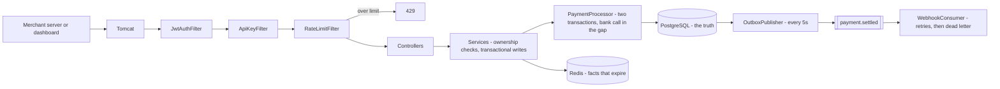

# Transakt

**A payment gateway built from scratch in Java.** Online businesses accept payments through one
API instead of integrating with banks directly. The bank is simulated — no real money moves.

[](https://github.com/ARV0007/transakt/actions/workflows/ci.yml)

**Live:** https://transakt.onrender.com · **API:** `/api/v1`

> Running on a free tier that sleeps after 15 minutes idle. The first request can take up to two
> minutes to wake the instance. Every request after that is immediate.

```bash
curl -s https://transakt.onrender.com/api/v1/health
# {"status":"UP","service":"transakt"}
```

---

## What's in it

| | |
|---|---|
| **Double-entry ledger** | Every approved payment appends two balancing rows. Balances are the sum of entries, never stored, never edited. Append-only, so the trail is tamper-evident. |
| **Two authentication doors** | API keys for machines, JWTs for humans. Keys cost one indexed lookup; tokens verify against an HMAC in memory with no database hit. |
| **Hashed API keys** | Stored as a public lookup prefix plus a SHA-256 hash. Shown to the merchant exactly once, at creation, and recoverable nowhere. |
| **Ownership authorization** | Identity comes from the credential, never the request body. A foreign resource returns 404 rather than 403, so IDs can't be enumerated. |
| **Idempotency keys** | `POST /payments` accepts an `Idempotency-Key`. A retry after a network timeout returns the original payment instead of charging twice. Enforced by a unique constraint inside the payment transaction, not by a lock. |
| **Rate limiting** | 20 requests per merchant per minute, counted in Redis with a key that expires itself. Fails **open** when Redis is down, deliberately. |
| **Versioned schema** | Flyway owns the database. Hibernate only validates. Every schema change is a numbered, checksummed, reviewable file. |
| **Two-transaction settlement** | The bank call sits *between* two transactions, so an 800ms third-party round trip never holds a pooled database connection. |
| **Reconciliation** | A bank call that times out leaves a payment `PENDING`, not `FAILED` — you don't know whether the bank acted. A scheduled sweep asks and settles. |
| **Transactional outbox** | The `payment.settled` event row commits with the payment. Either both exist or neither does, so an event cannot be lost. |
| **Kafka + webhooks** | A publisher sweeps unpublished events to Kafka; a consumer delivers them to the merchant with retries and a dead-letter topic. |
| **70 tests** | 53 integration tests through the full filter chain against a real database, plus 17 unit tests where the behaviour needs a dependency to fail on demand. |

---

## How a request flows



Three filters run before any controller. The first two record *who* the caller is without
rejecting anything; the third enforces a per-merchant ceiling and needs an identity to count
against, which is why it runs last. Controllers read identity from the security context and hand
services plain values, so the service layer never imports a Spring Security type.

Creating a payment is **two** transactions, not one. The first commits the payment as `PENDING`;
the bank call then happens with no transaction open and no connection held; the second records
the outcome, the ledger entries and an outbox event together. Holding a pooled connection across
a third party's network is how a slow bank becomes an unavailable database.

---

## Try it

**1. Sign up.** The response carries your API key — it is shown once and stored nowhere.

```bash
curl -s -X POST https://transakt.onrender.com/api/v1/merchants \
  -H "Content-Type: application/json" \
  -d '{"name":"Demo Shop","email":"you@example.com","password":"hunter2"}'
```

**2. Log in** for a JWT, valid one hour.

```bash
curl -s -X POST https://transakt.onrender.com/api/v1/auth/login \
  -H "Content-Type: application/json" \
  -d '{"email":"you@example.com","password":"hunter2"}'
```

**3. Create a payment** — ₹500, sent as integer paise. Repeat the exact command and the same
payment comes back rather than a second one.

```bash
curl -s -X POST https://transakt.onrender.com/api/v1/payments \
  -H "Authorization: Bearer $TOKEN" \
  -H "Content-Type: application/json" \
  -H "Idempotency-Key: demo-001" \
  -d '{"amountPaise":50000,"currency":"INR"}'
```

**4. Read your payments back.** Scoped to you, paginated, newest first.

```bash
curl -s "https://transakt.onrender.com/api/v1/payments?page=0&size=20" \
  -H "Authorization: Bearer $TOKEN"
```

**5. Watch the event pipeline** (local only — Kafka isn't deployed). Settling a payment writes an
outbox event in the same transaction, a scheduled publisher sends it to Kafka, and a consumer
POSTs it to your `webhook_url`.

```bash
kafka-console-consumer --bootstrap-server localhost:9092 \
  --topic payment.settled --from-beginning --property print.key=true
# 8fbe4ddf-...  {"paymentId":"8fbe4ddf-...","merchantId":"93a19e06-...","status":"CAPTURED",...}
```

A delivery that fails three times lands in `payment.settled-dlt` rather than being retried
forever or dropped.

---

## Endpoints

| Method | Path | Auth |
|---|---|---|
| `GET` | `/api/v1/health` | open |
| `POST` | `/api/v1/auth/login` | open |
| `POST` | `/api/v1/merchants` | open — signup; response carries the API key **once** |
| `GET` | `/api/v1/merchants/me` | authenticated; the caller's own record. No id in the route |
| `PATCH` | `/api/v1/merchants/me` | authenticated; sets the caller's own `webhook_url`. No id in the route |
| `GET` `PUT` `DELETE` | `/api/v1/merchants/**` | `ROLE_ADMIN` |
| `POST` | `/api/v1/payments` | authenticated; merchant taken from the credential; optional `Idempotency-Key` |
| `GET` | `/api/v1/payments` | authenticated; scoped to the caller; paginated, max 100 per page |
| `GET` | `/api/v1/payments/{id}` | authenticated; 404 unless yours or admin |
| `GET` | `/api/v1/payments/{id}/ledger` | authenticated; 404 unless yours or admin |

A payment moves `PENDING → CAPTURED` on approval, or `PENDING → FAILED` on decline. A bank call
that times out leaves it `PENDING` until the reconciler resolves it, because a timeout means the
outcome is unknown rather than negative.

---

## Run it locally

One command. Postgres, Redis, Kafka and the app.

```bash
docker compose up
```

Then `curl -i http://localhost:8080/api/v1/health`.

The schema builds itself — Flyway applies eight migrations against the empty containerised
database at startup, so there is no setup SQL to run and nothing to configure.

**Tests:**

```bash
./mvnw test
```

Seventy tests, well under a minute. Needs Postgres and Redis reachable on localhost —
`docker compose up` provides both. The Kafka listener is disabled in the test profile, so no
broker is required.

---

## Stack

Java 21 · Spring Boot 3.4.1 · Spring Security · Spring Data JPA · PostgreSQL 18 (Neon) · Redis
(Valkey in production) · Apache Kafka 4.0 (KRaft) · Spring Kafka · Flyway · jjwt · Maven ·
Docker · GitHub Actions · deployed on Render

---

## Design decisions worth reading about

Each of these was a choice with a trade-off rather than a default, and each is written up in
[`docs/notes.md`](docs/notes.md):

- **Money is integer paise, never a decimal.** Floating point cannot represent 0.1 exactly.
- **A balance is never stored.** It is the sum of ledger entries, so corruption is detectable.
- **404, not 403, for a resource that isn't yours.** A 403 confirms the ID exists and hands an
  enumerator exactly the signal they want. Both cases return an identical message.
- **`merchantId` was deleted from the payment DTO** rather than validated against the caller. A
  field that doesn't exist cannot be forged.
- **API keys can't be BCrypted.** A password lookup has an email to find the row first; an API key
  *is* the identity, so a salted hash would mean comparing against every row. An indexed prefix
  plus one SHA-256 comparison is constant time — the same shape as Stripe's `sk_live_` keys.
- **Idempotency is a unique constraint, not a lock.** Two simultaneous retries race at the
  database: the second blocks, then fails on `UNIQUE (merchant_id, idempotency_key)`, and the
  controller recovers by re-reading and returning the winner's payment. The race is detected and
  recovered from rather than prevented, because the database already serialises writes.
- **The bank call sits between two transactions.** A `@Transactional` method holds a pooled
  connection until commit, so an 800ms third-party call inside one drains the pool under load and
  a slow bank becomes an unavailable database.
- **A timeout is not a decline.** When the bank call throws you know you sent the request but not
  whether it acted. Recording that as `FAILED` would tell a merchant nothing happened while the
  customer's money may already be gone, so the payment stays `PENDING` for the reconciler.
- **The reconciler calls the same `settle` the happy path uses.** Two code paths that both write
  ledger entries is how a ledger comes to disagree with itself.
- **The outbox event commits with the payment.** Publishing after the transaction leaves a window
  where the payment settled and the event was never sent — which here means a merchant is never
  told, so they don't ship, and nothing in the system looks wrong.
- **The publisher stamps `published_at` only after the broker confirms.** Stamping first would let
  a failed send look published, which is the exact loss the outbox exists to prevent.
- **Fail open for rate limiting, fail safe for idempotency.** Same infrastructure, same failure
  mode, opposite correct answers: letting a request past a dead limiter costs a burst of traffic,
  letting a retry past a dead idempotency check charges a customer twice.
- **Retries belong to the error handler, not the listener.** `WebhookConsumer` is written as if
  delivery always succeeds and throws when it doesn't, so the failure policy lives in one place
  and a permanently broken merchant endpoint lands in a dead-letter topic instead of blocking the
  partition forever.
- **The webhook client has explicit timeouts.** An endpoint that hangs rather than failing would
  never throw, so no retry would fire, nothing would reach the dead letter, and every merchant
  behind that record on the partition would wait with it.
- **The event id is the outbox row's primary key, not a new UUID.** Delivery is at-least-once, so
  an id minted at publish time would differ on every retry and deduplicate nothing while looking
  like it did. The row id is written inside the payment transaction and survives every republish.
- **`/me` has no path variable.** Editing another merchant isn't a request that can be expressed,
  so there is no ownership check to get wrong — the same move as deleting `merchantId` from the
  payment DTO.
- **`sslmode` is a variable, defaulting to `prefer`.** The driver tries TLS and falls back, so one
  image runs against a local Postgres that doesn't offer it and a managed one that demands it.
- **Tests are integration tests deliberately.** A mocked unit test of the service layer passes
  happily while the security config is wide open.
- **One artifact, three environments.** Every external address is `${VAR:default}`, so the same
  image runs on a laptop, in compose and in production.

---

## Known limitations

Stated rather than discovered:

- **The event pipeline is local-only.** Render offers no managed Kafka and the development
  network blocks Aiven at DNS, so the deployed instance accumulates unpublished outbox rows.
- **`@Scheduled` runs on every instance.** Two copies of the app would sweep the same rows
  simultaneously. `SELECT ... FOR UPDATE SKIP LOCKED` or ShedLock is the fix.
- **The SSRF guard is TOCTOU.** `WebhookTargetValidator` resolves the host and refuses loopback,
  link-local, site-local and unresolvable targets immediately before connecting — but `RestClient`
  then resolves again, so in principle the record could change between the two. Closing that means
  pinning the resolved address and connecting to it with an explicit `Host` header. The write-time
  format check deliberately still accepts `http://169.254.169.254/`, because validating a string
  is not validating a destination.
- **The dead-letter path is untested.** Verified by hand, not by CI.
- **An idempotency key stops being honoured after 24 hours.** `RetentionSweeper` deletes it, so
  the same key then starts a new payment. Intended, and the window Stripe publishes — but it is a
  behaviour, not just housekeeping.
- **A stranded payment isn't recoverable by retry.** The reconciler resolves it, but the
  idempotency key means a retry returns the stranded payment rather than starting fresh.
- **The database is no longer on the app's private network.** Postgres moved to Neon, so every
  query crosses the public internet under TLS — safe, slightly slower, one more provider in the
  failure path. Neon also scales to zero after five minutes idle, so the first query after a
  quiet spell pays a wake-up on top of Render's own cold start.
- **The login limiter trusts `CF-Connecting-IP`.** Behind Cloudflare that header is overwritten
  by the proxy and safe to use; exposed without one, anyone could set it per request and evade the
  limit. It falls back to `getRemoteAddr()`, which behind a proxy is the proxy — so the limit would
  become global. Verify against the deployed instance before relying on it.
- **Fixed-window rate limiting allows a boundary burst** — 20 either side of a minute boundary is
  40 in two seconds. Sliding windows via sorted sets fix it at more complexity.
- **Idempotency keys aren't fingerprinted against the request body.** Reusing a key with a
  different amount returns the original payment; Stripe returns 422.
- **The idempotency race path is untested.** The test class is `@Transactional`, so a constraint
  violation would poison the test's own transaction and the recovery block never runs.
- **Offset pagination degrades with depth.** Cursors keyed on `(created_at, id)` are the standard
  answer.
- **Only one foreign key constraint exists.** `idempotency_keys.payment_id` references
  `payments(id)`; `merchantId` and `paymentId` elsewhere are scalar columns rather than JPA
  associations, so only the service layer prevents an orphan.
- **The API key prefix carries ~20 bits of entropy.** Collisions become plausible near a thousand
  merchants.
- **JWTs cannot be revoked before they expire.** The one-hour lifetime is the mitigation.
- **Dependency CVEs are unaudited.** Spring Boot 3.4.1 pulls transitive versions with known
  advisories.

---

## Docs

- [`docs/notes.md`](docs/notes.md) — every concept in the project explained, and why each decision
  went the way it did
- [`docs/WORKLOG.md`](docs/WORKLOG.md) — daily entries: what was built, why, what broke, what it
  taught
- [`docs/architecture.md`](docs/architecture.md) — versioned architecture with diagrams, currently
  v1.7
- [`docs/CONTEXT.md`](docs/CONTEXT.md) — the full current state of the project in one file

---

## Roadmap

**Next, in order of how much they matter:**

- A test for the dead-letter path
- Distributed locking for the three schedulers — ShedLock, or `FOR UPDATE SKIP LOCKED`
- `POST /api/v1/merchants` returns 200, not 201 with a `Location` header. Cosmetic, and changing
  the status touches the signup assertion in eleven test files

**Later, if the project continues:** refunds as a second event type on the same outbox ·
`SELECT ... FOR UPDATE SKIP LOCKED` so the schedulers survive more than one instance ·
splitting webhook delivery into its own deployable service consuming the same topic ·
a real acquirer as a second `BankClient` adapter