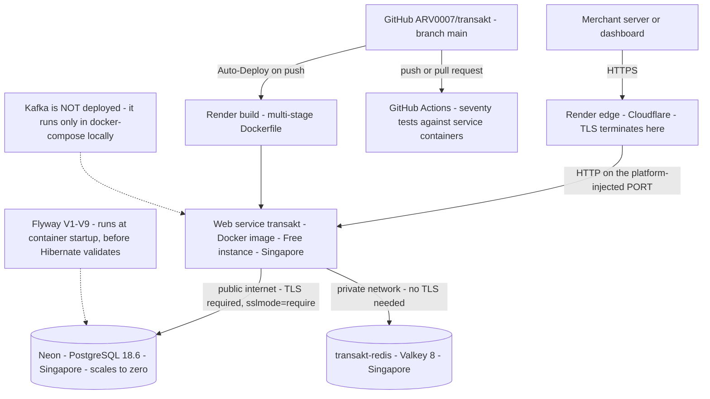
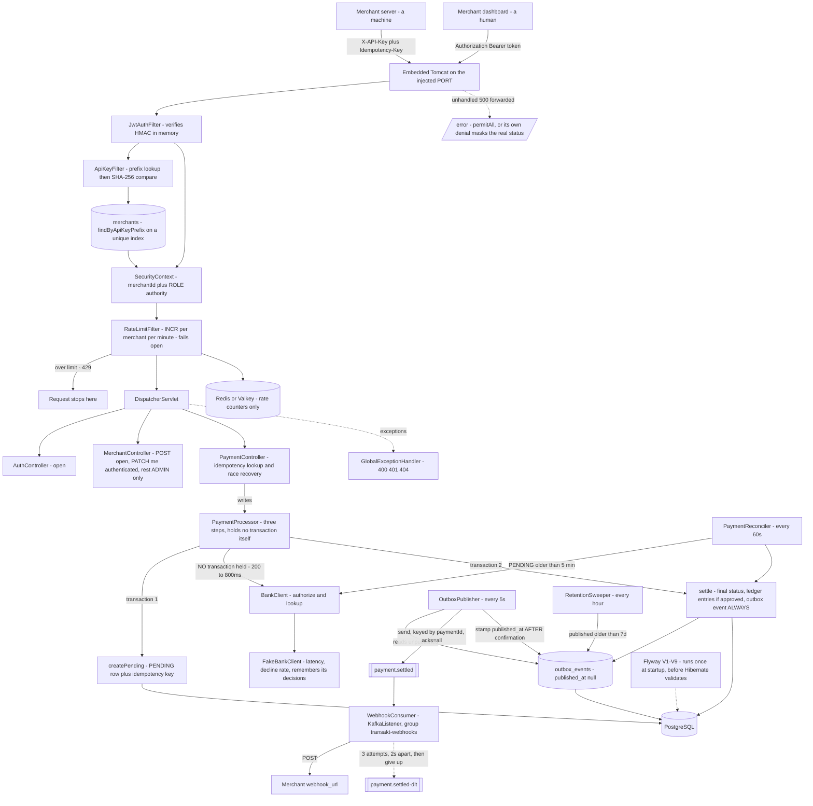
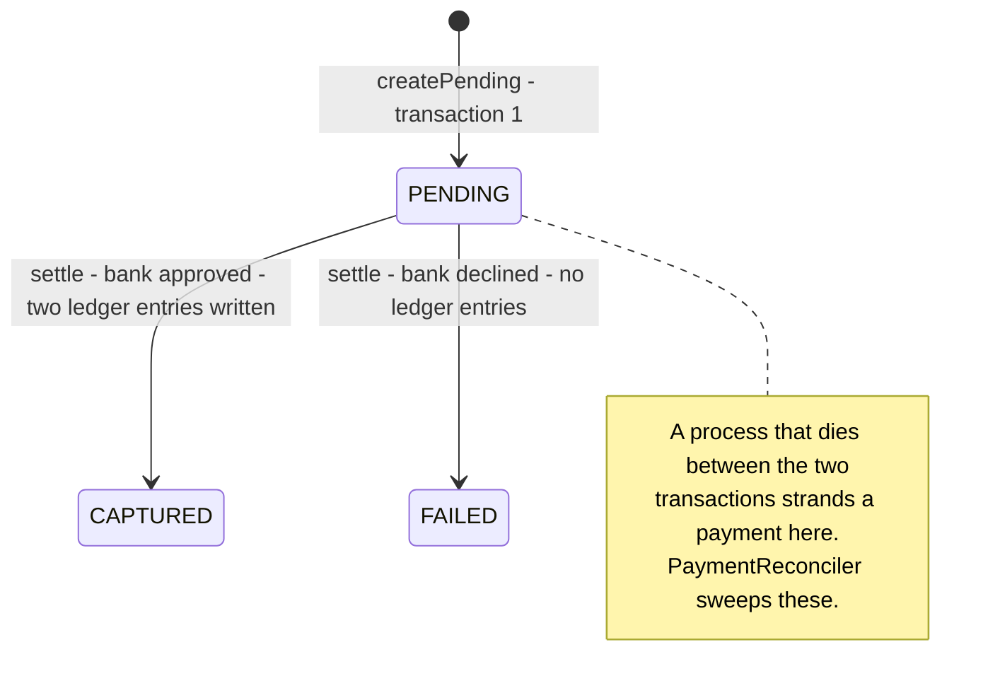

# Transakt — Understanding This Project

**A from-scratch walkthrough. Every step, why it was taken, and what you'd be asked about it.**

Repo: github.com/ARV0007/transakt · Live: https://transakt.onrender.com
Covers Days 1–25 · architecture v1.9 · 70 tests · Flyway V1–V9

---

## Chapter 0 — How to use this

This document is built in **build order**. It starts before any code exists and adds one thing at a time, in the order the project actually grew. Each step has four parts:

> **The situation** — what existed, and what was missing or wrong about it
> **What we did** — the actual change, with real code from the repo
> **Why** — the reasoning, from first principles
> **⚑ Counter-questions** — what someone would ask you *at that exact moment*, and how to answer

The counter-questions are the point. Anyone can say "I used JWT." The interview is won on "why not sessions?", "what happens when you need to log someone out?", "why one hour?" — and those are the questions sitting in the boxes.

**Read it with the repo open.** Every file named here exists; open it and match the words to the lines.

**Nothing is assumed.** Chapter 1 explains HTTP, JSON, databases and Spring Boot from zero. If you already know a section, skip it — but read its counter-questions, because knowing a thing and being able to *defend* it are different skills.

---

# Chapter 1 — The vocabulary, from zero

Before Day 1, here is every idea the project assumes.

## 1.1 Client and server

Two programs on two machines. The **client** asks; the **server** answers. Your browser is a client. Transakt is a server.

A server is not special hardware. It is a program that starts, opens a **port** (a numbered door — Transakt uses 8080), and waits. When something connects to that port, it reads the request, does work, writes a response, and goes back to waiting.

> **⚑ "What is a port, really?"**
> One machine has one IP address but runs many programs. The port number says which program the traffic is for. IP address finds the building; port finds the flat.

## 1.2 HTTP

The language client and server speak. A request is plain text with four parts:

```
POST /api/v1/payments HTTP/1.1          ← method + path
Host: transakt.onrender.com             ← headers
X-API-Key: tk_49c5461634a5477db4d1
Content-Type: application/json

{"amountPaise": 50000, "currency": "INR"}   ← body
```

**Method** — the verb. What kind of action:

| Method | Means | Safe to repeat? |
|---|---|---|
| `GET` | Read something. Change nothing | Yes |
| `POST` | Create something | **No** — twice means two things |
| `PUT` | Replace something entirely | Yes |
| `PATCH` | Change part of something | Usually |
| `DELETE` | Remove something | Yes |

**Path** — which resource. **Headers** — metadata about the request (who you are, what format the body is). **Body** — the actual data, only on POST/PUT/PATCH.

The response has the same shape, with a **status code** instead of a method:

| Range | Means | Examples |
|---|---|---|
| 2xx | It worked | 200 OK, 201 Created, 204 No Content |
| 3xx | Look elsewhere | 301 Moved, 304 Not Modified |
| 4xx | **You** got it wrong | 400 Bad Request, 401, 403, 404, 409, 429 |
| 5xx | **We** got it wrong | 500 Internal Server Error, 503 Unavailable |

The 4xx/5xx split matters more than people think. A 4xx means *do not retry unchanged, you sent something wrong*. A 5xx means *this might work if you try again*. Getting this backwards makes clients retry things that will never succeed, or give up on things that would have worked.

> **⚑ "Why does POST get treated differently from GET?"**
> Because POST is not **idempotent** — sending it twice creates two things. GET, PUT and DELETE are: doing them five times leaves the world the same as doing them once. This distinction is why Transakt needs an idempotency key on payment creation and nowhere else, and it comes back in Chapter 10.

> **⚑ "What is the difference between 401 and 403?"**
> 401 is "I don't know who you are" — no credential, or a bad one. 403 is "I know exactly who you are and you still may not do this." Authentication failure vs authorisation failure.

## 1.3 JSON

The format the body is written in. Six types: string, number, boolean, null, array, object.

```json
{
  "id": "ffe23e29-8b1a-4f4e-8124-cb8b98578047",
  "amountPaise": 50000,
  "currency": "INR",
  "status": "CAPTURED",
  "merchant": { "name": "Hook Demo" },
  "tags": ["retail", "india"]
}
```

It won for one reason: it is readable by a human *and* trivially parsed by every language. Its predecessor, XML, was neither.

In Java, the library that converts between JSON text and Java objects is **Jackson**, and Spring Boot wires it in automatically. When you return a `Payment` object from a controller, Jackson turns it into JSON. When a request body arrives, Jackson turns it into a `CreatePaymentRequest` object. This process has two names worth knowing: **serialisation** (object → text) and **deserialisation** (text → object).

> **⚑ "How does Jackson know which JSON key maps to which Java field?"**
> By name, by default. A field called `amountPaise` binds to a key called `amountPaise`. You can override it with `@JsonProperty`, and you can control direction — Transakt marks the password field `@JsonProperty(access = WRITE_ONLY)`, which means Jackson will *read* it from a request but never *write* it into a response. That single annotation is why a merchant's password hash can never leak through the API.

## 1.4 API and REST

An **API** is a contract: a set of requests a program promises to understand. Transakt's API is the promise that `POST /api/v1/payments` with a valid key and body will create a payment.

**REST** is a style for designing that contract:

- **Resources are nouns, in the path.** `/payments`, `/merchants`. Not `/createPayment`.
- **The verb is the HTTP method.** `POST /payments` creates; `GET /payments` lists.
- **Stateless.** Every request carries everything needed to serve it. The server remembers nothing between requests.
- **Hierarchy in the path.** `/payments/{id}/ledger` = the ledger belonging to that payment.

> **⚑ "Why does statelessness matter? It sounds like extra work."**
> Because it lets you run ten copies of the server behind a load balancer and any of them can serve any request. If request 1 created state in the memory of server A, request 2 has to hit server A too — and now you cannot scale, and one crash loses sessions. This is exactly why Transakt uses JWTs rather than server-side sessions (Chapter 8).

> **⚑ "Why `/api/v1/`?"**
> Versioning. The day you need to change the shape of a response in a way that breaks existing clients, you publish `/api/v2/` and leave v1 running. Without a version in the path, you can never make a breaking change without breaking someone.

## 1.5 Talking to it: curl and Postman

**curl** is a command-line HTTP client:

```bash
curl -i -X POST http://localhost:8080/api/v1/merchants \
  -H "Content-Type: application/json" \
  -d '{"name":"Hook Demo","email":"hook@shop.com","password":"hunter2"}'
```

`-i` shows response headers, `-X` sets the method, `-H` adds a header, `-d` supplies the body. **Postman** is the same thing with a graphical interface.

> **⚑ "Why did you use curl instead of just Postman?"**
> Because curl commands are text. They go into documentation, into scripts, into a bug report, into CI. A Postman click cannot be pasted into a README. Both have their place — Postman for exploring, curl for anything you need to repeat or share.

## 1.6 Databases and SQL

A **database** stores data that survives the program stopping. A **relational** database stores it in **tables**: rows and columns, like a spreadsheet with rules.

```
payments
┌──────────────┬─────────────┬──────────────┬──────────┬──────────┐
│ id (PK)      │ merchant_id │ amount_paise │ currency │ status   │
├──────────────┼─────────────┼──────────────┼──────────┼──────────┤
│ ffe23e29-... │ 400b4617-.. │ 50000        │ INR      │ CAPTURED │
└──────────────┴─────────────┴──────────────┴──────────┴──────────┘
```

**Primary key (PK)** — the column that uniquely identifies a row. No two rows share one.
**Foreign key (FK)** — a column pointing at another table's primary key. The database *enforces* that the target exists.
**Index** — a lookup structure that makes finding rows fast. Without one, the database reads every row (a **sequential scan**).
**Constraint** — a rule the database itself enforces: `NOT NULL`, `UNIQUE`, `CHECK`.

**SQL** is the language:

```sql
SELECT * FROM payments WHERE merchant_id = '400b4617' ORDER BY created_at DESC;
INSERT INTO payments (id, merchant_id, amount_paise) VALUES ('abc', '400b', 50000);
UPDATE payments SET status = 'CAPTURED' WHERE id = 'abc';
DELETE FROM idempotency_keys WHERE created_at < '2026-09-07';
```

> **⚑ "Why a relational database and not MongoDB?"**
> Money. Relational databases give you **transactions** across multiple tables (Chapter 5), **constraints** the database enforces regardless of application bugs, and **joins**. Transakt's core guarantee is that a payment and its two ledger entries are written together or not at all — that is a multi-row transaction, which is precisely what relational databases are built for. Document stores are better when the shape of your data varies; a payment's shape does not vary.

> **⚑ "What is a constraint doing that your Java code isn't already doing?"**
> Your Java code has bugs, gets bypassed by a migration script, or gets a second service written against the same database. A `UNIQUE` constraint is enforced by Postgres itself and cannot be bypassed by any of that. Transakt relies on this directly: idempotency works because of a `UNIQUE (merchant_id, idempotency_key)` constraint, not because of an `if` statement.

## 1.7 Java, the JVM, Maven

**Java** compiles to **bytecode**, which runs on the **JVM** (Java Virtual Machine). That is why one build runs on macOS, Linux and inside Docker unchanged.

**Maven** is the build tool. `pom.xml` lists your dependencies; Maven downloads them, compiles your code, runs your tests, and packages everything into one **JAR** file — a zip containing your compiled classes plus every library, plus an embedded Tomcat web server. `java -jar app.jar` and the server is running. There is no separate server to install.

```bash
./mvnw test        # compile + run all 70 tests
./mvnw package     # build the JAR
```

> **⚑ "What is `./mvnw` rather than `mvn`?"**
> The Maven Wrapper. A small script committed to the repo that downloads the exact Maven version the project expects. It means a new machine — or a CI runner — needs no Maven pre-installed and cannot use the wrong version. Same idea as a lockfile.

## 1.8 What Spring Boot actually does

Spring Boot does three things worth understanding.

**1. It runs the server.** Embedded Tomcat, started by `SpringApplication.run(...)`.

**2. Inversion of Control (IoC) and Dependency Injection (DI).** This is the big one.

Normally your code creates what it needs:

```java
public class PaymentController {
    private PaymentService service = new PaymentService(new PaymentRepository(...));
}
```

That is bad in a way that compounds: the controller now knows how to *build* a service, which means it knows the service's dependencies, and their dependencies. Change anything deep and everything above it changes. And in a test you cannot substitute a fake.

Instead, you **declare what you need in the constructor** and Spring hands it to you:

```java
public PaymentController(PaymentService paymentService,
                         IdempotencyService idempotencyService,
                         PaymentProcessor paymentProcessor) {
    this.paymentService = paymentService;
    ...
}
```

At startup, Spring scans for classes marked `@Component`, `@Service`, `@Repository`, `@RestController`, creates **one instance of each** (a **bean**), works out the dependency graph, and constructs everything in the right order. "Inversion of control" means the framework controls object creation, not you.

**The restaurant version:** the manager hires all the staff before opening and introduces them to each other. The waiter never has to go and recruit a chef mid-service.

**3. Auto-configuration.** Spring Boot looks at what is on your classpath and configures it. PostgreSQL driver present plus a datasource URL? It builds a connection pool. `spring-boot-starter-web` present? It starts Tomcat and wires up Jackson.

> **⚑ "What is the actual benefit of DI? Give me a concrete one from your project."**
> Two, both real. `OutboxPublisherTest` tests the Kafka publisher with a **mocked** `KafkaTemplate`, so it can force a send failure on demand — impossible against a real broker, and it runs with no broker at all. And on Day 4 the storage went from a `HashMap` to PostgreSQL and **no controller changed**, because the controller was handed an interface, not a thing it built itself.

> **⚑ "You said one instance of each bean. Isn't that a problem with many concurrent requests?"**
> Only if the bean holds mutable state, which is why Spring beans are written **stateless** — all the per-request data lives in method parameters and local variables, which are per-thread. A single `PaymentService` serving a thousand concurrent requests is fine because it stores nothing between calls.

## 1.9 Annotations

`@Entity`, `@RestController`, `@Transactional` — these are **annotations**: metadata attached to code. On their own they do nothing. Something else reads them and acts:

- **At compile time** — Lombok reads `@Data` and *generates* getters and setters into the bytecode.
- **At startup** — Spring reads `@RestController` and registers the class as a bean.
- **At runtime** — Spring wraps `@Transactional` methods in a proxy that opens and commits a transaction.

> **⚑ "Lombok generates code you never see. Isn't that dangerous?"**
> It has a specific failure mode and this project hit it hard. Lombok is an **annotation processor**, so if compilation fails early for any reason, Lombok never runs and *every generated getter in the project vanishes at once*. On Day 15, one missing `package` line produced about a hundred errors across four unrelated files, all saying `cannot find symbol: getAmountPaise()`. The lesson: with an annotation processor in play, a large error count usually means one structural problem — read the **first** error, never the last.

## 1.10 The three layers

Every request moves through the same three:

```
HTTP request
     ↓
  Controller     ← HTTP only. Read the request, call a service, return an object
     ↓
   Service       ← All business rules. Knows nothing about HTTP
     ↓
  Repository     ← Database only. Knows nothing about business rules
     ↓
  PostgreSQL
```

**The rule: dependencies point one way.** A controller knows about a service. A service must never know about HTTP — no `HttpServletRequest`, no status codes.

> **⚑ "Why not just put the logic in the controller? It's less code."**
> Three reasons, and one of them is proven in this repo. First, the same rule often needs to run from more than one entry point — a scheduled job calls `PaymentService.settle()`, and there is no HTTP request involved at all. Second, you can test the rules without HTTP. Third, and this actually happened: on Day 4 the storage layer was replaced entirely and the controllers did not change by one line. That only worked because they did not know what was underneath.

---

# Chapter 2 — Days 1–2: the skeleton

## The situation

Nothing exists.

## What we did

Generated a Spring Boot project with Maven, Java 21, and `spring-boot-starter-web`. Then one endpoint:

```java
package com.transakt.transakt;

import org.springframework.web.bind.annotation.GetMapping;
import org.springframework.web.bind.annotation.RestController;
import java.util.Map;

@RestController
public class HealthController {

    @GetMapping("/api/v1/health")
    public Map<String, String> health() {
        return Map.of("status", "UP", "service", "transakt");
    }
}
```

```bash
curl http://localhost:8080/api/v1/health
{"status":"UP","service":"transakt"}
```

## Why

Line by line, this is the whole framework in miniature:

- `@RestController` — Spring, at startup, register this class as a web handler. "Rest" means return values are serialised to JSON rather than treated as the name of an HTML page to render.
- `@GetMapping("/api/v1/health")` — send GET requests for this path to this method.
- The return type is `Map<String, String>`, not a string of JSON. Jackson does the conversion. You never write JSON by hand.

## Why a health endpoint first, specifically

Because it is the smallest thing that proves the whole chain works: Maven resolved dependencies, the code compiled, Tomcat started, the port bound, Spring registered the controller, routing found it, Jackson serialised the result. Seven things, one curl.

And it is not throwaway — it is what a deployment platform calls to decide whether your app is alive. Render is configured with `/api/v1/health` as its health check path today. If it stops returning 200, Render stops routing traffic.

> **⚑ "Your health endpoint returns UP unconditionally. Isn't that a lie?"**
> It is a **liveness** check, not a **readiness** check, and the distinction is real. Liveness = "is this process running and able to serve HTTP". Readiness = "can it actually do its job — is the database reachable, is Redis up". This one is liveness only. A production system wants both, and Spring Boot Actuator gives you readiness with dependency checks for free. That is a fair criticism of the current setup.

> **⚑ "Why did checking dependencies at startup turn out to be dangerous here?"**
> Because it was, catastrophically. Day 13 added six lines of debug scaffolding — a `CommandLineRunner` that pinged Redis at boot. A `CommandLineRunner` runs *after* the context refreshes and Tomcat binds, so when Redis was unreachable in production, it threw, `SpringApplication.run` closed the context and exited 1. Everything before it had already succeeded: image built, Postgres connected, migrations applied, Tomcat started. **The app was dying on the victory lap.** That cost three days of a deployment outage. A dependency check belongs in a health endpoint that *reports* a problem, never in startup code that can *abort* the boot.

---

# Chapter 3 — Day 3: merchants, in a HashMap

## The situation

One endpoint that returns a constant. No data, no storage, no concept of a user.

## What we did

Built full CRUD for merchants — create, read, update, delete — storing them in an in-memory `HashMap` inside the service. Three classes: `MerchantController`, `MerchantService`, `MerchantRepository`.

## Why store in a HashMap when we knew we needed a database?

Deliberately, to separate two problems. Day 3's problem was *the shape of the layers*: what belongs in a controller, what belongs in a service, how they talk. Day 4's problem was *persistence*: JPA, entities, connection pools, SQL. Solving both at once means when something breaks you do not know which half is wrong.

**The payoff was measurable.** On Day 4 the HashMap was replaced by PostgreSQL and Spring Data JPA, and the controllers did not change by a single line. That is the layering claim, demonstrated rather than asserted.

> **⚑ "Isn't that wasted work? You threw the HashMap away."**
> The HashMap was thrown away; the *interface* was not. The repository's method signatures — `save`, `findById`, `findAll`, `deleteById` — survived the swap unchanged, which is why nothing above them moved. What you keep from a throwaway implementation is the boundary you discovered by writing it.

> **⚑ "Why is CRUD on merchants ADMIN-only now, but signup is open?"**
> Because they are genuinely different operations wearing the same URL. `POST /api/v1/merchants` is **signup** — it has to be open, or nobody can ever create the first account. `GET/PUT/DELETE /api/v1/merchants/**` is **administration** — listing every merchant, editing another merchant. Spring Security splits them by HTTP method for exactly this reason, and the ordering of those rules is load-bearing (Chapter 8).

---

# Chapter 4 — Day 4: a real database

## The situation

Data vanishes when the process stops. Unusable for anything.

## What we did

PostgreSQL, Spring Data JPA, and Hibernate underneath it. The `Payment` entity as it stands today:

```java
@Entity
@Table(name = "payments")
@Data
@NoArgsConstructor
@AllArgsConstructor
public class Payment {

    @Id
    private String id;

    @Column(name = "merchant_id", nullable = false)
    private String merchantId;

    @Column(name = "amount_paise", nullable = false)
    private Long amountPaise;

    @Column(nullable = false)
    private String currency;

    @Enumerated(EnumType.STRING)
    @Column(nullable = false)
    private PaymentStatus status;

    @Column(name = "created_at", updatable = false)
    private Instant createdAt;
}
```

And the repository, which is an **interface with no implementation**:

```java
public interface PaymentRepository extends JpaRepository<Payment, String> {
    Page<Payment> findByMerchantId(String merchantId, Pageable pageable);
    List<Payment> findByStatusAndCreatedAtBefore(PaymentStatus status, Instant cutoff);
}
```

## Why

**What an ORM is.** Object-Relational Mapping. Java thinks in objects with references; SQL thinks in tables with foreign keys. An ORM translates between them. **Hibernate** is the ORM; **JPA** is the standard interface Hibernate implements; **Spring Data JPA** is a layer on top that removes the remaining boilerplate.

**The annotations, individually:**

| Annotation | What it does |
|---|---|
| `@Entity` | This class maps to a table |
| `@Table(name = "payments")` | Which table. **Plural** — a recurring source of errors in this project |
| `@Id` | The primary key |
| `@Column(name = "amount_paise")` | Java is `camelCase`, SQL is `snake_case`. This bridges them |
| `@Enumerated(EnumType.STRING)` | Store the enum as text (`"CAPTURED"`), not its ordinal number |
| `updatable = false` | Hibernate will never include this column in an UPDATE |

**The magic of the repository.** You write an interface. Spring generates the implementation at startup by *parsing the method name*. `findByStatusAndCreatedAtBefore` becomes `WHERE status = ? AND created_at < ?`. You never write that SQL.

> **⚑ "Why `EnumType.STRING` and not `ORDINAL`? Ordinal is smaller."**
> Ordinal stores the enum's position — `PENDING`=0, `CAPTURED`=1, `FAILED`=2. The moment someone inserts a new value in the middle of the enum, every existing row silently means something different. Your CAPTURED payments become FAILED with no error and no migration. Four bytes saved is not worth a database that quietly rewrites history.

> **⚑ "Why is the id a `String` you set yourself, not a `@GeneratedValue` from the database?"**
> Because an application-assigned UUID exists **before** the row does. You can build the object, reference its id in other objects, and write them all in one transaction without a round-trip to ask the database what number it picked. Day 24 depends on exactly this: the outbox event's payload embeds the event's own id, which is only possible because the id exists at construction time. A database sequence would not be known until flush.

> **⚑ "Your `payments` table has no foreign key to `merchants`. Isn't that a bug?"**
> It is a real gap and worth naming honestly. `Payment` holds `merchantId` as a plain `String` column, not a `@ManyToOne` relationship, so Hibernate never generated a foreign key. The database will happily accept a payment for a merchant that does not exist — only the service layer prevents it. The upside of scalar ids is that they do not drag whole object graphs into memory; the downside is exactly this. It is on the known-limitations list.

> **⚑ "What does `save()` actually do?"**
> More than it looks. If the entity's id is null, Hibernate calls `persist()` — a plain INSERT. If the id is already set, it calls `merge()`, which loads the existing row and copies **persistent state** onto a new instance, returning *that*. This bit Transakt badly: `Merchant.apiKey` is `@Transient` (Java-only, never stored), so after `save()` the returned object had `apiKey == null` and signup stopped returning the key. Caught by a test written weeks earlier for something else entirely.

---

# Chapter 5 — Day 5: payments and the double-entry ledger

## The situation

Merchants exist and persist. There is no way to take money.

## What we did

Added `Payment`, and alongside it `LedgerEntry` with an `EntryDirection` of `CREDIT` or `DEBIT`. Creating a payment writes **three** rows: one payment, and two balancing ledger entries.

## Why money is a `Long` of paise

`amountPaise = 50000` means ₹500.00.

Never `float` or `double`. Binary floating point cannot represent 0.1 exactly, so `0.1 + 0.2` is `0.30000000000000004`. Add a few thousand of those and the books do not balance — and money that does not add up is a worse failure than money that is missing, because you cannot tell where it went.

The rule is: store the smallest indivisible unit as an integer, and divide only when displaying. Stripe uses cents. Transakt uses paise.

> **⚑ "Why not `BigDecimal`? It's exact."**
> It is exact, and it is a legitimate answer. The reasons to prefer integers: they are faster, they are trivially serialisable to JSON without precision arguments, and they make it structurally impossible to end up with a fraction of a paisa, because there is nowhere to put one. `BigDecimal` is exact but still lets you write `0.005`. What is a half-paisa? Integers refuse the question.

## Why double-entry

Every approved payment writes two rows summing to zero:

```
payment abc123, ₹500 approved
  ├── CREDIT  merchant  50000
  └── DEBIT   gateway   50000
```

Two rules:

1. **Balances are derived, never stored.** A merchant's balance is `SUM(credits) - SUM(debits)`. There is no `balance` column anywhere.
2. **The table is append-only.** Nothing is ever updated or deleted. A refund is a *new pair of entries in the opposite direction*, not an edit.

> **⚑ "A balance column would be so much faster. Why not keep one and update it?"**
> Because then you have two sources of truth, and they can disagree. If the balance column says ₹5,000 and the entries sum to ₹4,900, which is right? You genuinely cannot tell — and one of them is wrong *now*, in production, involving somebody's money. A derived balance cannot drift, because there is only one number and it is computed. The performance concern is real at scale, and the industry answer is a **materialised balance that is periodically recomputed and reconciled against the entries**, not a balance that replaces them.

> **⚑ "Why append-only? Deleting a wrong entry seems simpler."**
> Because an audit trail that can be edited is not an audit trail. If a mistaken entry can be deleted, then so can a fraudulent one, and nothing in the history proves what happened. Appending a reversal leaves both the mistake and the correction visible. This is how accounting has worked since the 1400s and it is not an accident.

> **⚑ "Who is 'gateway' in that DEBIT row?"**
> Transakt's own internal account. Double-entry means every value movement has a source and a destination — money does not appear, it comes *from* somewhere. The merchant is credited; the gateway account is debited. Sum every entry in the whole table and you get zero, which is itself a correctness check you can run at any time.

## Why `@Transactional`

```java
@Transactional
public Payment settle(String paymentId, boolean approved) {
    // update payment status
    // write CREDIT entry
    // write DEBIT entry
    // write outbox event
}
```

A **transaction** is a group of database operations that either all happen or none do. The properties are **ACID**:

- **Atomicity** — all or nothing
- **Consistency** — constraints hold before and after
- **Isolation** — concurrent transactions do not see each other's half-finished work
- **Durability** — once committed, it survives a crash

Without it, a crash between the payment update and the second ledger entry leaves a captured payment with a half-written ledger. The books are broken and no error was ever reported.

> **⚑ "Where does `@Transactional` NOT work? This is the classic trap question."**
> Three places, and you should name all three.
> **One — self-invocation.** `@Transactional` is implemented with a **proxy**: Spring wraps your bean in a generated object that opens a transaction, calls your method, and commits. If method A on a bean calls method B on the *same* bean, the call goes direct and never touches the proxy, so B's `@Transactional` silently does nothing. No error. This is why idempotency orchestration in Transakt lives in the **controller** rather than inside the service.
> **Two — it only covers the database.** It does not roll back Redis, and it does not un-send a Kafka message. Which is the entire reason the transactional outbox exists (Chapter 19).
> **Three — private methods.** The proxy can only intercept what it can override.

> **⚑ "Why is the bank call outside the transaction?"**
> Because a transaction holds a database connection for its whole duration, and the pool is small. If you call an external bank inside the transaction, a slow bank holds a connection hostage. A hundred concurrent slow payments and the pool is exhausted — the database is effectively down, for everyone, including requests that have nothing to do with payments. So creation is split: TX1 writes `PENDING` and commits, the bank is called with **no transaction open**, TX2 settles. The cost is that `PENDING` becomes a real observable state that can get stranded, which is what the reconciler exists for (Chapter 18).

---

# Chapter 6 — Day 6: DTOs, validation, error handling

## The situation

Send `{"amountPaise": -500}` and it is stored. Send garbage and you get a 500 with a Java stack trace. Send a `merchantId` you do not own and it is accepted.

## What we did

Three things: a request DTO separate from the entity, Bean Validation on it, and one global exception handler.

## Why a DTO

`CreatePaymentRequest` is not `Payment`. It contains only what a client is allowed to send:

```java
public class CreatePaymentRequest {
    @NotNull @Positive
    private Long amountPaise;

    @NotBlank @Size(min = 3, max = 3)
    private String currency;
}
```

Compare with the entity, which also has `id`, `merchantId`, `status`, `createdAt`. Those are **server-controlled**. The controller sets them:

```java
private Payment buildPayment(CreatePaymentRequest request, String merchantId) {
    Payment payment = new Payment();
    payment.setMerchantId(merchantId);      // from the credential, never the body
    payment.setAmountPaise(request.getAmountPaise());
    payment.setCurrency(request.getCurrency());
    return payment;
}
```

**This is the single most important design idea in the project:**

> **Making the lie impossible beats validating against it.**

If `CreatePaymentRequest` had a `merchantId` field, you would have to check it against the authenticated caller on every code path, forever, and one missed check is a vulnerability. With no field, Jackson has nowhere to bind a forged value — it evaporates during deserialisation. The attack is not rejected; it cannot be expressed.

The same idea appears three more times in this project, and noticing that is worth marks:
- `LoginResponse` has no `apiKey` field, so the machine credential cannot leak through the human door.
- `PATCH /api/v1/merchants/me` has **no path variable**, so editing another merchant is not a request that can be formed.
- `OutboxEvent`'s three-argument constructor was deleted, so a payload built from the wrong id has nowhere to be passed.

> **⚑ "Isn't a DTO just duplication? The fields are nearly the same."**
> They are the same *today*. A DTO is a contract with the outside world; an entity is a description of your storage. They change for different reasons and at different speeds. Exposing entities directly means a database refactor becomes a breaking API change, and it means every field you add is automatically public — including the ones you did not think about. That last part is how mass-assignment vulnerabilities happen.

> **⚑ "Why validate in the DTO rather than in the service?"**
> Format validation belongs at the edge, because it is cheap and it fails fast — you reject `amountPaise: -500` before touching the database. **Business** rules belong in the service, because they need context the DTO does not have. `@Positive` is a format rule. "This merchant's daily limit is exceeded" is a business rule. Both are validation; they live in different places for good reason.

## Why `@Valid` and how it fails

`@Valid` on the parameter tells Spring to run Bean Validation before the method body executes. A violation throws `MethodArgumentNotValidException` — the controller body never runs.

That exception is caught by `GlobalExceptionHandler`, a class marked `@RestControllerAdvice`, which turns exceptions into clean JSON:

```json
{"webhookUrl":"webhookUrl must start with http:// or https:// and contain no spaces"}
```

> **⚑ "What is `@RestControllerAdvice` actually doing?"**
> It registers exception handlers that apply across **every** controller. Without it you would write try/catch in every method, and the ones you forgot would leak stack traces. A stack trace in a response is an information disclosure issue in its own right — it tells an attacker your framework, versions, and internal class names.

> **⚑ "Is there anything `@RestControllerAdvice` cannot catch?"**
> Yes, and it caused a real bug. **Filters run before the DispatcherServlet exists**, so an exception thrown in a filter never reaches Spring MVC's exception handling. `RateLimitFilter` therefore writes its own 429 JSON by hand. And when Redis went down, the connection exception escaped every filter to Tomcat, which set 500 and re-dispatched to `/error` — that dispatch re-ran the security chain, arrived **anonymous** because `OncePerRequestFilter` skips error dispatches by default, and `anyRequest().authenticated()` denied it. An empty 403 overwrote the real 500. The fix was `.requestMatchers("/error").permitAll()` as the first matcher.

## Why the specific status codes

| Code | Used for | Why not something else |
|---|---|---|
| 400 | Validation failure | It is the client's message that is malformed |
| 401 | No or bad credential | "Who are you?" |
| 403 | Known caller, not permitted | "I know you, and no" |
| 404 | Not found **or not yours** | See Chapter 9 — this is deliberate |
| 409 | Conflict | An idempotency key reused with a different body |
| 429 | Rate limited | Explicitly "slow down", not "you are wrong" |

> **⚑ "Why is 429 separate from 403? Both are refusals."**
> Because they tell the client to do opposite things. 403 means *stop, this will never work*. 429 means *this will work, wait and retry*. A client that treats 429 as 403 gives up on a request that would have succeeded; one that treats 403 as 429 hammers your server forever. A proper 429 also carries a `Retry-After` header telling the client how long to wait; Transakt sends one, as a seconds count rounded up so it can never be zero.
---

# Chapter 7 — Day 7: API keys and the filter chain

## The situation

Every endpoint is open to the internet. Anyone can create a payment for anyone.

## What we did

Issued each merchant an API key at signup, and wrote a **servlet filter** that checks it before any controller runs.

## Why a filter and not a check inside the controller

A **filter** is a piece of code that runs on every request *before* Spring MVC. It gets the raw request, can inspect it, can reject it, or can pass it along the chain.

Authentication belongs there because:

1. It applies to every endpoint. Put it in controllers and you must remember it in each one, forever, and the one you forget is a hole.
2. It has to happen before routing. By the time a controller runs, you have already decided this request is legitimate enough to route.
3. It is not business logic. A controller's job is the payment; who you are is a separate concern.

**The restaurant version:** the ID reader is at the staff entrance, not at each table.

```java
@Component
public class ApiKeyFilter extends OncePerRequestFilter {

    protected void doFilterInternal(HttpServletRequest request,
                                    HttpServletResponse response,
                                    FilterChain filterChain) {

        String apiKey = request.getHeader("X-API-Key");

        if (apiKey != null
                && SecurityContextHolder.getContext().getAuthentication() == null) {

            String prefix = ApiKeyHasher.prefixOf(apiKey);

            if (prefix != null) {
                Optional<Merchant> merchant = merchantRepository.findByApiKeyPrefix(prefix);

                if (merchant.isPresent()
                        && ApiKeyHasher.matches(apiKey, merchant.get().getApiKeyHash())) {
                    var authentication = new UsernamePasswordAuthenticationToken(
                            merchant.get().getId(),
                            null,
                            List.of(new SimpleGrantedAuthority(
                                    "ROLE_" + merchant.get().getRole().name()))
                    );
                    SecurityContextHolder.getContext().setAuthentication(authentication);
                }
            }
        }

        filterChain.doFilter(request, response);
    }
}
```

Four details worth reading closely:

**It extends `OncePerRequestFilter`.** A single request can be dispatched more than once internally — a forward, an include, an error dispatch. Without this base class the filter would run again on each. It also has a consequence that caused a real bug: by default it *skips* error dispatches entirely (see Chapter 6's counter-question).

**It checks `getAuthentication() == null` first.** If JWT already authenticated this request, do not overwrite it. Filters cooperate rather than compete.

**On success it does not return a response.** It puts an `Authentication` into the `SecurityContext` and calls `filterChain.doFilter(...)`. The filter's job is to establish identity, not to decide access.

**On failure it also does nothing.** No exception, no 401. It just passes along with no authentication set, and the *authorisation* layer downstream refuses. Separating "who are you" from "may you" means one filter does not need to know which endpoints are public.

**The principal is `merchant.get().getId()`, not the email.** Deliberately. Emails change; ids do not. Both filters resolve to the merchant id so everything downstream works with one stable identifier.

> **⚑ "Why is the authority string `ROLE_ADMIN` and not `ADMIN`?"**
> Because Spring's `hasRole("ADMIN")` looks for an authority literally named `ROLE_ADMIN`. It prepends the prefix when **checking** but not when you **create**. Get it wrong and you get a silent 403 with no error and no log line saying why. Write `ROLE_` when creating, omit it when checking.

> **⚑ "Where exactly does your filter sit in the chain, and does the order matter?"**
> It matters a great deal. The order is: `JwtAuthFilter` → `ApiKeyFilter` → `RateLimitFilter`. The rate limiter is deliberately **after** both authentication filters, because it counts requests **per merchant** and cannot do that before it knows who the merchant is. Wire it first and it either cannot limit at all or limits by IP, which is a different feature.

---

# Chapter 8 — Day 8: JWT and roles

## The situation

Machines can authenticate. A human logging into a dashboard cannot — you would have to give a person a permanent API key, which is the wrong shape of credential for a browser.

## What we did

Passwords hashed with BCrypt, a `/api/v1/auth/login` endpoint returning a JWT, and a second filter that validates it.

## Why two doors rather than one

| | API key | JWT |
|---|---|---|
| For | Machines — the merchant's server | Humans — a dashboard |
| Header | `X-API-Key: tk_...` | `Authorization: Bearer eyJ...` |
| Lifetime | Until rotated | 1 hour |
| Verified by | Database lookup | Signature check, no DB hit |
| Revocable early | Yes | **No** |

A server-to-server integration wants a credential that does not expire every hour and can be stored in a config file. A browser session wants the opposite: something short-lived, so a stolen token stops working quickly.

## What a JWT actually is

Three base64 segments joined by dots: `header.payload.signature`.

```
eyJhbGciOiJIUzI1NiJ9 . eyJzdWIiOiI0MDBiNDYxNyIsInJvbGUiOiJNRVJDSEFOVCJ9 . 3vQ2f...
```

- **Header** — the algorithm, `HS256`
- **Payload** — the claims: subject (merchant id), role, expiry
- **Signature** — `HMAC-SHA256(header + "." + payload, secret)`

**The payload is base64, not encryption.** Anyone holding the token can read it. What they cannot do is *change* it, because any change invalidates the signature and only the server knows the secret.

That is the whole trick: the server does not need to store the token or look it up. It recomputes the signature. If it matches, the claims are authentic — so authorisation costs **zero database queries**.

> **⚑ "If anyone can read the payload, why is that safe?"**
> Because you never put secrets in it. It holds a merchant id and a role — things the holder already knows about themselves. If you need to carry something confidential, that is a different tool. The guarantee JWT gives is **integrity**, not confidentiality.

> **⚑ "How do you log someone out?"**
> You cannot, and this is the honest weakness of the approach — say it before they catch you. A JWT is valid until it expires; there is no server-side record to delete. The mitigations are: keep the lifetime short (one hour here), or maintain a revocation list, which reintroduces the database lookup you avoided. The real answer is short-lived access tokens plus refresh tokens, which Transakt does not implement.

> **⚑ "Why one hour?"**
> A trade-off between how long a stolen token stays useful and how often a user must log in again. One hour is a common default. Fifteen minutes with refresh tokens would be better security; five minutes without them would be an unusable dashboard.

> **⚑ "Why HS256 and not RS256?"**
> HS256 is symmetric — one secret both signs and verifies. That is right when the same application does both, which is the case here. RS256 is asymmetric: a private key signs and a public key verifies, so you can let other services validate tokens without giving them the power to mint tokens. That matters in a microservice fleet. It does not here, and choosing the more complex option without a reason is not a good sign.

## Why BCrypt for passwords and SHA-256 for API keys

This is the single best "do you understand security or did you copy it" question in the project.

**Passwords → BCrypt, cost 10, auto-salted.**
- BCrypt is deliberately **slow**. That is the feature. If your database leaks, an attacker brute-forcing millions of guesses is throttled by the algorithm itself.
- **Cost 10** means 2^10 internal iterations. Raising it makes both attacks and logins slower; it is a dial.
- **Salted** means a random value mixed into each hash, so two users with the same password get different hashes and one precomputed rainbow table cannot crack both.

**API keys → SHA-256, no salt.** People assume this is a mistake. It is not:

- A password lookup has an **email** to find the row first. Then you verify one hash. Slow is fine.
- An API key **is** the identity. There is no other field. A salted hash would mean comparing the presented key against **every row in the table**, because each row's salt differs.
- So the key is split: `tk_49c54` — an indexed public **prefix** finds the row — plus a SHA-256 hash of the full key to verify it.
- SHA-256 rather than BCrypt is safe here because a **256-bit random key is not guessable at any hash speed**. Slowness exists to protect weak, human-chosen secrets. This secret is not weak.

Stripe (`sk_live_`) and GitHub (`ghp_`) use exactly this shape.

> **⚑ "Why is the comparison constant-time?"**
> `ApiKeyHasher.matches` uses `MessageDigest.isEqual`, not `String.equals`. A normal string comparison returns as soon as it finds a differing character, so a wrong key that shares the first five characters takes measurably longer to reject than one that differs immediately. That is a **timing attack** — an attacker recovers the secret one character at a time by measuring response times. Constant-time comparison always examines every byte.

> **⚑ "Where is the API key stored so a merchant can see it again?"**
> Nowhere, on purpose. `Merchant.apiKey` is `@Transient` — it exists as a Java field and has no column. The key is returned exactly once, in the signup response, and after that only the prefix and hash exist. There is no endpoint to read it back and no way to recover it. This is the correct design and it has a consequence worth stating: a leaked key **cannot be rotated** either, because there is no regenerate endpoint yet. That is a real gap.

## Why the security rule order matters

```java
.requestMatchers(HttpMethod.POST, "/api/v1/merchants").permitAll()
.requestMatchers(HttpMethod.PATCH, "/api/v1/merchants/me").authenticated()
.requestMatchers("/api/v1/merchants/**").hasRole("ADMIN")
.anyRequest().authenticated()
```

`authorizeHttpRequests` is **first match wins**. Signup must come before the ADMIN rule or nobody can ever create an account. `PATCH /me` must come before it too, or a merchant editing their own webhook URL is sent into the ADMIN check and gets a silent 403 — which is precisely the bug Day 24 avoided by putting it there.

> **⚑ "Spring MVC also matches URLs. Are those the same rules?"**
> No, and this catches people. Spring Security is **first match wins, in the order you wrote them**. Spring MVC's `@GetMapping` resolves by **pattern specificity** — `/me` beats `/{id}` regardless of declaration order. Two matching systems, two different rules, in the same application.

---

# Chapter 9 — Day 9: ownership

## The situation

Authentication works, roles work. But any authenticated merchant can fetch **any** payment by id. Alice can read Bob's.

## What we did

Removed `merchantId` from the request DTO entirely, took the caller's id from `Authentication`, and made every read check ownership.

```java
@GetMapping("/{id}")
public Payment getById(@PathVariable String id, Authentication authentication) {
    return paymentService.getById(id, authentication.getName(), isAdmin(authentication));
}
```

## Why ownership failures return 404, not 403

If Alice requests Bob's payment she gets **404, with the same message as a payment that does not exist**.

403 would be honest and would be a vulnerability. It confirms the payment is real. An attacker walks through ids, and 403 versus 404 tells them exactly which ones exist — the endpoint becomes an oracle for enumerating your data even though it never returns a body. GitHub returns 404 for private repositories you cannot see, for the same reason. Stripe does the same.

> **⚑ "Doesn't that make debugging harder for legitimate users?"**
> Slightly, yes, and that is the accepted cost. A legitimate merchant requesting their own payment never sees this, because they own it. The only people confused by it are people asking for things that are not theirs.

## Why collections are handled differently from single resources

Two patterns, deliberately:

- **Single resource** — fetch, then check. `getById` loads the row and throws `ResourceNotFoundException` if the caller does not own it.
- **Collection** — scope the query itself. `findByMerchantId(merchantId, pageable)`.

Filtering a collection in Java would mean loading rows the caller is not allowed to see into memory first. Even if you filter them out perfectly, you have read data you had no right to read, and any bug in the filter leaks it. Scoping the query means the rows never leave the database.

> **⚑ "`getLedgerForPayment` calls `getById` and throws the result away. Why?"**
> So the ownership rule lives in exactly **one** place. The ledger for a payment is only visible to whoever can see the payment, so rather than duplicating the check, it reuses it and discards the value. Duplicated authorisation logic is how one path gets fixed and the other does not.

---

# Chapter 10 — Day 10: Redis, idempotency, rate limiting

## The situation

If a payment request succeeds and the response is lost, the merchant retries and the customer is charged twice. And a single client can hammer the API without limit.

## What Redis is

An in-memory key-value store. Not a replacement for Postgres — a different tool:

| | PostgreSQL | Redis |
|---|---|---|
| Where | Disk | RAM |
| Speed | Fast | Much faster |
| Durability | Guaranteed | Configurable, often off |
| Structure | Tables, relations, transactions | Keys and values |
| Good for | Truth | Counters, caches, things that may expire |

**TTL** — time to live — is Redis's signature feature. `SET key value EX 86400` deletes itself after 24 hours. No cleanup job.

**The restaurant version:** the notepad by the till. Fast to scribble on, wiped nightly, nobody cries if it is lost.

## Idempotency, from scratch

**Idempotent** means doing it twice has the same effect as doing it once. `GET`, `PUT` and `DELETE` are naturally idempotent. `POST` is not — that is the entire problem.

The failure it protects against is specific and worth stating precisely: **the request succeeds and the response is lost.** The client cannot distinguish that from a request that never arrived, so it retries. Without protection, the customer is charged twice.

The solution: the client generates a unique string and sends it as `Idempotency-Key`. The server records it alongside the payment it created. A second request with the same key returns the **original** payment instead of making a new one.

```java
Optional<String> existing = idempotencyService.findPaymentId(merchantId, idempotencyKey);
if (existing.isPresent()) {
    return paymentService.getById(existing.get(), merchantId, false);
}
```

> **⚑ "Why does the client generate the key rather than the server?"**
> Because the client is the only one who knows that two requests are *the same intent*. If the server generated it, the retry would arrive with no way to link it to the original. The key has to survive the client's own retry loop, which means it must be created before the first attempt.

> **⚑ "Why is it scoped per merchant?"**
> Because clients choose their own strings and two merchants will inevitably both pick `"1"`. Without scoping, merchant B's request would return merchant A's payment — which is both a correctness bug and a data leak. The uniqueness constraint is on `(merchant_id, idempotency_key)`, not on the key alone.

> **⚑ "What if someone reuses a key with a *different* body?"**
> That is a real hole in the current implementation and worth naming. Transakt returns the original payment; Stripe **fingerprints the request body** and returns 422 if the same key arrives with different content. Not doing that means a client bug — reusing a key for a genuinely new payment — silently returns the wrong payment instead of erroring.

## Rate limiting

`INCR` on `rate:<merchantId>:<epochMinute>`, TTL set only when the count reaches 1. Over the limit, `RateLimitFilter` writes a 429 by hand.

Why the key includes the minute: it makes the window self-cleaning. A new minute is a new key starting at zero, and the old key expires on its own.

> **⚑ "What algorithm is that, and what's wrong with it?"**
> **Fixed window**, and its known flaw is the boundary burst: 20 requests at 10:00:59 and 20 more at 10:01:00 is 40 requests in one second, all legal. **Sliding window** or **token bucket** fix it at the cost of more state. For this project the flaw is documented rather than fixed, which is a defensible choice as long as you know it is there.

> **⚑ "What happens if Redis goes down?"**
> **It fails open** — allows the request. `RateLimitService` catches `RedisConnectionFailureException` specifically, logs a warning naming the merchant, and returns `true`.
> This is the most interesting design decision in the file, so explain the reasoning: a rate limiter exists to **protect availability**. If it takes the whole API down when its own datastore blips, it has caused exactly the outage it was there to prevent. Losing rate limiting for a few minutes is much cheaper than losing the API. The counter-argument is that fail-open means an attacker who can knock over your Redis has also disabled your protection — which is why you fail open on a *connection* error specifically, not on every exception.

> **⚑ "Who isn't rate limited?"**
> Nobody, now. It used to be unauthenticated callers, because the filter counts per merchant and a merchant id only exists after authentication — so `/api/v1/auth/login` had no ceiling and passwords could be guessed as fast as the network allowed. Since Day 25 a second counter keys on the client address instead. Section 21.9 covers why that is harder than it sounds.

---

# Chapter 11 — Day 11: the test suite

## The situation

Everything is verified by hand with curl. Nothing catches a regression.

## What we did

An integration test suite against a real database and a real Redis, with a separate `transakt_test` database and an `application-test.yaml` profile. Today: **70 tests**, 53 integration and 17 unit.

## Why mostly integration tests

Most projects are told to prefer unit tests. Transakt deliberately does the opposite, and the reason is that **the interesting behaviour lives in the wiring**, not in individual methods.

Consider what actually needs to be true:
- Does the filter chain reject a request with no credential?
- Does the ownership check return 404 rather than 403?
- Does the unique constraint actually prevent a double charge?
- Does the transaction roll back all three rows together?

None of those are properties of a method. They are properties of the assembled system — filters, Spring Security config, JPA mappings, database constraints — and a unit test with mocks would pass while the real system was broken.

```java
@SpringBootTest
@AutoConfigureMockMvc
@ActiveProfiles("test")
@Transactional
class MerchantWebhookIntegrationTest { ... }
```

- `@SpringBootTest` — start the entire application context
- `@AutoConfigureMockMvc` — give me a `MockMvc` that sends real requests through the **entire filter chain** without opening a network port
- `@ActiveProfiles("test")` — use `application-test.yaml`
- `@Transactional` — roll back everything this test wrote, so tests do not contaminate each other

## Where unit tests are used, and why exactly there

Seven unit tests across three classes, and each exists for the same reason: **the rule being pinned needs a dependency to fail on demand.**

- `RateLimitServiceTest` — mocked `StringRedisTemplate`, so Redis can be made to throw and fail-open can be verified. You cannot ask a real Redis to fail on cue.
- `OutboxPublisherTest` — mocked `KafkaTemplate`, so a send failure can be forced.
- `WebhookConsumerTest` — `MockRestServiceServer`, so the merchant's server can return 500 on command.

> **⚑ "Give me a test that caught a real bug."**
> Day 12. After the migration that dropped the plaintext API key column, signup started returning `apiKey: null`, because `save()` calls `merge()` for an entity with an assigned id, and `merge()` drops `@Transient` fields. It was caught by `AuthIntegrationTest.signupIsOpenAndNeverReturnsThePassword` — a test written weeks earlier to check something completely different. That is the return on an integration suite: it fails for reasons you did not anticipate.

> **⚑ "Why `@Transactional` on the test class?"**
> Every test runs in a transaction that is rolled back at the end, so tests do not see each other's data and can run in any order. **It does not roll back Redis** — test isolation is per-store, which is why Redis-touching tests need an explicit `flushDb()` in `@BeforeEach`.

> **⚑ "Your tests need Postgres, Redis and Kafka running. Isn't that fragile?"**
> It is a real cost, paid deliberately. The alternative — an in-memory H2 database — tests against something that is *not what you run in production*, and H2 does not behave identically to Postgres on constraints, types or SQL dialect. CI solves the friction by running real `postgres:18` and `redis:8-alpine` service containers. Kafka is the exception: the listener is **disarmed** in tests with `auto-startup: false`, so CI needs no broker, and nothing is lost because the consumer is covered by a unit test that intercepts its HTTP client instead.

---

# Chapter 12 — Day 12: migrations, pagination, hashed keys

## The situation

Three problems. The schema was created by Hibernate's `ddl-auto: update`, which means there is no record of how it got that way and no way to reproduce it. `GET /payments` returns every payment ever. API keys are stored in plaintext.

## Why Flyway

`ddl-auto: update` lets Hibernate change your schema at startup by comparing entities to tables. It sounds convenient and it is unusable in production:

- No record of what changed or when
- It will not do anything destructive, so it silently leaves you half-migrated
- **It cannot add a `NOT NULL` column to a table with rows.** There is nothing to put in the existing ones. A Java field initialiser does not help — that only runs for new objects.
- Two developers get different schemas from the same code

**Flyway** replaces it with numbered SQL files applied in order and recorded with a checksum:

```
V1__initial_schema.sql
V2__add_query_indexes.sql
...
V9__add_retention_indexes.sql
```

Config becomes `ddl-auto: validate` — Hibernate now only *checks* that the schema matches the entities and refuses to boot if not. It never changes anything.

> **⚑ "What happens if you edit a migration that already ran?"**
> Flyway stores a checksum of each applied file. Change it and the checksum will not match, and Flyway refuses to run at all. This is a feature: the database you have was built by the *old* content of that file, so the file no longer describes reality. Fixes go in a new migration, always.

> **⚑ "When do migrations run?"**
> At application startup, before Hibernate validates. Which has an important consequence: **a failed boot performs no migration at all.** During the Day 14 outage this mattered — the app was dying after migrations had already applied, so the database was fine and the logs were misleading.

> **⚑ "Your dev database was 'baselined' but the test one wasn't. Why the difference?"**
> Dev already had a schema when Flyway arrived, so `baseline-on-migrate: true` tells Flyway "treat what exists as V1 and carry on from V2". The test profile sets it **false** on purpose, so a non-empty test schema fails loudly instead of silently skipping V1. The consequence is genuinely useful: `transakt_test` is the only place V1 through V9 execute as real SQL, which makes **`./mvnw test` the proof that the migrations are correct**. On Day 24 this paid off directly — if V9 had bad SQL, every test would have gone red rather than the migration failing silently.

## Expand/contract: changing a schema without downtime

Moving API keys from plaintext to hashed, on a live table, in four steps:

1. **Expand** — V3 adds `api_key_prefix` and `api_key_hash`, both **nullable**, and backfills them from the existing plaintext column
2. **Dual-write** — the service writes all three columns
3. **Switch readers** — `ApiKeyFilter` starts using prefix + hash
4. **Contract** — V4 sets the new columns `NOT NULL` and drops the plaintext column

Two rules learned painfully:

**Writers before readers.** Switch the reader first and anything created between the two deploys has no hash — those merchants cannot authenticate. The window is small and the failure is silent.

**`NOT NULL` belongs to contract, not expand.** During expand the entity does not map the new columns yet, so every insert would write null and violate the constraint immediately.

> **⚑ "Why bother with four steps? Just take the site down for a minute."**
> Because in a real system you cannot, and because the four-step version is not much harder once you know it. It also survives a partial rollout: at every intermediate step, both old and new code work against the same database. That property is what makes the deploy safe, not the absence of downtime.

## Indexes

An **index** is a separate B-tree structure sorted by a column. Without one, finding rows means reading every row — a **sequential scan**. With one, the database jumps straight there.

V2 added `idx_payments_merchant_id` and `idx_ledger_entries_payment_id`, because the original schema dump contained **zero** `CREATE INDEX` statements and both of those lookups were sequential scans.

**Partial indexes** cover only rows matching a condition:

```sql
CREATE INDEX idx_outbox_events_unpublished
  ON outbox_events (created_at) WHERE published_at IS NULL;
```

> **⚑ "Why not index everything?"**
> Every index has to be updated on every INSERT, UPDATE and DELETE, and takes disk. Indexes make reads faster and writes slower. You index what you actually query on.

> **⚑ "When is a partial index worth it, and when is it not?"**
> **A partial index pays off when its predicate selects a minority of rows.** Unpublished outbox events are a transient backlog, so that index stays the size of the backlog however large the table grows. The *mirror image* is not worth it: `RetentionSweeper` queries **published** rows, which are nearly the whole table, so a partial index there would be no smaller than a plain one and would carry an extra condition the planner has to match. V9 uses plain indexes for exactly that reason. Knowing when **not** to apply a technique is worth more than knowing the technique.

## Pagination

`GET /api/v1/payments?page=0&size=20&sort=createdAt,desc`, capped at 100 via `spring.data.web.pageable.max-page-size`.

> **⚑ "Why cap the page size?"**
> Because without a cap, `?size=999999` is a supported request. One client typo becomes an attempt to load the entire table into memory and serialise it to JSON.

> **⚑ "What is `@EnableSpringDataWebSupport(pageSerializationMode = VIA_DTO)` for?"**
> Serialising Spring's `Page` object directly publishes `PageImpl`'s **internal field names** as your public API contract. Upgrade Spring, the internals change, and every client breaks. `VIA_DTO` wraps it in a stable shape you control:
> ```json
> {"content":[...],"page":{"size":20,"number":0,"totalElements":0,"totalPages":0}}
> ```

> **⚑ "What's wrong with offset pagination?"**
> It degrades with depth. `OFFSET 100000` still makes the database walk 100,000 rows to skip them. It is also unstable: if a row is inserted while you are paging, you can see the same item twice or miss one. **Cursor pagination** — "give me the 20 after id X" — fixes both and is the standard answer. It is on the limitations list.

---

# Chapter 13 — Day 13: Docker

## The situation

The app runs on one MacBook, with Postgres from Postgres.app and Redis from Homebrew. "Works on my machine" is the entire deployment story.

## What a container is

Not a virtual machine. A VM emulates hardware and runs a whole guest OS — gigabytes, and a slow boot. A **container** shares the host kernel and isolates only the filesystem, network and process tree. Megabytes, and it starts in under a second.

An **image** is the recipe: filesystem plus metadata. A **container** is a running instance. One image, many containers.

## Why multi-stage

```dockerfile
FROM maven:3.9-eclipse-temurin-21 AS build
WORKDIR /app
COPY pom.xml .
RUN mvn dependency:go-offline -B     ← cached layer
COPY src ./src
RUN mvn clean package -DskipTests

FROM eclipse-temurin:21-jre
WORKDIR /app
COPY --from=build /app/target/*.jar app.jar
```

Two stages. The first has Maven and the full JDK and builds the JAR. The second has only a **JRE** and copies the JAR across. Maven, the source code and the build cache never reach the final image.

Why: a smaller image ships faster and has less in it to be vulnerable. Your source code and build tooling are not needed to *run* the application, so they should not be in the thing you run.

**Why `COPY pom.xml` before `COPY src`.** Docker caches each instruction as a **layer** and reuses it while its inputs are unchanged. Dependencies change rarely; source changes constantly. Copying the pom and downloading dependencies first means editing a Java file does not re-download the internet. That layer took 236 seconds on Day 24's rebuild — it would be paid on every single build without this ordering.

**Why `-DskipTests`.** The tests need Postgres and Redis, which do not exist during an image build. Tests run in CI, where those containers do exist.

## docker-compose

Four services in one file: `postgres`, `redis`, `kafka`, `app`.

**Service names are hostnames.** Inside the compose network, `DB_HOST: postgres` resolves. This is why `localhost` fails inside a container — `localhost` is the container itself, not the host.

**Only `app` publishes port 8080.** Postgres and Redis stay invisible to the Mac, which also avoids clashing with the Postgres.app already on 5432.

**Healthchecks are load-bearing:**

```yaml
depends_on:
  postgres:
    condition: service_healthy
```

`depends_on` alone waits for the container to **exist**, not for Postgres to **accept connections**. Postgres takes several seconds to initialise; the app boots in three. Without the healthcheck the app reliably starts first and dies.

> **⚑ "Your tests passed but the container behaved differently. How?"**
> This happened on Day 24 and it is the single most useful debugging lesson in the project. `docker compose up -d` starts the **existing image**; it does **not** rebuild when source changes. 41 green tests, three commits pushed, and the endpoint returned 403 because the container had come up in 0.4 seconds from an image built before the endpoint existed. `--build` is required.
> The tell was in the *shape* of the wrong answer: an invalid URL returned 403 instead of 400. Validation returning nothing meant the request never reached the controller — and only the security layer stops a request that early.
> **`./mvnw test`, a running container, and a deployed service are three builds of three different snapshots, and nothing keeps them in step. When tests pass and the live thing disagrees, suspect the artifact before the logic.** That has now been the answer three separate times on this project.

> **⚑ "Why is there a named volume on Postgres but not Redis?"**
> Because they hold different kinds of data. Postgres holds truth and must survive a restart. Redis holds rate-limit counters, which are *meant* to expire — losing them on restart is harmless and matches the same trade-off accepted in Chapter 10.

---

# Chapter 14 — Day 14: deployment

## The situation

It runs in Docker locally. Nobody else can reach it.

## What we did

Render, using the Docker runtime, with managed PostgreSQL and a managed Redis-compatible store. Live at `https://transakt.onrender.com`.

## Why configuration must come from the environment

```yaml
datasource:
  url: jdbc:postgresql://${DB_HOST:localhost}:5432/${DB_NAME:transakt}?sslmode=${DB_SSLMODE:prefer}
  username: ${DB_USER:aman}
  password: ${DB_PASSWORD:}
server:
  port: ${PORT:8080}
```

`${VAR:default}` means "read the environment variable, fall back to this". Every value that differs between laptop, compose and production is a variable — and every default is the *local* value, so the project still runs with no configuration at all.

**One image runs in three places, unchanged.** That is the point. If the image had the production database baked in, you would need a different build per environment, and the thing you tested would not be the thing you shipped.

> **⚑ "Why can't secrets just be in the config file?"**
> Because the config file is in git, and git is forever. A password committed once stays in history even after you delete it. Environment variables are supplied by the platform at runtime and never touch the repository.

> **⚑ "What is `server.port: ${PORT:8080}` for?"**
> Render assigns a port and expects your app to bind to *that*, not to a port you chose. Hard-code 8080 and the platform routes traffic to a port nothing is listening on.

## The three-day outage, and what it teaches

Worth telling as a story, because it demonstrates method rather than knowledge.

Every deploy failed with `Exited with status 1 while running your code`. The eventual `Caused by` chain read:

```
RedisConnectionException: Unable to connect to localhost/<unresolved>:6379
```

**It was never the database.** Two days had gone into ports, build context and DB configuration on a wrong hypothesis. The cause was six lines of Day 13 debug scaffolding — a `@Bean CommandLineRunner` that pinged Redis at startup. Because a `CommandLineRunner` runs *after* the context refreshes and Tomcat binds, everything before it had already succeeded. The app was dying on the victory lap.

Three transferable lessons:

1. **Read a Spring stack trace bottom-up.** The real cause is the last `Caused by`, not the first line.
2. **Search a deploy log for `ERROR` then `Caused by`.** Do not scroll it.
3. **A wrong hypothesis is more expensive than no hypothesis.** The belief that "the app will start without Redis because Lettuce connects lazily" was never tested, and it made two separate symptoms look like two separate problems when they were one.

> **⚑ "`x-render-routing: no-deploy` — what does that tell you?"**
> That the service exists at that URL but has **never had a successful deploy**, so the edge serves its own 502. That single header ruled out three hypotheses at once: it is not a sleeping free instance waking up, not a wrong URL, and not a routing misconfiguration. Reading the headers rather than the body is often faster than reading logs.

> **⚑ "Your database moved from Render to Neon. Why?"**
> Render's free Postgres expires 30 days after creation. Neon's free tier does not. Migrating cost one config change — Neon refuses unencrypted connections, so the JDBC URL gained `?sslmode=${DB_SSLMODE:prefer}` with production setting `require`. The schema itself needed no work, because it is nine Flyway migrations and rebuilds itself on an empty database. That is the payoff from Chapter 12 arriving unannounced.

---

# Chapter 15 — Day 15: continuous integration

## The situation

A test suite that runs when someone remembers to run it.

## What we did

`.github/workflows/ci.yml` — on every push and pull request to `main`, GitHub spins up an Ubuntu runner with `postgres:18` and `redis:8-alpine` as health-checked **service containers**, installs Java 21 with a Maven cache, and runs `./mvnw test`.

Green on the first run, in about 70 seconds.

## Why

A test suite nobody runs is documentation, not a safety net. CI moves the question from "did you remember" to "did it pass", and the answer is attached to the commit where anyone can see it.

The one real catch was a single environment variable: `DB_PASSWORD: postgres`. `application-test.yaml` sets only the URL, so username and password fall through to local defaults — and the containerised Postgres demands a password that the developer's local install did not.

> **⚑ "Why service containers rather than an in-memory database?"**
> Because an in-memory database is not the database you run in production. H2 differs from Postgres on constraints, types, SQL dialect and behaviour under concurrency. A test that passes on H2 and fails on Postgres has told you nothing. Service containers cost about a minute per run and test the real thing.

> **⚑ "CI is green. Does that mean production is fine?"**
> No, and conflating the two has cost this project three separate debugging sessions. CI proves that **the code at that commit** passes its tests. It says nothing about whether the running container was built from that commit, whether the deployed service is on that commit, or whether the production environment matches the test environment. Those are four different things.
---

# Chapter 16 — Days 16–17: hardening what already existed

Two changes that added no features and made the system materially better. Both are good interview material precisely because they are not features.

## 16.1 The rate limiter learns to fail open

**The situation.** Redis went down and every authenticated endpoint returned an empty 403. Not a 500 — a 403 with no body.

**The diagnosis** is in Chapter 6's counter-question, and it is worth being able to retell: the Redis exception escaped every filter to Tomcat, which set 500 and re-dispatched to `/error`; that dispatch re-ran the security chain but arrived **anonymous**, because `OncePerRequestFilter` skips error dispatches by default; `anyRequest().authenticated()` denied it and the empty 403 overwrote the real 500.

**Two fixes.** `.requestMatchers("/error").permitAll()` as the first matcher. And more importantly, `RateLimitService.isAllowed` now catches `RedisConnectionFailureException` specifically, logs a warning naming the merchant, and returns `true`.

> **⚑ "Fail open means an attacker who kills Redis has disabled your rate limiting. Isn't that worse?"**
> It is the real counter-argument and you should meet it directly. The reasoning is about **which failure is worse**. A rate limiter exists to protect availability. Failing closed means a Redis blip takes down the entire API for every merchant — the limiter causes the exact outage it was built to prevent. Failing open means that during a Redis outage you lose one protective layer while the service keeps working. Note the catch is on `RedisConnectionFailureException` specifically, not a blanket `catch (Exception e)` — a logic bug should still surface, only an infrastructure outage should be tolerated.

## 16.2 Idempotency moves from Redis to Postgres

**The situation.** Idempotency lived in Redis: `SET NX EX` under `idem:<merchantId>:<clientKey>`, 24-hour TTL, with an `IN_PROGRESS` marker and a release path. Two problems: a Redis outage disabled double-charge protection, and the key and the payment committed to two different systems, so they could disagree.

**What we did.** V5 creates `idempotency_keys` with `UNIQUE (merchant_id, idempotency_key)` and a foreign key to `payments`, written **inside `PaymentService.create`'s transaction**. The `IN_PROGRESS` marker, the release path and the 409 all disappeared.

**Why the code got smaller.** The Redis version needed a marker because two concurrent requests with the same key could both find nothing and both proceed. With a unique constraint, the database resolves the race — one insert wins, the other throws `DataIntegrityViolationException`, and the controller catches it and returns the winner's payment:

```java
try {
    return paymentProcessor.process(buildPayment(request, merchantId), idempotencyKey);
} catch (DataIntegrityViolationException e) {
    return idempotencyService.findPaymentId(merchantId, idempotencyKey)
            .map(paymentId -> paymentService.getById(paymentId, merchantId, false))
            .orElseThrow(() -> e);
}
```

**Letting the database enforce the invariant deleted a whole class of concurrency bug.**

> **⚑ "What did you lose in that move?"**
> The TTL, and it was invisible for weeks. Redis expired keys after 24 hours **for free**. Postgres has no TTL. Nothing failed, no test went red, and the table grew with keys from three weeks earlier still being honoured, until Day 24 added a sweeper.
> The generalisation is the valuable part: **a migration between stores moves the data, but not the guarantees the old store provided implicitly.** TTL, eviction, ordering, the atomicity of a multi-key operation — these are properties of the store, not of the data. The guarantees you wrote down get re-implemented. The ones the store did for you get silently lost.

---

# Chapter 17 — Day 18: the bank, and why PENDING exists

## The situation

Payments were approved instantly by the service itself. No outside party, so no failure modes.

## What we did

Introduced a **port and adapter**:

```java
public interface BankClient {          // the port — what we need
    BankResult authorize(Payment payment);
}

@Component
public class FakeBankClient implements BankClient {   // the adapter — one way to get it
    ...
}
```

And split payment creation into **two transactions with the network call in the gap**.

## Why an interface for something with one implementation

Because the interface describes **what the application needs**, and the implementation describes **one way to provide it**. Swapping the fake for a real bank means writing one new class and changing nothing else — the service depends on `BankClient`, and Spring injects whichever bean implements it.

This is the same layering idea from Chapter 1.10, applied to an external dependency instead of a database. It is also what makes the whole thing testable: a test can supply a bank that always declines.

> **⚑ "Isn't a one-implementation interface over-engineering? YAGNI."**
> Fair challenge, and the answer is that there are already two implementations in spirit and three uses. The fake bank, the eventual real bank, and — importantly — the *deterministic* bank in tests. Before Day 23 the test profile's `bank:` block was misplaced in the YAML, so tests got random approval decisions and were flaky and slow. Fixing that made the suite deterministic and twice as fast. An interface with one implementation is over-engineering; an interface at a boundary you will cross is not.

## Why two transactions

```
TX1:  write payment as PENDING, commit
      ─── call the bank ───            ← no transaction held open
TX2:  settle to CAPTURED or FAILED
      write CREDIT + DEBIT ledger entries
      write the outbox event
      commit
```

A transaction holds a **database connection** for its whole duration, and the connection pool is small — typically ten. Call an external bank inside the transaction and a slow bank holds a connection hostage. A hundred concurrent slow payments and the pool is exhausted, which means the database is effectively down **for every request in the application**, including ones that have nothing to do with payments.

> **⚑ "What does this design cost you?"**
> `PENDING` becomes a real, observable state, and a payment can get **stranded** in it — if the process dies between TX1 and TX2, the payment sits `PENDING` forever with no ledger entries and no event. The customer's money may or may not have moved and the database does not know. That is not a hypothetical; it is the direct consequence of the split, and it is why the next chapter exists.

> **⚑ "Could you avoid PENDING with a distributed transaction across the bank and your database?"**
> Two-phase commit, in principle. In practice, no bank will enrol in your 2PC coordinator, 2PC blocks if the coordinator dies, and it is essentially extinct in modern systems for exactly these reasons. The industry answer is what Transakt does: accept an intermediate state, then reconcile.

---

# Chapter 18 — Days 19–20: the reconciler

## The situation

Payments can be stranded in `PENDING` and nothing notices.

## What we did

`PaymentReconciler` — a scheduled job that finds them and resolves them.

```java
private static final Duration STRANDED_AFTER = Duration.ofMinutes(5);

@Scheduled(fixedDelayString = "...")
public void reconcile() {
    Instant cutoff = Instant.now().minus(STRANDED_AFTER);
    List<Payment> stranded =
            paymentRepository.findByStatusAndCreatedAtBefore(PaymentStatus.PENDING, cutoff);
    // for each: ask the bank what actually happened
}
```

If the bank has no record, it **leaves the payment PENDING and logs a warning**:

```java
log.warn("Bank has no record of payment {} — leaving PENDING", payment.getId());
```

## Why five minutes

It has to be longer than the slowest legitimate bank call, or the reconciler starts second-guessing payments that are still perfectly in flight. Five minutes is comfortably beyond any real authorisation and short enough that a genuine strand does not sit unnoticed for hours.

## Why "no record" means do nothing

**Guessing about money is worse than not knowing.** Mark it FAILED and you may have failed a payment the customer was charged for. Mark it CAPTURED and you may have credited a merchant for money that never arrived. Leaving it PENDING and logging keeps a human in the loop for the one case the system genuinely cannot resolve — which is exactly where a human belongs.

> **⚑ "This is a real pattern. Does it have a name?"**
> Reconciliation. Every payment company has one, and it exists because distributed systems cannot guarantee that two parties agree about the outcome of an interaction. You cannot prevent disagreement, so you detect and resolve it after the fact.

> **⚑ "What happens if you run two copies of the application?"**
> Both reconcilers wake up, both find the same stranded payments, and both act. This is a genuine limitation and it applies to all three schedulers now — publisher, reconciler and retention sweeper. The fix is a distributed lock: `SELECT ... FOR UPDATE SKIP LOCKED` so each instance claims a disjoint set of rows, or ShedLock so only one instance runs the job at all. It is on the roadmap and it is honest to say it is not done.

---

# Chapter 19 — Days 20–22: outbox, Kafka, webhooks

The most conceptually dense part of the project, and the best interview material in it.

## 19.1 The problem: the dual write

A merchant wants to know when a payment settles. So after settling, you need to notify them. That means:

1. Write the payment result to the database
2. Publish an event so a webhook goes out

**These are two different systems, and no transaction spans both.** So:

- **Publish first, then write?** The database write can fail after you have announced something that did not happen. The merchant ships goods for a payment that does not exist.
- **Write first, then publish?** The publish can fail and the event is lost forever. The merchant is never told about a real payment.

This is the **dual write problem**. There is no ordering that fixes it, because the failure is between the two operations and you cannot make two systems atomic.

> **⚑ "Why not just call the merchant's webhook directly from the service?"**
> Because their server might be down for an hour. If the HTTP call is inside the payment request path, their downtime becomes *your* latency and *your* failure. And retrying inside the request means holding the request open. Decoupling means the payment succeeds immediately and delivery retries independently.

## 19.2 The transactional outbox

Write the event as **a row in the same database, in the same transaction** as the payment. Now they are atomic, because they are one database and one transaction.

```java
@Transactional
public Payment settle(String paymentId, boolean approved) {
    // ... update status, write CREDIT + DEBIT ...

    OutboxEvent event = new OutboxEvent(settled.getId(), "payment.settled");
    event.setPayload("""
            {"eventId":"%s","paymentId":"%s","merchantId":"%s", ... }"""
            .formatted(event.getId(), settled.getId(), settled.getMerchantId(), ...));
    outboxEventRepository.save(event);
}
```

A separate scheduled publisher then forwards them:

```
TX: payment row + ledger rows + outbox row     ← atomic, one database
                    ↓
      OutboxPublisher, every 5 seconds
                    ↓
                  Kafka
                    ↓
          stamp published_at                    ← only after Kafka confirms
```

**The outbox converts a distributed-transaction problem into a local transaction plus a retry.** That sentence is the whole pattern.

**The table has no status enum.** `published_at` is either null or a timestamp. Null means unpublished; a value means published *and records when*. One column, two facts, no enum to keep in sync.

> **⚑ "Why is the record keyed by payment id when sent to Kafka?"**
> ```java
> kafkaTemplate.send(topic, event.getAggregateId(), event.getPayload())
> ```
> Kafka guarantees ordering **within a partition**, not across a topic. The key decides the partition. Keying by payment id puts every event for one payment on one partition, so `settled` then `refunded` can never arrive backwards. Send with no key and records round-robin across partitions and ordering is gone — which for money is a correctness bug, not a performance detail.

> **⚑ "What happens if one send fails mid-sweep?"**
> The sweep **stops** rather than skipping to the next row. Continuing would publish later events before earlier ones and defeat the ordering the key just bought you. The failed row stays unpublished and the next sweep retries it.

## 19.3 Kafka, from scratch

A **message broker** is durable storage for messages between programs. A producer writes; a consumer reads; neither needs the other to be up at the same moment.

| Term | Meaning |
|---|---|
| **Topic** | A named stream of records — here, `payment.settled` |
| **Partition** | A topic is split into these. Ordering is guaranteed *within* one |
| **Key** | Decides which partition. Same key → same partition → ordered |
| **Consumer group** | `transakt-webhooks`. Each record goes to exactly one member |
| **Offset** | How far a group has read. Committed after successful processing |
| **DLT** | Dead-letter topic — where records that cannot be processed go |

**KRaft** is Kafka running without ZooKeeper, which used to be a separate service required for coordination. Modern Kafka manages its own metadata, so compose runs one container instead of two.

> **⚑ "Why a broker at all? You could write a retry loop against a database queue."**
> You could, and for this scale it would work. What a broker buys you: durability and replay independent of your application, consumer groups so you can add a second consumer without touching the producer, ordering guarantees per key, and retention so a consumer that was down for an hour catches up rather than losing everything. The honest answer is that Kafka is more machinery than this project strictly needs, and it is here partly because understanding it is the point.

> **⚑ "What is a consumer group actually for?"**
> Scaling and isolation. Within one group, each record goes to exactly one member — so three instances of the webhook consumer split the work rather than all sending the same webhook. Across groups, everyone gets everything — so an analytics consumer in a different group reads the same events without interfering.

## 19.4 The webhook consumer

```java
@KafkaListener(topics = "${outbox.topic}", groupId = "transakt-webhooks")
public void deliver(String payload) {
    // parse, look up the merchant's webhookUrl, POST it
}
```

Three deliberate details:

**It has connect and read timeouts.** Without them, one merchant whose server accepts a connection and never responds blocks a consumer thread indefinitely. That is a denial of service you inflicted on yourself on behalf of somebody else's bad server.

**A merchant with no `webhook_url` produces no HTTP call at all.** The column is nullable; not having a webhook is a normal state, not an error.

**On a 5xx from the merchant, it throws.** This is the most important line in the class, and it is the thing a well-meaning code review would break:

> **⚑ "Why not wrap the delivery in try/catch? Swallowing the exception looks like good hygiene."**
> Because Spring's `DefaultErrorHandler` **only fires on an exception**. A `try`/`catch` there would read as defensive programming in a diff and would silently delete every failed webhook — no retry, no dead letter, the offset committed as if delivery succeeded. It is a one-line change that turns at-least-once delivery into silent data loss. That is why `WebhookConsumerTest`'s most valuable assertion is that a 500 from the merchant makes `deliver` **throw**.

> **⚑ "What is the dead-letter topic for?"**
> A **poison record** — one that will never process successfully, whatever you do — would otherwise be retried forever and block everything behind it on that partition. After the configured retries are exhausted, the record is moved to `payment.settled-dlt` so the queue drains, and a human can inspect it later. Spring's suffix is `-dlt`, lowercase; the topic is `payment.settled-dlt`.
> Honest gap: **the dead-letter path is the one thing in this pipeline with no automated test.** It is verified by hand, and manual runs do not execute in CI.

---

# Chapter 20 — Day 23: making the tests honest

Two fixes that produced no user-visible change and made everything more trustworthy.

**The Kafka listener is disarmed in tests.** `auto-startup: false` creates the listener container and leaves it stopped, so CI needs no broker. Nothing is lost: the publisher is covered by a unit test with a mocked `KafkaTemplate`, and the consumer by a unit test that intercepts its HTTP client.

**A misplaced `bank:` block.** In `application-test.yaml`, a correctly spelled `bank:` key sat at the wrong level of nesting. YAML does not complain about that — it silently ignores it and the defaults apply. The tests still passed, for the wrong reason: bank decisions were random rather than deterministic, so the suite was flaky and slow. Fixing the indentation made it deterministic and roughly twice as fast.

> **⚑ "What is the general lesson from the YAML bug?"**
> **A misspelled key fails loudly. A misplaced one does not.** The same file has a second version of this trap: YAML forbids duplicate keys at one level, so a second `spring:` block silently drops the first. Both failures look like "the config is being ignored" and neither produces an error. When configuration seems inert, check placement before spelling.

---

# Chapter 21 — Days 24–25: event ids, retention, and hardening

## 21.1 The event id

**The situation.** Delivery is **at-least-once** by construction. `OutboxPublisher` sends to Kafka, *then* stamps `published_at`; if the process dies in that gap, the next sweep sends the same row again. Kafka also redelivers on consumer failure. So a merchant will eventually receive the same event twice — with nothing in the payload to tell them so.

**Why at-least-once is the right choice.** The alternative is stamping *before* sending, which is at-most-once and **loses** events. Two systems cannot be made atomic; you choose which way to fail. Sending twice is recoverable by the receiver. Losing it is not recoverable by anyone.

**What we did.** The payload carries an `eventId`.

**The subtlety, and this is the part worth rehearsing:** the event id is the **outbox row's primary key**, not a fresh UUID.

```java
OutboxEvent event = new OutboxEvent(settled.getId(), "payment.settled");
event.setPayload("""{"eventId":"%s", ... }""".formatted(event.getId(), ...));
```

An id generated at publish time would be **different on every retry**. The merchant would see two events with two ids and no way to relate them — which is worse than having no id at all, because they would trust it. The row id is written once, inside the payment transaction, and the payload is stored once and resent verbatim, so every redelivery carries the same id for free.

**No migration was needed.** The id column already existed. If you find yourself writing a migration for this, you picked the wrong id.

> **⚑ "You deleted a constructor for this. Why does that matter?"**
> `OutboxEvent` used to have a three-argument constructor taking a ready-made payload. That let a caller build the payload from a *different* UUID than the row's id, and every column would still look correctly populated — the same trap the API key hit on Day 12, where the stored prefix and hash came from two different generated keys.
> So it was **deleted**, not kept alongside a two-argument one. The payload can now only be built from `event.getId()`. There is no second UUID to keep in sync because there is nowhere to put one. Keeping both would mean two entry points making different guarantees, and the weaker one eventually gets used — the same reasoning that deleted the two-argument `generateToken` overload on Day 8.

> **⚑ "Does the event id guarantee merchants won't double-process?"**
> No. It gives them the *means* to deduplicate; nothing verifies that they do. At-least-once delivery makes idempotency the receiver's responsibility, and the honest statement is that Transakt provides the identifier and documents the contract.

## 21.2 Retention

**The situation.** `outbox_events` and `idempotency_keys` are both append-only and neither expires anything. The idempotency table in particular had lost its 24-hour TTL when it moved from Redis to Postgres (Chapter 16.2), so keys from weeks earlier were still being honoured.

**What we did.** `RetentionSweeper`, hourly:

- **Published** outbox rows older than **7 days**
- Idempotency keys older than **24 hours**

**The two windows are different kinds of thing.** The outbox is a queue, not an archive — once `published_at` is stamped the row's remaining value is a *debugging window*. The idempotency window is a **promise to merchants**: reuse a key inside it and you get the original payment; after it, the same key starts a new payment. That is a behaviour, not housekeeping, and it is the window Stripe publishes.

**Both are constants in code, not configuration.** Rate limits and topic names are config because they legitimately differ between environments. How long an idempotency key is honoured is a product decision — **a promise that changes per environment is not a promise.**

**The clause the whole thing rests on:**

```sql
WHERE published_at IS NOT NULL AND published_at < :cutoff
```

Never age alone. An old **unpublished** row is precisely a row that has been failing to publish — a merchant who was never told their payment settled — and it is also the *oldest row in the table*. `WHERE created_at < :cutoff` would delete exactly the events that still matter, oldest first. The outbox pattern exists to make that loss impossible and one careless DELETE would undo it. It has its own test asserting a year-old unpublished row survives the sweep.

> **⚑ "Why `@Modifying @Query` instead of a derived `deleteByPublishedAtBefore`?"**
> Because a derived delete is a **loop**. Spring Data implements it as a SELECT of every matching row into the persistence context followed by one DELETE per row, so entity lifecycle callbacks fire. On a table you are cleaning *because it got big*, that is the worst possible shape — the memory spike is proportional to the mess you are clearing. `@Modifying @Query` sends one statement and materialises nothing.

> **⚑ "What does that cost you?"**
> It bypasses the persistence context, which also means it does **not flush pending changes before running**. A test that saved rows with `save()` and then swept would run the DELETE against a table that did not yet contain them — and pass, for entirely the wrong reason. The fixtures use `saveAndFlush()` to make the ordering real rather than lucky.

> **⚑ "Does running the sweeper twice cause problems?"**
> No, and the contrast is instructive. A DELETE that matches nothing is a no-op, so two instances sweeping concurrently is harmless. That is **not** true of the outbox publisher next door, where a double publish is a duplicate webhook. Same `@Scheduled` annotation, completely different tolerance for concurrency.

## 21.3 `PATCH /api/v1/merchants/me`

**The situation.** `webhook_url` existed as a column since V8 but could only be set with a manual SQL `UPDATE`. No merchant can run that.

**What we did.** A PATCH endpoint that sets the caller's own webhook URL. Sending `null` clears it, which is how delivery is turned off.

**Why `/me` and not `/{id}`.** There is **no path variable**. "Edit another merchant" is not a request that can be expressed, so there is no ownership check to get wrong. This is Chapter 6's principle applied to a route: making the lie impossible beats validating against it.

**The security matcher had to go above the ADMIN rule:**

```java
.requestMatchers(HttpMethod.PATCH, "/api/v1/merchants/me").authenticated()
.requestMatchers("/api/v1/merchants/**").hasRole("ADMIN")
```

First match wins. Reversed, every merchant editing their own webhook gets a silent 403.

## 21.4 SSRF — the security issue you should raise yourself

The URL is format-validated:

```java
@Pattern(regexp = "^https?://\\S+$")
```

Two live requests, run against the local container:

```
PATCH {"webhookUrl":"ftp://elsewhere.example.com/hook"}        → 400
PATCH {"webhookUrl":"http://169.254.169.254/latest/meta-data/"} → 200
```

The second is the **cloud instance-metadata endpoint**, and it was accepted. So is `http://localhost:5432`, and so is anything on the private network.

This is **server-side request forgery**. What makes a webhook URL different from any other string field is that **this server** makes the outbound request, with **this server's** network identity, to a destination **the merchant chose**. Signup is open, so anyone on the internet can register and set one. Even with the response body discarded, the status code and the timing are enough to map an internal network.

**Format validation cannot fix it, and neither can resolving the hostname at write time.** A name that resolves to a public address when saved can resolve to `127.0.0.1` when called, because whoever owns the record controls it and its TTL. That is **DNS rebinding**: nothing about the string changed, the destination did. The check therefore belongs at **delivery** time, in `WebhookConsumer`, against the address actually connected to.

**It was shipped open, deliberately, and closed the next day.** No broker is deployed on Render, so `WebhookConsumer` never runs and nothing outbound is ever sent — the hole was real in the code and unreachable in production, which made it a blocker on deploying Kafka rather than a live incident. Section 21.5 is the fix.

> **⚑ "Why ship an endpoint with a known SSRF hole at all?"**
> Because closing it properly needed a profile toggle — the tests point at `merchant.example.com`, which does not resolve, and local development needs `localhost` to work — and that is its own change. Shipping it with the exposure written into the code, onto the roadmap as a named blocker, and unreachable in production is a defensible trade. Shipping it silently would not have been. The test of whether that was judgement or an excuse is whether it actually got closed, and it did, the next session.

---

## 21.5 Closing the SSRF hole

**What we did.** `WebhookTargetValidator`, called from `WebhookConsumer` immediately before the POST:

```java
if (!targetValidator.isAllowed(url)) {
    log.warn("Refusing to deliver to {} for merchant {} - ...", url, merchantId);
    return;
}
```

It resolves the host and refuses loopback, link-local, site-local, the wildcard address, multicast, and IPv6 unique-local. A host that does not resolve at all is also refused.

**Three decisions worth defending.**

**The check is at delivery, not at write.** That is the entire point, and 21.4 explains why: DNS rebinding means a write-time check can be true when saved and false when called.

**It fails closed, and the escape hatch defaults to off.** `WEBHOOK_ALLOW_PRIVATE_TARGETS` lets local development reach `localhost`, and defaults to `false`. A deploy that forgets the variable **blocks** private targets. The opposite default would mean one missed environment variable silently reopens the hole, with nothing failing and nobody noticing.

**A blocked target is skipped, not thrown on.** Throwing means retry, and a blocked address will never become deliverable — you would spend all three attempts and a dead-letter slot on something permanent. It matches how a merchant with no webhook URL is already handled.

> **⚑ "`isSiteLocalAddress()` already covers the private ranges. Why the extra check?"**
> For IPv4 it does — `10/8`, `172.16/12`, `192.168/16`. For IPv6 it covers the **deprecated** `fec0::/10`, not `fc00::/7`, which is the range actually used for private IPv6 today. That range would pass every built-in check, so the validator tests the first byte explicitly.

> **⚑ "Why does the loop reject if ANY resolved address is private?"**
> Because a hostname with one public A record and one pointing at `127.0.0.1` is an attack, not a typo. Accepting on the first good answer would make the guard trivially bypassable.

> **⚑ "Is it completely fixed?"**
> No, and say so. It is TOCTOU: Java resolves for the check, `RestClient` resolves again to open the socket, and in principle the record could change between them. The complete fix pins the resolved address and connects to it with an explicit `Host` header. Narrowing a hole and knowing exactly how far you narrowed it is a better answer than claiming it is shut.

**The test is a unit test using literal IPs only** — `InetAddress.getAllByName` returns immediately for a literal and performs no DNS lookup, so nine cases run with no network and cannot go flaky.

---

## 21.6 The signup privilege escalation

The most serious bug in the project's history, and it had been there since Day 3.

**The situation.** `POST /api/v1/merchants` took `@RequestBody Merchant` — the entity. Every other write path had a DTO by Day 6; signup was written before DTOs existed and nothing went back for it.

**The attack.** One request, no credentials:

```json
POST /api/v1/merchants
{"name":"x","email":"e@x.com","password":"hunter2","role":"ADMIN"}
```

returned an administrator. `/api/v1/merchants/**` is `hasRole("ADMIN")`, so that account could read, edit and delete every merchant on the platform.

**Why it worked.** Three things lined up, and any two would have been harmless:

1. The controller bound an untrusted body onto a class with a `role` column.
2. `Merchant.role` has a field initialiser of `MERCHANT` — which looks like a safe default and is not one. **A field initialiser runs at construction. Jackson's setter runs after it.** The default was overwritten before the service ever saw the object.
3. `MerchantService.create` set the id, key, prefix, hash, timestamp and password — and never touched `role`, because the field looked defaulted.

**The fix.** `CreateMerchantRequest`, with fields for name, email, password and business name. No `role`. A forged one has nowhere to bind and evaporates during deserialisation.

> **⚑ "Why not just `merchant.setRole(MERCHANT)` in the service? One line."**
> Because it has to be repeated on every path that constructs a merchant, forever, and the one that gets forgotten is a vulnerability. It also leaves `role` visible in the request contract, so a client can reasonably believe it means something. The DTO makes the attack unexpressible rather than rejected — the same move as removing `merchantId` from `CreatePaymentRequest` on Day 9 and giving `/me` no path variable on Day 24. Three instances of one idea, and this was the one that was missed.

> **⚑ "Sixty tests and none of them caught it. Why not?"**
> Because every one of them sent only fields the API documents. That is the honest limit of a test suite: it checks the requests you thought to write, and an attacker sends the ones you did not. The gap is in the **shape** of the suite, not its coverage, and "a test that sends undocumented fields on purpose" is now its own item on the limitations list.

> **⚑ "Which of your two tests for this actually matters?"**
> `aRoleInTheSignupBodyIsIgnored` checks what the response *says*. `aMerchantWhoAskedForAdminStillCannotUseAdminRoutes` signs up asking for ADMIN, logs in, calls an admin route and expects 403 — it checks what the credential can *do*. The first would keep passing if someone changed the serialisation while leaving the authority intact. **Assert on what a credential can do, not on what a response says about it.**

`@NotBlank` on the password closed a second gap at the same time: signup used to accept a merchant with no password, creating an account that could never log in.

## 21.7 Two smaller closures

**`GET /api/v1/merchants/me`.** A merchant could write their webhook URL and not read it back. The security matcher for `/me` also stopped being scoped to a single HTTP method — `/me` can only ever mean the caller, so no method reachable there can elevate anything, and the next route added to `/me` cannot be forgotten from the list. That omission is exactly what made `PATCH /me` return 403 the first time.

> **⚑ "`GET /merchants/{id}` also matches `/me`. Which wins?"**
> `/me`, because Spring MVC resolves by **pattern specificity** — a literal segment beats a template variable — regardless of declaration order. That is the opposite rule from Spring Security's first-match-wins, in the same application. The test asserts the returned id equals the caller's, which is what proves `/me` won rather than a 404 from looking up a merchant literally named "me".

**`Retry-After` on 429s.** A 429 told clients to stop without saying when they could resume. The value is a seconds count computed from the window boundary and **rounded up**, so it is never zero — a client that trusts a zero retries straight back into the same window, and a `Retry-After` that is too short is worse than none at all.

> **⚑ "Why does that calculation live in `RateLimitService` rather than the filter?"**
> The window boundary is the service's concept. If the algorithm becomes a sliding window or a token bucket, the filter should only have to ask "how long", not know how the answer is worked out.

---

## 21.8 The last entity-bound request body

**The situation.** `PUT /api/v1/merchants/{id}` still took `@RequestBody Merchant`. It was never exploitable — the route is ADMIN-only and an administrator can already change roles — so this is a fix for the *rule*, not for a bug.

**Why fix an unexploitable route.** Because of which rule it buys you.

> **Rule A.** *The service ignores the fields the caller must not control.*
> True of signup before the escalation. To trust it you must read every service method, hold the entity's whole field list in your head, and redo that whenever anyone edits either file. Nobody does. Signup stayed broken for twenty-two days.
>
> **Rule B.** *No controller binds a request body to an entity.*
> ```bash
> grep -rn "@RequestBody" src/main/java/ | grep "public "
> ```
> Five hits, five DTOs: `LoginRequest`, `CreatePaymentRequest`, `CreateMerchantRequest`,
> `UpdateWebhookRequest`, `UpdateMerchantRequest`. Four seconds, and it depends on nobody
> remembering anything. The `grep "public "` matters — without it a sixth line turns up,
> a javadoc in `UpdateMerchantRequest` that mentions `@RequestBody` in prose. A check
> whose output you cannot predict exactly is not the kind of check this rule is claiming
> to be.

**A rule you can check by reading beats a rule you have to re-verify**, even when the second happens to be true today. A rule with an untested exception is not a rule.

**The bug found next door.** `update` returned `null` for a missing id and the controller handed it straight to Jackson, so editing a merchant that does not exist answered **200 with an empty body**.

> **⚑ "Why is a 200 there worse than a 500?"**
> A 500 tells the client something went wrong. A 200 tells it everything is fine and returns nothing — and a client that checks the status code, which is what you want clients to do, proceeds as though the edit landed. The fix is `getById`, which already throws, letting `GlobalExceptionHandler` produce a 404.

> **⚑ "Is that pattern anywhere else?"**
> It was. `delete` returned `false` for a missing id, so `DELETE` answered 200 with the body `false` — fixed the same day, the same way. The shape to watch for is a service method returning `null` or `false` to signal absence: every caller has to handle it, and the one that forgets fails silently. No method in the merchant package does it any more, which is checkable by reading rather than by remembering — the same kind of rule as Rule B above.

> **⚑ "Your admin test needs an ADMIN, but signup can only make a MERCHANT now. How?"**
> Create the merchant, promote the row through the repository, *then* log in. The order is load-bearing: the JWT carries the role as a claim and is signed at login, so a token minted before the promotion would still say MERCHANT until it expired. The cost of stateless authorisation, showing up as three lines of test setup.

---

## 21.9 Counting someone you cannot name

**The situation.** The per-merchant rate limiter cannot protect login, and the reason is structural rather than an oversight: it keys on a merchant id, and a merchant id only exists once you are authenticated. **The point of attacking login is not being authenticated yet.** So for twenty-five days `/api/v1/auth/login` had no ceiling and passwords could be guessed as fast as the network allowed.

**What we did.** A second counter, keyed on the client's address, checked in the same filter before the controller runs. Five attempts a minute by default against twenty for the API — generous for a human typing a password, useless for a script.

> **⚑ "Your tests all use the wrong password and still expect the limit to fire. Why?"**
> Because the filter runs before the controller, so a failed attempt counts exactly like a successful one. That is the point: an attacker's requests all fail, and failing is what they are doing. A limiter that only counted successful logins would be no obstacle to guessing passwords at all.

> **⚑ "Just use `getRemoteAddr()`. What's wrong with that?"**
> Behind a proxy it is the *proxy's* address. Render sits behind Cloudflare, so every request on the planet arrives from a handful of edge addresses — the sixth login attempt globally, in any minute, would lock out every merchant. That is not brute-force protection, it is a denial of service against yourself.

> **⚑ "So use `X-Forwarded-For`."**
> This is the wrong answer and the one most people give. XFF is **appended** to as a request passes through proxies, so its leftmost entry is whatever the original caller claimed. An attacker sets a fresh forged value on every request and the counter never reaches two. The header to trust behind Cloudflare is `CF-Connecting-IP`, because Cloudflare **overwrites** it.

> **⚑ "Then your limiter is only as good as the proxy in front of it."**
> Correct, and that is written into the javadoc rather than hidden. Exposed directly to the internet, anyone could set `CF-Connecting-IP` themselves and the limit would be worthless. Every header-based IP decision in every application has this boundary; the difference between a good implementation and a bad one is whether somebody stated where it sits. It also means the limiter needs verifying against the *deployed* instance rather than assumed.

> **⚑ "Fail open or closed?"**
> Open, like its sibling, and it is the same question applied to a different case: which failure is worse. Failing closed means a Redis blip locks every human out of the dashboard. Failing open means losing brute-force protection for a few minutes — against BCrypt at cost 10, and only for an attacker who has also knocked over your Redis.

---

# Chapter 22 — Everything at once: one request, traced

`POST /api/v1/payments`, `X-API-Key: tk_49c54...`, body `{"amountPaise": 50000, "currency": "INR"}`.

| # | Where | What happens |
|---|---|---|
| 1 | Tomcat | Accepts the TCP connection, builds an `HttpServletRequest` |
| 2 | `JwtAuthFilter` | No `Authorization` header. Does nothing, passes on |
| 3 | `ApiKeyFilter` | `tk_49c54` → indexed prefix lookup → SHA-256 → constant-time compare → sets `Authentication` whose name is the **merchant id** |
| 4 | `RateLimitFilter` | `INCR rate:<merchantId>:<minute>` in Redis. Over 20 → writes 429 by hand and stops. Redis down → **allows** |
| 5 | Spring Security | Matches the URL against `authorizeHttpRequests`, first match wins |
| 6 | `DispatcherServlet` | Routes to `PaymentController.create` |
| 7 | Jackson | Body → `CreatePaymentRequest`. There is **no** `merchantId` field, so a forged one evaporates |
| 8 | `@Valid` | Bean Validation. Failure throws before the method body; `GlobalExceptionHandler` → 400 |
| 9 | Controller | Reads merchant id from `Authentication`; checks the idempotency key if present |
| 10 | `PaymentService.create` **TX1** | Payment row as `PENDING` + idempotency key row. **Commit** |
| 11 | `PaymentProcessor` | Calls `BankClient` — **outside any transaction** |
| 12 | `PaymentService.settle` **TX2** | Status → `CAPTURED`; CREDIT merchant + DEBIT gateway; one outbox row with the payload. **Commit** |
| 13 | **Response** | The merchant has their answer. Everything below is asynchronous |
| 14 | `OutboxPublisher` (5s) | Unpublished rows oldest-first → Kafka `payment.settled`, **keyed by payment id** → stamp `published_at` only after confirmation |
| 15 | `WebhookConsumer` | `@KafkaListener`, group `transakt-webhooks`. Looks up `webhook_url`, checks the resolved address against `WebhookTargetValidator`, then POSTs with timeouts. A 5xx **throws** → retries → `payment.settled-dlt` |
| 16 | `RetentionSweeper` (1h) | Published outbox rows > 7 days, idempotency keys > 24 hours |
| 17 | `PaymentReconciler` | Anything still `PENDING` after 5 minutes gets checked against the bank |

**Where each failure lands:**

| Failure | Result |
|---|---|
| Bad API key | 403, no body |
| Over rate limit | 429 |
| Redis down | Request **succeeds**, warning logged, no limiting |
| Bank slow | Payment sits `PENDING`; reconciler resolves it after 5 min |
| Crash between TX1 and TX2 | Stranded `PENDING`; reconciler resolves it |
| Kafka down | Payment succeeds; outbox rows accumulate; publisher retries |
| Merchant's server down | Retries, then dead-letter topic |
| Duplicate request with same key | Original payment returned, not a second charge |

---

# Chapter 23 — Rapid-fire

**"Tell me about your project."**
Use this, then offer to go deeper: *"Transakt is a payment gateway I built in Java and Spring Boot. A merchant signs up, gets an API key, and calls one endpoint to create a payment. Behind it, the payment goes to a simulated bank, the result is written to a double-entry ledger in PostgreSQL in the same transaction, and a settlement event goes out through a transactional outbox to Kafka, which drives a webhook back to the merchant. Two authentication doors — API keys for machines, JWTs for humans — idempotency so a retry can't charge twice, per-merchant rate limiting, versioned migrations, 70 tests, CI on every push, and it's deployed and running on Render."*

**"What's the hardest bug you fixed?"**
The three-day deployment outage. Six lines of debug scaffolding in a `CommandLineRunner`, which runs *after* the context refreshes and Tomcat binds — so everything had already succeeded and the app was dying on the victory lap. Found by reading the deploy log's `Caused by` chain bottom-up.

**"What would you do differently?"**
Close the SSRF hole before shipping the endpoint. Add distributed locking for the schedulers from the start rather than after three of them existed. And write the idempotency table with an expiry from day one instead of discovering weeks later that moving off Redis had lost the TTL.

**"How would you scale this to 10,000 payments a second?"**
Honestly: I would need to measure first. The obvious candidates are that derived balances get slower as the ledger grows — the standard fix is a periodically recomputed materialised balance reconciled against the entries — and that the schedulers assume one instance, so those need distributed locking before you can run many. Offset pagination would need to become cursor-based. Kafka partitions are already keyed by payment id, so consumers scale horizontally without changing the producer.

**"Why Spring Boot?"**
Dependency injection, auto-configuration, and the ecosystem — Spring Data for repositories, Spring Security for the filter chain, Spring for Kafka. It is also what most Indian product and services companies actually run.

**"What's `@Transactional` and where does it not work?"**
All-or-nothing on the database. It fails on **self-invocation**, because it is a proxy and an internal call bypasses it. It covers **only the database** — not Redis, not Kafka, which is why the outbox exists. And it cannot intercept private methods.

**"Explain the outbox pattern in one breath."**
You need to write to a database and publish an event, in two systems, with no transaction spanning both. So you write the event as a row in the same transaction as the data, and a separate publisher forwards it. It converts a distributed-transaction problem into a local transaction plus a retry.

**"Why 404 and not 403 for ownership?"**
403 confirms the resource exists, which turns the endpoint into an oracle for enumerating ids. Same status and same message as "doesn't exist". GitHub and Stripe both do this.

**"Why SHA-256 for API keys but BCrypt for passwords?"**
A password lookup has an email to find the row first, so a slow salted hash is fine. An API key *is* the identity — there is no other field — so a salted hash would mean comparing against every row. I split it into an indexed prefix plus a SHA-256 hash. SHA-256 is safe because a 256-bit random key is not guessable at any speed; slowness protects weak secrets, and this one is not weak.

**"Tell me about a security bug you found in your own code."**
Signup bound the request body straight onto the entity, and the entity has a role column — so an unauthenticated POST with `role: ADMIN` created an administrator, and the admin routes let you read and delete every merchant. What made it subtle is that the field *looked* defaulted: `role` had a field initialiser of MERCHANT. But a field initialiser runs at construction and Jackson's setter runs after it, so the default was already gone by the time my service saw the object. I fixed it with a DTO that has no role field, so a forged role has nowhere to bind — the attack can't be expressed rather than being rejected.

**"What's still wrong with it?"**
Name two or three specifically: the SSRF guard is TOCTOU; the dead-letter path is untested; the schedulers assume a single instance; JWTs can't be revoked early; the API key prefix carries only ~20 bits, so collisions become likely around 1,200 merchants; and the login limiter is only as trustworthy as the proxy in front of it.

**"Did you use AI to build this?"**
Answer it plainly and pivot to what you can demonstrate: yes, as a teacher and a pair — and then explain any design decision in this document from first principles, including the trade-off you rejected. That is the actual test, and it is the one you can pass.

---

# Chapter 24 — Glossary

| Term | One line |
|---|---|
| **ACID** | Atomicity, Consistency, Isolation, Durability — the guarantees a transaction gives |
| **At-least-once** | Delivery may duplicate but never loses. The receiver deduplicates |
| **At-most-once** | Delivery may lose but never duplicates. Wrong for money |
| **BCrypt** | Deliberately slow, salted password hash. Cost 10 = 2^10 iterations |
| **Bean** | An object Spring creates and manages, one instance per application |
| **Consumer group** | Kafka: a set of consumers among whom each record goes to exactly one |
| **Container** | Isolated process sharing the host kernel. Not a VM |
| **DI / IoC** | You declare dependencies; the framework supplies them |
| **DLT** | Dead-letter topic — where records that cannot be processed are parked |
| **DNS rebinding** | A hostname that resolves differently when checked and when used |
| **DTO** | Data Transfer Object — the API's shape, separate from the entity |
| **Dual write** | Writing to two systems with no transaction spanning both |
| **Entity** | A Java class mapped to a database table |
| **Expand/contract** | Add nullable → dual-write → switch readers → enforce and drop |
| **Fail open** | On infrastructure failure, allow rather than block |
| **Filter** | Code that runs on every request before Spring MVC exists |
| **Flyway** | Numbered, checksummed SQL migrations applied in order |
| **Hibernate / JPA** | The ORM, and the standard interface it implements |
| **Idempotent** | Doing it twice has the same effect as doing it once |
| **JWT** | `header.payload.signature`. Readable by anyone, forgeable by nobody |
| **KRaft** | Kafka without ZooKeeper |
| **Offset** | Kafka: how far a consumer group has read |
| **Outbox** | Event written as a row in the same transaction as the data |
| **Paise** | 1/100 rupee. Money is stored as an integer count of these |
| **Partial index** | Index covering only rows matching a condition. Worth it for a minority |
| **Partition** | Kafka: a topic's ordered subdivision. Ordering holds within one |
| **Port / adapter** | An interface describing a need, and one implementation of it |
| **Proxy** | The wrapper Spring generates to implement `@Transactional` and `@Scheduled` |
| **Reconciliation** | Detecting and resolving disagreement between two systems after the fact |
| **REST** | Nouns in the path, verbs as HTTP methods, stateless |
| **Self-invocation** | A bean calling its own method, bypassing the proxy. Silent bug |
| **Sequential scan** | Reading every row because no index applies |
| **SSRF** | Making your server fetch a URL an attacker chose |
| **TTL** | Time to live — a key that deletes itself |
| **`@Transient`** | A Java field with no database column |

---

## The eight sentences

If you remember nothing else:

1. **Making the lie impossible beats validating against it.**
2. **Two systems cannot be made atomic — you choose which way to fail.**
3. **At-least-once beats at-most-once, because duplication is recoverable and loss is not.**
4. **An id that changes on retry deduplicates nothing while looking like it does.**
5. **A rate limiter must not cause the outage it exists to prevent.**
6. **A derived balance cannot drift; a stored one can, and you won't know which is right.**
7. **A misspelled config key fails loudly; a misplaced one does not.**
8. **When tests pass and the live system disagrees, suspect the artifact before the logic.**
---

# Chapter 25 — The diagrams

Three views of the same system. These render on GitHub; in a PDF they appear as their source.

## 25.1 Deployment topology — what actually runs where



Four things to notice, because each is a question:

**TLS terminates at the edge.** Cloudflare decrypts HTTPS and forwards plain HTTP to your container on the injected `PORT`. Your application never handles a certificate. That is why `server.port: ${PORT:8080}` matters and why the app speaks HTTP internally.

**Postgres is over the public internet; Redis is not.** Neon is a different provider, so that connection leaves Render's network and `sslmode=require` is mandatory. The Key Value store is inside Render's private network in the same region, so it needs no TLS — and internal networking is per-region, which is why all three services had to be in Singapore.

**Kafka is not deployed.** It exists only in `docker-compose` locally. In production the outbox rows accumulate unpublished, which is correct behaviour rather than a fault — and it is the single reason the SSRF exposure in Chapter 21.4 is unreachable.

**Two arrows leave GitHub.** One triggers a Render build; the other triggers CI. They are independent — a deploy can succeed while tests fail, unless you wire a branch protection rule. That is worth knowing before you rely on it.

## 25.2 Application internals — one request through every component



The one line most people miss on this diagram: **`settle` writes the outbox event ALWAYS**, but ledger entries only on approval. A declined payment is still an event the merchant needs to hear about. Ledger entries record value movement, and a decline moves no value.

## 25.3 Payment lifecycle



Three states, and `PENDING` is the interesting one — it exists **only** because the bank call sits outside a transaction (Chapter 17). Every stranded-payment problem, and the entire reconciler, descends from that one design choice.

---

# Chapter 26 — The day-by-day index

Which day built what, and where in this document it is explained.

| Day | Date | Shipped | Chapter |
|---|---|---|---|
| 1–2 | 19–20 Jul | Tooling, repo, Spring Boot skeleton, `/health` | 2 |
| 3 | 21 Jul | Merchant CRUD in a `HashMap` | 3 |
| 4 | 22–24 Jul | PostgreSQL + Spring Data JPA | 4 |
| 5 | 27–29 Jul | Payments, double-entry ledger, `@Transactional` | 5 |
| 6 | 31 Jul–1 Aug | DTOs, Bean Validation, `GlobalExceptionHandler` | 6 |
| 7 | 2–3 Aug | API key auth via a custom filter | 7 |
| 8 | 4–7 Aug | BCrypt, JWT, login endpoint, RBAC | 8 |
| 9 | 7 Aug | Ownership authorisation, 404-not-403 | 9 |
| 10 | 9–10 Aug | Redis: idempotency + rate limiting | 10 |
| 11 | 10–12 Aug | Integration test suite (19 tests) | 11 |
| 12a | 13 Aug | Flyway V1–V2 | 12 |
| 12b | 13–14 Aug | Pagination, `VIA_DTO` serialisation | 12 |
| 12c | 14–15 Aug | Hashed API keys, V3–V4, expand/contract | 12 |
| 13 | 15–17 Aug | Dockerfile, docker-compose | 13 |
| 14 | 17–23 Aug | Render deployment, the three-day outage | 14 |
| 15 | 23 Aug | GitHub Actions CI, green first run | 15 |
| 16 | 24 Aug | The 403 masking a 500; rate limiter fails open | 16.1 |
| 17 | 27 Aug | Idempotency moves to Postgres, V5 | 16.2 |
| 18 | 28 Aug | `BankClient` port, `PENDING`, split transactions | 17 |
| 19 | 29 Aug | `PaymentReconciler`, V6 | 18 |
| 20 | 30 Aug | Pinning the reconciler with tests | 18 |
| 21–22 | 5–6 Sep | Outbox V7, Kafka publisher, webhook consumer, V8 | 19 |
| 23 | 7 Sep | Listener disarmed in tests; misplaced `bank:` block; Neon | 20 |
| 24 | 8 Sep | `eventId`, `RetentionSweeper` + V9, `PATCH /merchants/me` | 21 |
| 25 | 11 Sep | SSRF guard; `GET /merchants/me`; signup escalation fixed; `Retry-After`; the last entity-bound body; per-IP login limiting | 21.5–21.9 |

**Day 24's commits:** `d744f60` (docs corrected), `831f0e8` (event id), `da42bfd` (retention), `0c7207a` (PATCH endpoint).

> **⚑ "Your `WORKLOG.md` has Day 13, 14, 16 and 17 twice, and no Day 15."**
> Correct, and it is a real defect rather than a stylistic one. Day 13's two copies are byte-identical; Days 14, 16 and 17 differ slightly between copies, so removing the wrong one loses content. Day 15 — the CI day — was never written up at all, even though CI exists and is green. Both are on the fix list. Worth saying out loud because "my documentation has a known bug and here it is" reads better than being caught by it.

---

# Chapter 27 — Migration reference

Nine migrations. Each is a numbered SQL file, applied in order, recorded with a checksum, run at startup before Hibernate validates.

| File | What it does | Why |
|---|---|---|
| `V1__initial_schema.sql` | `merchants`, `payments`, `ledger_entries` | Captured from a `pg_dump --schema-only` of the schema Hibernate had built |
| `V2__add_query_indexes.sql` | `idx_payments_merchant_id`, `idx_ledger_entries_payment_id` | The dump had **zero** indexes, so both lookups were sequential scans |
| `V3__hash_api_keys.sql` | Adds `api_key_prefix` + `api_key_hash` nullable, backfills both | **Expand** phase — see Chapter 12 |
| `V4__drop_plaintext_api_key.sql` | Sets them `NOT NULL`, drops `api_key` | **Contract** phase |
| `V5__add_idempotency_keys.sql` | `idempotency_keys` with `UNIQUE (merchant_id, idempotency_key)` + FK to `payments` | Idempotency moves off Redis into the payment transaction |
| `V6__add_pending_payments_index.sql` | Partial index for the reconciler's query | The reconciler scans for stranded `PENDING` rows every 60s |
| `V7__add_outbox_events.sql` | `outbox_events` + partial index `WHERE published_at IS NULL` | The transactional outbox |
| `V8__add_merchant_webhook_url.sql` | `merchants.webhook_url VARCHAR(512)`, nullable | Nullable because not having a webhook is a normal state |
| `V9__add_retention_indexes.sql` | Plain indexes on `outbox_events(published_at)` and `idempotency_keys(created_at)` | Plain, not partial — see Chapter 12's counter-question |

**The backfill in V3 is worth reading**, because it does in SQL exactly what the Java does in Chapter 8:

```sql
UPDATE merchants SET
  api_key_prefix = left(api_key, 8),
  api_key_hash   = encode(sha256(convert_to(api_key, 'UTF8')), 'hex');
```

`encode(..., 'hex')` produces lowercase hex, which is why the Java uses `HexFormat` lowercase — the two must agree or every backfilled key fails to authenticate. That kind of cross-language agreement is exactly the sort of thing that breaks silently.

> **⚑ "How do you know the migrations are actually correct?"**
> Because the test profile sets `baseline-on-migrate: false`, `transakt_test` starts empty, and every `./mvnw test` executes V1 through V9 as real SQL. If any migration is malformed, Flyway fails at startup and every test goes red. **The test suite is the proof.** This paid off on Day 24: V9 was written and verified without a single manual `psql` session.

---

# Chapter 28 — Configuration reference

Every key in `application.yaml`, and what breaks without it.

```yaml
spring:
  datasource:
    url: jdbc:postgresql://${DB_HOST:localhost}:5432/${DB_NAME:transakt}?sslmode=${DB_SSLMODE:prefer}
    username: ${DB_USER:aman}
    password: ${DB_PASSWORD:}
  jpa:
    hibernate:
      ddl-auto: validate
    show-sql: true
    open-in-view: false
  kafka:
    bootstrap-servers: ${KAFKA_BOOTSTRAP_SERVERS:localhost:9092}
    producer:
      acks: all
  data:
    redis:
      host: ${REDIS_HOST:localhost}
      port: ${REDIS_PORT:6379}
      password: ${REDIS_PASSWORD:}
    web:
      pageable:
        max-page-size: 100
  flyway:
    enabled: true
    baseline-on-migrate: true
    baseline-version: 1

server:
  port: ${PORT:8080}

jwt:
  secret: ${JWT_SECRET:transakt-dev-secret-key-change-me-min-32-chars}
  expiration-ms: 3600000

ratelimit:
  requests-per-minute: ${RATE_LIMIT_PER_MINUTE:20}

outbox:
  topic: ${OUTBOX_TOPIC:payment.settled}
```

| Key | Why it is set this way |
|---|---|
| `${VAR:default}` everywhere | One image runs on a laptop, in compose and in production. Every default is the **local** value, so the project runs with no configuration at all |
| `sslmode=${DB_SSLMODE:prefer}` | Neon refuses unencrypted connections; production sets `require`. Local Postgres does not care |
| `ddl-auto: validate` | Hibernate **checks** the schema matches the entities and refuses to boot if not. It never changes anything — Flyway owns the schema |
| `open-in-view: false` | Closes the persistence context when the transaction ends rather than at the end of the HTTP request. Prevents accidental lazy-loading queries during JSON serialisation, which is a classic hidden N+1 |
| `show-sql` + `format_sql` | Prints the SQL Hibernate generates. Turned on deliberately — it is how the pagination query was verified to use the V2 index |
| `acks: all` | The Kafka producer waits for **all** in-sync replicas to confirm before considering a send successful. `acks: 1` would let a broker failure lose a confirmed message, and the outbox would have stamped `published_at` on an event nobody received |
| `max-page-size: 100` | Without a cap, `?size=999999` is a supported request |
| `baseline-on-migrate: true` | Dev already had a schema when Flyway arrived. The **test** profile sets this `false` on purpose so a non-empty test schema fails loudly |
| `expiration-ms: 3600000` | One hour. A JWT cannot be revoked, so lifetime is the only mitigation |
| `jwt.secret` min 32 chars | HS256 requires a key of at least 256 bits |

> **⚑ "Your JWT secret has a default in a file that's in git. Isn't that a leaked secret?"**
> The default is a placeholder that literally says `change-me`, and production supplies `JWT_SECRET` from the environment. But the honest answer goes further: a default that *works* is dangerous, because a misconfigured deploy will silently run with it rather than failing. The safer pattern is no default at all — `${JWT_SECRET}` with no fallback — so the application refuses to start without one. That is a real improvement I would make.

> **⚑ "Two YAML traps bit this project. What are they?"**
> **Duplicate keys** — a second `spring:` at the same level silently drops the first. **Misplaced keys** — a correctly spelled key at the wrong nesting depth is silently ignored and defaults apply. On Day 23 a misplaced `bank:` block in the test profile meant bank decisions were random instead of deterministic, and the tests passed anyway, flakily and slowly. **A misspelled key fails loudly; a misplaced one does not.**

---

# Chapter 29 — Endpoint reference

| Method | Path | Auth | Notes |
|---|---|---|---|
| `GET` | `/api/v1/health` | open | Liveness only. Render's health check path |
| `POST` | `/api/v1/auth/login` | open | Returns a JWT. **No rate limit** — known gap |
| `POST` | `/api/v1/merchants` | open | Signup. Returns the API key **once**, ever |
| `GET` | `/api/v1/merchants/me` | authenticated | The caller's own record. No id in the route |
| `PATCH` | `/api/v1/merchants/me` | authenticated | Sets the caller's own `webhook_url`. No id in the route |
| `GET` `PUT` `DELETE` | `/api/v1/merchants/**` | `ROLE_ADMIN` | Administration |
| `POST` | `/api/v1/payments` | API key or JWT | Accepts `Idempotency-Key` |
| `GET` | `/api/v1/payments` | API key or JWT | Paginated, scoped to the caller |
| `GET` | `/api/v1/payments/{id}` | API key or JWT | **404** if not yours |
| `GET` | `/api/v1/payments/{id}/ledger` | API key or JWT | Ownership checked via `getById` |

**Status codes this API returns:** 200, 400 (validation), 401 (bad credential), 403 (no credential, or wrong role), 404 (missing **or not yours**), 409 (conflict), 429 (rate limited).

> **⚑ "Why does a missing credential give 403 and a *bad* one give 401?"**
> Because they take different paths. A bad password reaches `AuthService`, which throws `InvalidCredentialsException`, and `GlobalExceptionHandler` maps it to 401 with a body. A missing credential never establishes an `Authentication` at all, so Spring Security's authorisation layer denies it with its default empty 403. Arguably both should be 401. It is a small inconsistency and worth naming rather than defending.

---

# Chapter 30 — Everything that broke, and why

The most useful chapter for an interview, because it is the only one that demonstrates method.

## 30.1 One missing line, a hundred errors

**Symptom.** ~100 compile errors across four unrelated files, all `cannot find symbol: getAmountPaise()`.
**Cause.** `ApiKeyHasher.java` lost its `package` line to a select-all-then-paste. javac saw the class along two paths and reported a duplicate. Lombok is an **annotation processor**, so that early failure aborted processing and every generated getter in the project vanished at once.
**Lesson.** A large error count usually means one structural problem. Read the **first** errors: `./mvnw compile 2>&1 | grep "ERROR.*\.java:" | head -20`.

## 30.2 The three-day deployment outage

**Symptom.** `Exited with status 1 while running your code`, every deploy, for three days.
**Cause.** Six lines of debug scaffolding — a `@Bean CommandLineRunner` pinging Redis at startup. It runs *after* the context refreshes and Tomcat binds, so everything before it had already succeeded. **The app was dying on the victory lap.**
**Lesson.** Read Spring stack traces bottom-up. Search deploy logs for `ERROR` then `Caused by`. And a wrong hypothesis is more expensive than no hypothesis — two days went into ports and database config because of an untested belief that the app would boot without Redis.

## 30.3 The 403 that was hiding a 500

**Symptom.** Redis down, authenticated endpoints returned an **empty 403** instead of a 500.
**Cause.** The exception escaped every filter to Tomcat, which set 500 and re-dispatched to `/error`. That dispatch re-ran the security chain but arrived **anonymous**, because `OncePerRequestFilter` skips error dispatches by default. `anyRequest().authenticated()` denied it, and the empty 403 overwrote the real 500.
**Lesson.** `.requestMatchers("/error").permitAll()` first. And an error page that is itself protected can hide every error you have.

## 30.4 The config key in the wrong place

**Symptom.** Tests passing, but flaky and twice as slow as they should be.
**Cause.** A correctly spelled `bank:` block at the wrong nesting level in `application-test.yaml`. YAML ignored it silently and the defaults applied, so bank decisions were random rather than deterministic.
**Lesson.** A misspelled key fails loudly; a misplaced one does not. When config seems inert, check placement before spelling.

## 30.5 The stale artifact, three times

**Day 14.** Render kept building an old commit — the config edits were never pushed.
**Day 14 again.** A commit *was* pushed, but its diff was one modified line rather than the three insertions expected.
**Day 24.** 41 green tests, everything pushed, and `PATCH /merchants/me` returned 403 locally, because `docker compose up -d` starts the **existing image** and does not rebuild on source changes.

**Every time, the code was right and the running artifact was old.** The Day 24 tell was in the *shape* of the wrong answer: an invalid URL returned 403 instead of 400, and validation returning nothing means the request never reached the controller.

**Lesson.** `./mvnw test`, a running container and a deployed service are three builds of three different snapshots. When tests pass and the live thing disagrees, **suspect the artifact before the logic**.

## 30.6 `merge()` silently drops `@Transient`

**Symptom.** After V4, signup returned `apiKey: null`.
**Cause.** `save()` calls `merge()` for an entity with an assigned id, and `merge()` copies only **persistent** state onto a new instance and returns that. `@Transient` fields do not survive.
**Caught by.** `AuthIntegrationTest.signupIsOpenAndNeverReturnsThePassword` — a test written weeks earlier to check something else entirely. That is the return on an integration suite.

## 30.7 Checks that only look where you expect

Twice in one day, both mine.

**The Mermaid diagram.** A doc pass to correct the test count grepped for `29`. The architecture diagram spells it as "twenty-nine", so the grep walked straight past it — in the first thing anyone sees when they open the file. Eleven edits found, twelve needed.

**`wc -l` and the missing newline.** The file has no trailing newline, so `wc -l` under-reports by one. Reading "to line 325" missed line 326 — which was the `v1.7` version-log row that appeared to be absent. A duplicate was nearly added.

**Lesson.** A check that only looks for the shape you expect will not find the one you did not.

## 30.8 Twenty-two days of anonymous admin

**Symptom.** None. Nothing failed, nothing logged, every test passed.

**Cause.** `POST /api/v1/merchants` bound an untrusted request body onto the `Merchant` entity, which has a `role` column. `Merchant.role`'s field initialiser ran at construction; Jackson's setter ran after it; `MerchantService.create` never reset it. An unauthenticated `{"role":"ADMIN"}` produced an administrator with full access to every merchant.

**Found by** reading the signup path while looking for something else entirely, on Day 25.

**Lesson.** A default applied before untrusted input is not a default, it is a suggestion. And a test suite only checks the requests you thought to write — sixty tests, a full integration suite, CI green on every push, and not one of them ever sent a field the API does not document.

---

# Chapter 31 — Known limitations, complete

Ordered by how much they would matter in production.

| # | Limitation | Fix |
|---|---|---|
| 1 | **SSRF guard is TOCTOU** — resolved for the check, resolved again by `RestClient` to connect | Pin the resolved address; connect with an explicit `Host` header |
| 2 | **Dead-letter path untested** — proved only by a manual run | An integration test with an embedded broker |
| 3 | **Schedulers assume one instance** — publisher, reconciler and sweeper would all double-run | `SELECT ... FOR UPDATE SKIP LOCKED`, or ShedLock |
| 4 | **JWTs cannot be revoked** before expiry | Short-lived access tokens + refresh tokens |
| 5 | **The login limiter trusts `CF-Connecting-IP`** — safe behind Cloudflare, worthless if the app is ever exposed directly | State the trust boundary; ignore the header without a proxy |
| 6 | **API key prefix carries ~20 bits** — `tk_` eats 3 of 8 chars; 50% collision chance near ~1,200 merchants | A longer dedicated random segment in the key format |
| 7 | **No API key rotation** — a leaked key cannot be replaced | A regenerate endpoint |
| 8 | **Idempotency keys are not body-fingerprinted** — same key + different body returns the old payment | Hash the body; return 422 on mismatch, as Stripe does |
| 9 | **Fixed-window rate limiting** allows a boundary burst | Sliding window or token bucket |
| 10 | **Offset pagination** degrades with depth and is unstable under inserts | Cursor pagination |
| 11 | **Only one foreign key exists** — a payment can reference a merchant that does not exist | `@ManyToOne`, or FK constraints in a migration |
| 12 | **`POST /api/v1/merchants` returns 200**, not 201 with `Location` | Two lines |
| 13 | **Health check is liveness only** — returns UP even if Postgres is unreachable | Actuator readiness with dependency checks |
| 14 | **`jwt.secret` has a working default** — a misconfigured deploy runs rather than failing | Remove the fallback |
| 15 | **`WORKLOG.md` has four duplicated entries and no Day 15** | A documentation pass |
| 16 | **No test sends undocumented fields** — the Day 25 escalation survived sixty tests because every one sent only documented fields | A test that posts unexpected keys on purpose |
| 17 | **`MerchantService.delete` used to return a boolean** — now 204/404; `POST /api/v1/merchants` still returns 200, not 201 with a `Location` header | Two lines, but the status change touches eleven test files |

> **⚑ "That's a long list. Doesn't it make the project look unfinished?"**
> The opposite, and this is worth internalising. Everyone's project has this list; most candidates have not written it down and cannot answer "what's wrong with it". Being able to name 17 specific gaps, rank them, and say what the fix is demonstrates that you understand the system rather than that you assembled it. The one that impresses is **#1**, because finding a genuine SSRF vector in your own code and scoping it correctly is not a tutorial exercise.

---

# Chapter 32 — Keeping this document true

This file is **maintained**, not written once. The Day 10 version of it was written, handed over as a download, never committed, and lost — which is why `CONTEXT.md` referenced a missing file for sixteen days.

## What updates it

At the end of a working session, alongside `notes.md`, `WORKLOG.md` and `architecture.md`:

- **A new day** → a new chapter in build order, with counter-questions, and a row in the Chapter 26 index
- **A new migration** → a row in Chapter 27
- **A new config key** → a row in Chapter 28
- **A new endpoint** → a row in Chapter 29
- **A bug that took more than an hour** → an entry in Chapter 30
- **Something fixed** → strike it from Chapter 31; **something discovered** → add it
- **A changed number** → the header, and every chapter that repeats it

## The numbers that go stale

When any of these change, they change in several places at once. Grep for the old value before assuming one edit is enough — the Day 24 doc pass found the count wrong in **five** places, and the twelfth occurrence was spelled out in words inside a diagram.

| Number | Currently |
|---|---|
| Tests | 70 (53 integration, 17 unit) |
| Migrations | V1–V9 |
| Architecture version | v1.9 |
| Days | 25 |
| Endpoints | 10 |
| Known limitations | 18 |

## Changelog

| Version | Day | What changed |
|---|---|---|
| 1.0 | 24 | Written from scratch, covering Days 1–24. Chapters 1–24 in build order with 46 counter-question boxes |
| 1.1 | 24 | Folded in the architecture diagrams, day index, migration/config/endpoint references, the failure catalogue, the complete limitations list, and this maintenance chapter |
| 1.2 | 25 | Day 25 added as sections 21.5–21.7: the SSRF guard, the signup privilege escalation, `GET /me` and `Retry-After`. New failure 30.8, new rapid-fire answer |
| 1.3 | 25 | Section 21.8 — the last entity-bound request body, and the rule it completes. `DELETE` fixed to 204/404 |
| 1.4 | 25 | Section 21.9 — per-IP login limiting, and why `X-Forwarded-For` is the wrong header. Counts to 70 |

---

*Companion documents: `notes.md` — concepts in depth · `architecture.md` — versioned diagrams · `WORKLOG.md` — the day-by-day record · `CONTEXT.md` — paste into a new chat to restore full project context.*
