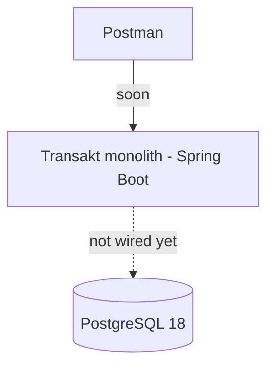

# Transakt Architecture

## Current: v0.1 — empty shell (Day 1–2)

```mermaid
flowchart TD
  client[Postman] -->|soon| app[Transakt monolith - Spring Boot]
  app -.->|not wired yet| db[(PostgreSQL 18)]
```

## Version log
| Version | Day | What changed |
|---------|-----|--------------|
| v0.1 | 1 | Repo + tooling. No code yet. |