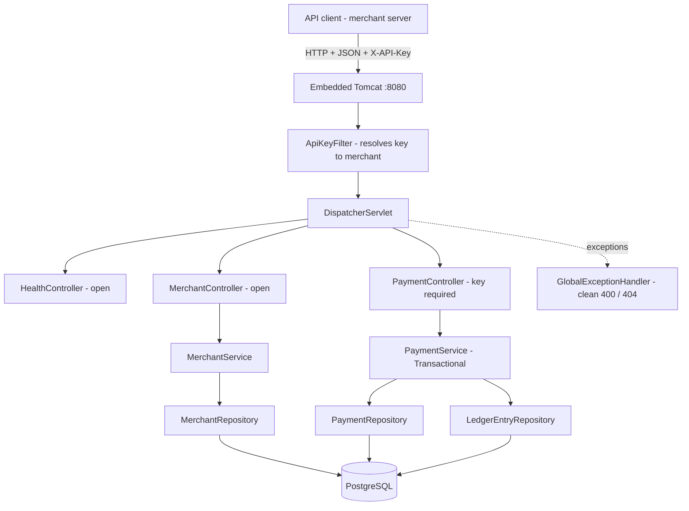
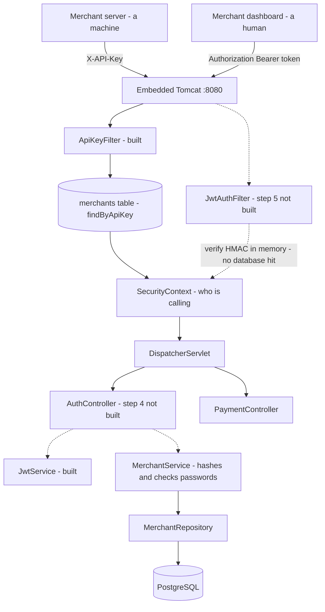

# Transakt Architecture

## Current: v0.7 — API key authentication (Day 7)

**How a request flows:** Tomcat parses the HTTP request. Before any controller runs, `ApiKeyFilter` inspects the `X-API-Key` header and, if it matches a merchant, marks the request authenticated and records which merchant it belongs to. The DispatcherServlet then routes to the right controller. Incoming payment JSON is bound to a validated DTO — `@Valid` rejects bad input before it reaches any logic. Controllers handle only HTTP concerns and delegate to services. `PaymentService` is `@Transactional`: creating a payment writes the payment row plus two balancing ledger entries as one atomic unit. Services reach the database only through repositories; Spring Data JPA turns those calls into SQL against PostgreSQL.

**Authentication (v0.7):** every merchant receives an API key (prefixed `tk_`) when their account is created. `/api/v1/health` and `/api/v1/merchants` are open — the latter deliberately, since a merchant must exist before it can hold a key. Everything else, including `/api/v1/payments`, requires a valid key; requests without one are refused before reaching a controller. CSRF protection is disabled because this is a stateless API, not a browser form application.

**Validation and error handling (v0.6):** clients send a DTO exposing only the fields they may set (merchantId, amountPaise, currency), never internal fields like id, status, or createdAt. Bean Validation annotations enforce rules such as "amount must be positive." A single `GlobalExceptionHandler` (`@RestControllerAdvice`) catches every exception and returns small, consistent JSON with the correct status code — 400 for validation failures, 404 for missing resources — so stack traces never leak to clients.

**The double-entry ledger (v0.5):** a payment never updates a stored balance. It appends two `LedgerEntry` rows — a CREDIT to the merchant account and an equal DEBIT from the gateway account. The two are equal and opposite, so the books always net to zero; any corruption makes them stop balancing, which is what makes errors detectable. Entries are append-only. Money is stored as integer paise, never a decimal, so arithmetic is exact.

**Known limitation:** there is still no human login path in the running application — see v0.8 below, which is partially built. API keys are also stored in plain text; production systems store a hash and show the key only once at creation.

---

## In progress: v0.8 — JWT authentication for humans (Day 8, steps 1–3 of 7)

> Not yet the running architecture. `JwtService` exists and can mint and verify tokens, but nothing in the request path issues or accepts one. This section describes the target and marks what is built.

Solid lines are built. Dashed lines are pending.

**Why a second door at all:** an API key belongs to a machine. The shop's server never sleeps, never forgets, and sends the same credential on every request — a permanent credential is appropriate there. A human logging into a dashboard is a different case. A credential that never expires is a liability if it leaks, and it carries no notion of role. There is also a quieter cost: `ApiKeyFilter` runs `findByApiKey` against the database on every single request, purely to answer "is this credential real?" A JWT answers the same question by recomputing a signature in memory, so authentication cost stays flat as merchant count grows. Transakt therefore ends up with two deliberate entrances — API keys for machines, JWTs for humans.

**Password storage (built):** `Merchant` gained a `password` field annotated `@JsonProperty(access = WRITE_ONLY)`, so Jackson accepts it on the way in and never writes it out — necessary because `/api/v1/merchants` is still open to the world. `MerchantService` injects a `PasswordEncoder` and hashes with BCrypt immediately before `save()`, so the plaintext exists nowhere in the system. BCrypt is deliberately slow (roughly 100ms per attempt, cost factor 10) and salts automatically, so two merchants who chose the same password get different hashes. The encoder bean lives in its own `common/PasswordConfig.java` rather than in `SecurityConfig`: `SecurityConfig` constructor-injects `ApiKeyFilter`, and putting the encoder there risks a bean dependency cycle. `update()` deliberately does not touch the password — a naive assignment would either null it out on a PUT that omits it, or store it unhashed.

**Token service (built):** `auth/JwtService` reads `jwt.secret` and `jwt.expiration-ms` from `application.yaml` via `@Value` and derives its signing key once at startup, since deriving a key is real computation and doing it per login would be waste. `generateToken` sets the standard `sub`, `iat` and `exp` claims plus a custom `merchantId` claim; `parseClaims` is private and verifies the signature before returning anything, so there is no code path that reads an unverified token.

**Token structure:** three Base64 parts joined by dots — header, payload, signature. The payload is **encoded, not encrypted**: anyone holding the token can read every claim. The signature does not hide the payload, it proves nothing was altered. The design rule that follows is that nothing secret goes in a token. `merchantId` is an identifier, not a credential, which is why it is safe to carry — and carrying it is precisely what removes the database lookup.

**The trade-off:** stateless verification means a JWT cannot be revoked before it expires; there is no central authority to ask. The mitigation is a short lifetime — one hour. A revocation list would work but reintroduces exactly the per-request state lookup that JWTs exist to avoid.

**Still to build:** the login endpoint (`POST /api/v1/auth/login` — email and password in, token out), `JwtAuthFilter` to read the `Authorization: Bearer` header, wiring both filters into `SecurityConfig` so they coexist without stepping on each other, and role-based access control distinguishing `ROLE_MERCHANT` from `ROLE_ADMIN`.

**Known limitation carried forward:** API keys remain plain text, and hashing them is not symmetric with hashing passwords. Verifying an API key means *finding* the merchant it belongs to, and a hash cannot be indexed — you would BCrypt-compare against every merchant in the table. Passwords escape this because login also sends an email, which finds the row in one indexed query before a single hash comparison. The real fix is a lookup prefix (`tk_live_<lookup>_<secret>`), indexing the lookup half in plain text and hashing only the secret half.

---

## Version log

| Version | Day | What changed |
|---------|-----|--------------|
| v0.1 | 1 | Repository and tooling. No code. |
| v0.2 | 2 | Spring Boot application running; first REST endpoint. |
| v0.3 | 3 | Merchant domain: controller, service, in-memory store. |
| v0.4 | 4 | PostgreSQL + Spring Data JPA. Data now durable. |
| v0.5 | 5 | Payments + double-entry ledger, atomic transactional writes. |
| v0.6 | 6 | DTO validation + global exception handling. |
| v0.7 | 7 | API key authentication via a Spring Security filter. |
| v0.8 | 8 | *In progress.* BCrypt password storage, jjwt 0.13.0, `JwtService`. Login endpoint, JWT filter and RBAC still to come. |
