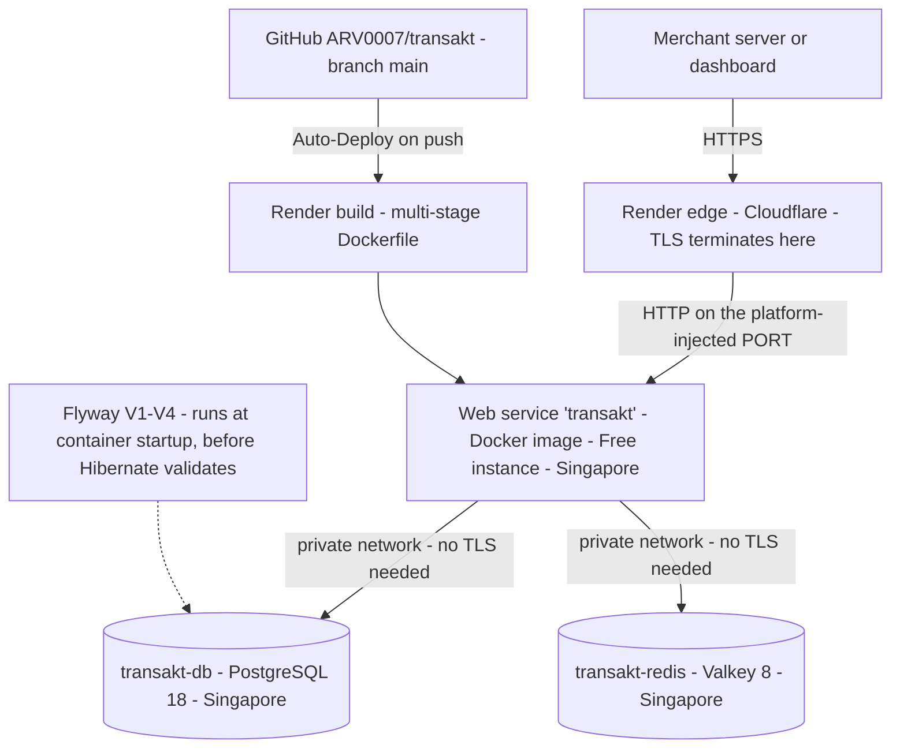
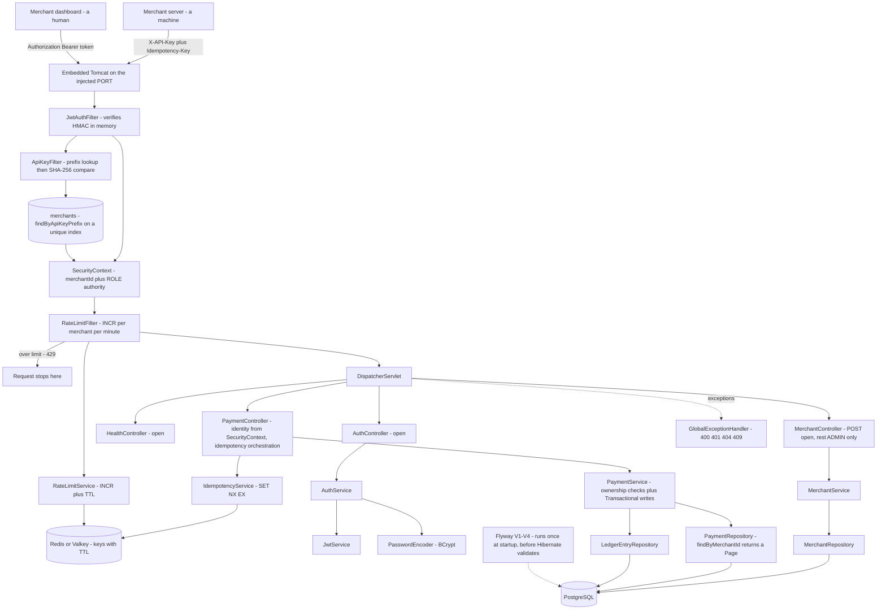

# Transakt Architecture

## Current: v1.3 — containerised and deployed (Days 13–14)

**Live at https://transakt.onrender.com**

### Deployment topology

All three services sit in the same region because Render's private networking is per-region — an
internal hostname resolves only from inside it. The public internet reaches exactly one of them.

### Application internals

**How a request flows:** Tomcat parses the HTTP request. Three filters run before any controller. `JwtAuthFilter` looks for an `Authorization: Bearer` header and, if the signature verifies and the token has not expired, records the caller's merchant ID and role in the SecurityContext with no database access. `ApiKeyFilter` then looks for `X-API-Key` and, if the context is still empty, takes the key's first eight characters as a lookup prefix, finds the single matching merchant row through a unique index, and compares the SHA-256 of the whole key against the stored hash before recording the same identity. `RateLimitFilter` runs last of the three — deliberately, because it needs an identity to count against — and refuses the request outright with 429 if that merchant has exceeded its per-minute allowance. The DispatcherServlet then routes to a controller. Controllers read the caller's identity from the SecurityContext and hand services plain values, so services stay free of Spring Security types. `PaymentService` is `@Transactional` on writes: a payment plus its two balancing ledger entries commit together or not at all.

**One artifact, three environments (v1.3):** every external address in `application.yaml` is now `${VAR:sensible-default}` — database host, name, user and password; Redis host, port and password; the HTTP port; the JWT secret; the rate limit. The same jar and the same image run on a MacBook, inside docker-compose, and in Singapore. Only the environment differs.

The defaults are not laziness, they are the thing that keeps local development at zero setup: with no variables set at all, the app looks for Postgres and Redis on localhost, which is exactly where they are on the development machine. Compose overrides the hosts with service names. Render overrides them with managed hostnames. Nothing branches on an environment name, and there is no `application-prod.yaml` — a profile would be a fourth thing to keep in sync, and every value it would hold is already a variable.

`server.port: ${PORT:8080}` sits at the top level as a sibling of `spring:`, because the platform decides which port to route to and tells the container. Binding a hardcoded port is a contract the platform never agreed to.

**Containerised (v1.3):** the `Dockerfile` is multi-stage. The first stage is `maven:3.9-eclipse-temurin-21` and produces the jar; the second is `eclipse-temurin:21-jre` and runs it. The build needs Maven, a full JDK and roughly two hundred megabytes of downloaded dependencies; the runtime needs a JRE and one jar. Shipping the first to production means shipping a compiler and a package manager to a machine that should only execute code.

Instruction order inside the build stage is a design decision rather than a formatting one. `COPY pom.xml` and `mvn dependency:go-offline` come before `COPY src`, because Docker caches each instruction and invalidates everything beneath the first change. With the source copied first, a one-character edit re-downloads every dependency. Split, that layer took 154.9 seconds once and has taken zero since.

`docker-compose.yml` runs three services — `postgres:18`, `redis:8-alpine` and the app. Two details matter. Service names are hostnames inside the compose network, so the app reaches the database at `postgres`; `localhost` inside a container means *that container*, not the host. And `depends_on` alone is not enough, because it waits for the container to exist rather than for Postgres to accept connections — the app boots in three seconds and would lose that race routinely. Healthchecks with `condition: service_healthy` are load-bearing. Only Postgres gets a named volume; Redis deliberately doesn't, because everything in it has a TTL and is meant to expire. Only the app publishes a port, which keeps the data stores invisible to the host and avoids colliding with Postgres.app on 5432.

The first containerised run was also the clearest proof of Day 12a's value: V1 through V4 applied as real SQL against a completely empty Postgres that had never seen this project, with no baselining, on infrastructure nobody had configured.

**Deployed (v1.3):** Render, free tier, three resources — a Docker web service, managed PostgreSQL 18, and a managed Key Value store. That last one runs **Valkey 8**, the fork created after Redis changed its licence; it is wire-compatible, so Lettuce and Spring Data Redis needed no changes at all.

Auto-Deploy watches `main` on GitHub and rebuilds on push, which means the deployed artifact is whatever is *pushed* rather than whatever is saved locally — a distinction that cost a day. Flyway is what makes redeployment cheap: the schema builds itself from four migration files on any database, so a fresh instance needs no manual SQL and losing the free Postgres to expiry costs demo data rather than the ability to run.

Two properties of the free tier are worth stating rather than discovering. The web service spins down after fifteen minutes idle, and the first request afterwards has been measured at **over two minutes**, not the fifty seconds advertised — so a link shared for review needs that caveat attached. And the managed Postgres expires thirty days after creation, with a fourteen-day grace period.

One asymmetry is worth auditing rather than inheriting: the managed Postgres ships with an inbound rule of `0.0.0.0/0`, accepting connections from the entire internet with only a password in front of it, while the Key Value store ships blocking all external traffic. Same platform, two opposite defaults, neither of them a decision anyone made.

**A startup hook is not free (v1.3):** a `@Bean CommandLineRunner` runs *after* the context refreshes and Tomcat binds — and if it throws, `SpringApplication.run` treats the whole startup as failed, closes the context and exits non-zero. That ordering is the trap: the image builds, the database connects, the migrations apply and the server starts, every time, and then a single line at the very end takes the process down. Debug scaffolding that touches an external service is therefore not neutral; it converts an optional dependency into a hard startup requirement. Redis is optional for booting this application by design, and one such runner made it mandatory for three days.

**Schema is versioned, not inferred (v1.2):** the database shape is now defined by numbered SQL migrations in `db/migration` rather than derived from the entity classes at startup. Hibernate runs in `validate` mode — it compares entities against the schema and refuses to start on a mismatch, but never builds anything. All construction is Flyway's. This closes a real gap: `ddl-auto: update` cannot add a `NOT NULL` column to a populated table, so the fix on Day 8 was a hand-run `ALTER TABLE` that existed only on one laptop and was recorded nowhere. Every schema change is now a reviewable file with a checksum, replayable on any machine. Flyway runs inside application startup, which means a failed boot performs no migration at all and leaves the database exactly as it was.

The existing development database was **baselined** rather than rebuilt: `baseline-on-migrate` writes a marker row and skips everything at or below version 1, because those tables already existed. The test database, created empty, runs V1 for real — making `./mvnw test` the only place the initial migration actually executes, and therefore the proof that it is correct. The test profile deliberately sets `baseline-on-migrate: false`, so a test database left in an unexpected state fails the build loudly rather than silently baselining and skipping a migration.

**Collections are paginated (v1.2):** `GET /api/v1/payments` returns a page rather than every matching row — twenty by default, newest first, with a server-enforced ceiling of one hundred. Without that cap the parameter is a suggestion rather than a protection, since a client could simply ask for a million. Spring Data rewrites the query to add `LIMIT`/`OFFSET`, and the resulting `WHERE merchant_id = ? ORDER BY created_at DESC` is exactly what the index added in the same day's first migration was built for. The response is serialised through `PagedModel` rather than as a raw `PageImpl`, because `PageImpl`'s field layout is a framework implementation detail and publishing it would make a library refactor a breaking API change. The known ceiling is offset depth: `OFFSET 100000` makes Postgres walk and discard a hundred thousand rows, which is why cursor-based pagination exists.

**API keys are stored hashed (v1.2):** the plaintext `api_key` column is gone. Each merchant now has an `api_key_prefix` — the first eight characters, indexed, unique, not secret — and an `api_key_hash`, the SHA-256 of the whole key. Hashing an API key is not symmetric with hashing a password, and the asymmetry is the design driver: a password lookup is identified by an email first, so a salted hash can be compared against one known row. An API key has no such identifier — the key *is* the identity — so a salted hash would force a comparison against every row in the table. Splitting the key gives one indexed lookup plus one comparison, constant time regardless of merchant count. This is why Stripe's `sk_live_...` and GitHub's `ghp_...` keys are shaped the way they are.

SHA-256 rather than BCrypt is deliberate. Slow hashing defends against guessable inputs; a 256-bit random key is not guessable at any speed, so BCrypt would add latency to every request to prevent an attack that cannot occur. Comparison uses `MessageDigest.isEqual` for constant time. The entity keeps `apiKey` as a `@Transient` field, so a newly created merchant sees their key exactly once in the creation response and it exists nowhere afterwards.

The migration was performed as **expand and contract** across four steps: add the columns nullable and backfill them, start writing them on every signup, switch the reader, then enforce `NOT NULL` and drop the old column. Between the first and last step the database supported both shapes, so no intermediate state could lose data, and the only irreversible step was last and isolated. Two orderings inside that sequence are easy to get backwards and both matter: writers must switch before readers, or a merchant created in between has a key but no hash; and `NOT NULL` belongs to the contract phase, because during expand the entity does not yet map the columns and every insert would write null.

**The test suite (v1.1):** nineteen integration tests across four classes, running against the full stack in about twenty seconds. `AuthIntegrationTest` covers signup, login and both failure paths. `OwnershipIntegrationTest` covers foreign payments and ledgers returning 404, list scoping, and the forged `merchantId` being ignored. `IdempotencyIntegrationTest` covers key reuse, key scoping per merchant, and the deliberate decision not to fingerprint the request body. `RateLimitIntegrationTest` covers the 429 threshold and the fact that one merchant hitting the ceiling does not affect another. All use `MockMvc`, which sends real requests through the entire filter chain and into a real database without opening a network port.

**Why integration rather than unit tests (v1.1):** almost everything interesting in this system lives in the wiring — a three-filter chain, first-match-wins path rules, ownership checks that depend on who authenticated, idempotency and rate limiting that depend on Redis. A unit test of `PaymentService` with mocked repositories would pass happily while `SecurityConfig` was wide open, because it never touches a filter. Testing through the front door is what makes the security model verifiable at all. The tests worth having are the ones guarding failures that would be **silent** in production: removing `@JsonProperty(WRITE_ONLY)` from the password field, changing one login error message and reopening email enumeration, adding `merchantId` back to the request DTO, or dropping the merchant ID out of an idempotency or rate-limit key. Each is a one-word change that looks harmless in a diff.

The clearest evidence arrived on Day 12. Making `apiKey` transient caused signup to return null, because Spring Data calls `merge()` rather than `persist()` for an entity whose ID is already assigned — and `merge()` copies only persistent state onto a new instance. The failure surfaced in a test written on Day 11 to check something entirely unrelated: that signup never leaks the password hash. A test's value is not the bugs it catches on the day it is written.

**Test isolation is per-store (v1.1, updated v1.2):** the `test` profile points at a separate `transakt_test` database. It no longer uses `create-drop` — the schema is now built by the same Flyway migrations that build production, under `ddl-auto: validate`, which is a stronger check: it verifies that the migrations and the entity mappings genuinely agree. `@Transactional` on each test class rolls back after every test, so tests cannot see each other's data. Crucially, that rollback covers **Postgres only**: Redis keys survive between tests, so the idempotency and rate-limit classes flush Redis explicitly in `@BeforeEach`. Tests use Redis database 1 while the application uses 0 — sixteen numbered databases share one server with entirely separate keyspaces, so no second install is needed. The rate-limit class raises its own low limit through `@TestPropertySource`, which forces Spring to build a separate application context for that class alone.

**Two state stores, on purpose (v1.0):** PostgreSQL holds the truth — merchants, payments, ledger entries, all durable and queryable. Redis holds facts that matter intensely for a short time and then never again: idempotency keys for 24 hours, rate-limit counters for 60 seconds. Redis's TTL means both expire themselves, with no scheduled cleanup job anywhere in the codebase. The trade-off accepted knowingly is durability — Redis is in-memory and a restart loses its contents, which for a rate-limit counter is harmless and for an idempotency key opens a brief window in which a retry could double-charge. Systems that cannot tolerate that store idempotency keys in the database with a unique index and pay the latency.

**Idempotency (v1.0):** `POST /api/v1/payments` accepts an optional `Idempotency-Key` header. The controller reserves the key with an atomic `SET NX EX` under `idem:<merchantId>:<clientKey>`, creates the payment, then overwrites the reservation with the payment ID. A retry carrying the same key gets the **original payment** back — same id, same createdAt — rather than creating a second one. A duplicate arriving while the original is still in flight finds `IN_PROGRESS` and receives **409 Conflict**. A failed creation releases the reservation, so a transient error does not lock the merchant out of that key for a day. The atomicity is the point: checking whether a key exists and then setting it is two operations, and two simultaneous retries can both pass the check. Keys are scoped by merchant because clients choose their own key strings and two merchants could independently pick the same one.

**The orchestration lives in the controller, not the service (v1.0)** — partly because idempotency is an HTTP concern driven by a header and expressed in status codes, but chiefly because a service method calling its own `@Transactional` method would bypass Spring's proxy entirely and run with no transaction at all. Self-invocation defeats proxy-based annotations, silently.

**Rate limiting (v1.0):** `RateLimitService` uses `INCR` on `rate:<merchantId>:<epochMinute>` with a 60-second TTL set only on the first increment, since overwriting a Redis value clears its expiry. Because the current minute is part of the key name, a new window creates a fresh counter automatically and the old one expires itself — there is no reset logic in the code. Past twenty requests per minute the filter returns **429 Too Many Requests**. Unlike the authentication filters, this one rejects rather than merely recording, and it writes its JSON response by hand: filters run before the DispatcherServlet, so `@RestControllerAdvice` cannot catch anything they throw. The counter is per merchant per *minute* across every authenticated endpoint — not per endpoint — so a payment creation and a list request draw from the same allowance.

**Three layers of authorization (v0.9):** the system answers three separate questions, and each needed its own mechanism. *Who are you* is authentication — a signed token or a valid API key. *What kind of user are you* is role authorization — `hasRole("ADMIN")` on a path. *Is this record yours* is ownership authorization, and neither of the first two touches it. `CreatePaymentRequest` has no `merchantId` field at all, so a client cannot file a payment under another account — the lie has nowhere to land. Reads of a foreign payment return **404 rather than 403**, because a 403 would confirm the ID is real and hand an enumerator exactly the signal they want; both cases return an identical message, which is what makes it work. Collections are **scoped rather than filtered**: `findByMerchantId(caller)` for a merchant, `findAll()` for an admin, so unauthorised rows never load. This required first unifying the principal: `JwtAuthFilter` previously set the email while `ApiKeyFilter` set the UUID, so `getName()` returned different shapes depending on which door the caller used. Merchant ID won, because emails change.

**Two authentication paths, on purpose (v0.8):** an API key belongs to a machine that sends the same permanent credential forever; a JWT belongs to a human, expires in an hour, and carries a role. The API-key path queries `merchants` on every request — one indexed lookup on the prefix, then one in-memory hash comparison — while the JWT path recomputes an HMAC in memory with no database access at all. Both stay flat as merchant count grows. The trade-off is revocation: a JWT cannot be invalidated before it expires, which is why the lifetime is short.

**Passwords and roles (v0.8):** BCrypt at cost factor 10 — deliberately slow, automatically salted, and annotated `@JsonProperty(WRITE_ONLY)` so it is accepted on input and never serialised out. Every merchant has a `MerchantRole` defaulted by a field initialiser, carried as a token claim, and converted into a Spring authority named `ROLE_ADMIN` or `ROLE_MERCHANT` — the prefix is mandatory, since `hasRole("ADMIN")` prepends it when checking.

**Validation and error handling (v0.6):** clients send DTOs exposing only the fields they may set. Bean Validation enforces rules such as "amount must be positive". A single `GlobalExceptionHandler` turns every exception into consistent JSON with the right status code — 400 validation, 401 bad credentials, 404 missing or inaccessible, 409 idempotency conflict — so stack traces never leak.

**The double-entry ledger (v0.5):** a payment never updates a stored balance. It appends two `LedgerEntry` rows — a CREDIT to the merchant account and an equal DEBIT from the gateway account. They are equal and opposite, so the books always net to zero and corruption is detectable. Entries are append-only. Money is integer paise, never a decimal.

**Known limitations:**

- **No CI.** The suite runs when someone remembers to run it. Nothing runs it on push. This is now the largest gap in the project.
- **The rate limiter's behaviour when Redis is unreachable is accidental rather than designed.** With the store down, authenticated requests return an empty-bodied **403** — not a 500, and not a deliberate 503. `RateLimitFilter` is registered before `UsernamePasswordAuthenticationFilter` and therefore runs upstream of `ExceptionTranslationFilter`, so an uncaught throw should have escaped as a 500; something is catching the `RedisConnectionException` and converting it. The deeper question is unanswered: should a rate limiter **fail open or fail closed**? Failing closed turns a Redis outage into a total outage. Failing open removes the ceiling exactly when the system is already unhealthy. And the answer should probably differ for idempotency, where failing open means charging a customer twice.
- **The free web service spins down after fifteen minutes idle.** A measured cold start exceeded two minutes. Any shared link needs that caveat.
- **The free managed Postgres expires 17 September 2026**, thirty days after creation, with a fourteen-day grace period. The schema rebuilds from migrations, so the loss would be demo data rather than capability — but it is a date, not a warning that arrives.
- **The managed Postgres accepts inbound connections from `0.0.0.0/0` by default.** The Key Value store, on the same platform, blocks all external traffic by default. Tightening Postgres to the internal network is the fix.
- **Unauthenticated traffic is not rate limited.** The filter guards on an existing identity, so brute-forcing `/auth/login` hits no ceiling. Production gateways add an IP-keyed limiter.
- **Fixed-window rate limiting allows a boundary burst** — twenty requests either side of a minute boundary is forty in two seconds. Sliding windows via sorted sets fix it at more complexity.
- **Idempotency keys are not fingerprinted against the request body.** Reusing a key with a different amount returns the original payment silently; Stripe returns 422 instead. This limitation is itself covered by a test, so changing it cannot happen unnoticed.
- **The API key prefix carries only about twenty bits of entropy.** `tk_` occupies three of the eight prefix characters, leaving five hex digits. The birthday bound puts a meaningful collision chance somewhere near a thousand merchants, at which point the unique index would begin rejecting legitimate signups. The fix is a longer dedicated random segment in the key format rather than slicing the prefix off the front.
- **Offset pagination degrades with depth.** `OFFSET 100000` scans and discards every skipped row. Cursor pagination keyed on `(created_at, id)` is the standard answer.
- **There are no foreign key constraints.** `Payment` holds `merchantId` and `LedgerEntry` holds `paymentId` as plain scalar columns rather than JPA associations, so Hibernate never generated any. The database will accept a payment referencing a merchant that does not exist; only the service layer prevents it.
- **Signup does not require a password.** The hashing step is guarded on the field being non-null, so a merchant can be created that can never log in. `@NotBlank` on the request would close it.
- **No merchant-scoped ledger listing.** Ledger entries are reachable only through their parent payment.
- **There is no ADMIN account on the deployed instance.** Role is server-controlled at signup, so every merchant created through the public API is a MERCHANT and `/api/v1/merchants/**` is unreachable in production. Correct behaviour, but it means the admin paths are only exercised locally and by the test suite.
- `POST /api/v1/merchants` returns 200; REST convention is 201 with a `Location` header. There is no password-change endpoint and no `Retry-After` on 429s.

## Version log
| Version | Day | What changed |
|---------|-----|--------------|
| v0.1 | 1 | Repository and tooling. No code. |
| v0.2 | 2 | Spring Boot application running; first REST endpoint. |
| v0.3 | 3 | Merchant domain: controller, service, in-memory store. |
| v0.4 | 4 | PostgreSQL + Spring Data JPA. Data now durable. |
| v0.5 | 5 | Payments + double-entry ledger, atomic transactional writes. |
| v0.6 | 6 | DTO validation + global exception handling. |
| v0.7 | 7 | API key authentication via a Spring Security filter. |
| v0.8 | 8 | BCrypt passwords, JWT login, a second auth filter, and role-based access control. |
| v0.9 | 9 | Ownership authorization: identity taken from the token, 404 on foreign resources, scoped collection queries. |
| v1.0 | 10 | Redis. Idempotency keys prevent double charges; per-merchant rate limiting. |
| v1.1 | 11 | Integration test suite — nineteen tests across auth, ownership, idempotency and rate limiting. |
| v1.2 | 12 | Flyway migrations replace ddl-auto; paginated payment listing; API keys stored as a lookup prefix plus SHA-256 hash. |
| **v1.3** | **13–14** | **Multi-stage Docker image and docker-compose; every external address parameterised; deployed to Render with managed PostgreSQL and Valkey, live over HTTPS.** |
