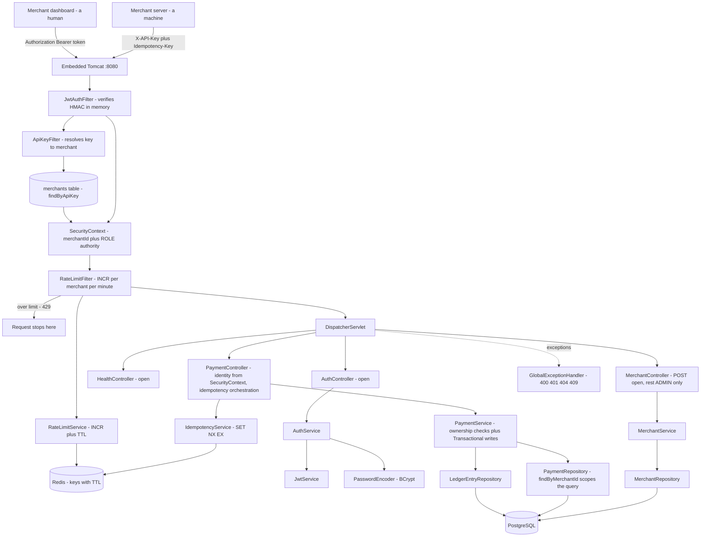

# Transakt Architecture

## Current: v1.1 — Integration test suite (Day 11)

**How a request flows:** Tomcat parses the HTTP request. Three filters run before any controller. `JwtAuthFilter` looks for an `Authorization: Bearer` header and, if the signature verifies and the token has not expired, records the caller's merchant ID and role in the SecurityContext with no database access. `ApiKeyFilter` then looks for `X-API-Key` and, if the context is still empty, resolves the key to a merchant row and does the same. `RateLimitFilter` runs last of the three — deliberately, because it needs an identity to count against — and refuses the request outright with 429 if that merchant has exceeded its per-minute allowance. The DispatcherServlet then routes to a controller. Controllers read the caller's identity from the SecurityContext and hand services plain values, so services stay free of Spring Security types. `PaymentService` is `@Transactional` on writes: a payment plus its two balancing ledger entries commit together or not at all.

**The test suite (v1.1):** nineteen integration tests across four classes, running against the full stack in about twenty seconds. `AuthIntegrationTest` covers signup, login and both failure paths. `OwnershipIntegrationTest` covers foreign payments and ledgers returning 404, list scoping, and the forged `merchantId` being ignored. `IdempotencyIntegrationTest` covers key reuse, key scoping per merchant, and the deliberate decision not to fingerprint the request body. `RateLimitIntegrationTest` covers the 429 threshold and the fact that one merchant hitting the ceiling does not affect another. All use `MockMvc`, which sends real requests through the entire filter chain and into a real database without opening a network port.

**Why integration rather than unit tests (v1.1):** almost everything interesting in this system lives in the wiring — a three-filter chain, first-match-wins path rules, ownership checks that depend on who authenticated, idempotency and rate limiting that depend on Redis. A unit test of `PaymentService` with mocked repositories would pass happily while `SecurityConfig` was wide open, because it never touches a filter. Testing through the front door is what makes the security model verifiable at all. The tests worth having are the ones guarding failures that would be **silent** in production: removing `@JsonProperty(WRITE_ONLY)` from the password field, changing one login error message and reopening email enumeration, adding `merchantId` back to the request DTO, or dropping the merchant ID out of an idempotency or rate-limit key. Each is a one-word change that looks harmless in a diff.

**Test isolation is per-store (v1.1):** the `test` profile points at a separate `transakt_test` database with `ddl-auto: create-drop`, so every run begins from an empty, correctly-shaped schema built from the entities — which doubles as a free check that the mappings are valid. `@Transactional` on each test class rolls back after every test, so tests cannot see each other's data. Crucially, that rollback covers **Postgres only**: Redis keys survive between tests, so the idempotency and rate-limit classes flush Redis explicitly in `@BeforeEach`. Tests use Redis database 1 while the application uses 0 — sixteen numbered databases share one server with entirely separate keyspaces, so no second install is needed. The rate-limit class raises its own low limit through `@TestPropertySource`, which forces Spring to build a separate application context for that class alone.

**Two state stores, on purpose (v1.0):** PostgreSQL holds the truth — merchants, payments, ledger entries, all durable and queryable. Redis holds facts that matter intensely for a short time and then never again: idempotency keys for 24 hours, rate-limit counters for 60 seconds. Redis's TTL means both expire themselves, with no scheduled cleanup job anywhere in the codebase. The trade-off accepted knowingly is durability — Redis is in-memory and a restart loses its contents, which for a rate-limit counter is harmless and for an idempotency key opens a brief window in which a retry could double-charge. Systems that cannot tolerate that store idempotency keys in the database with a unique index and pay the latency.

**Idempotency (v1.0):** `POST /api/v1/payments` accepts an optional `Idempotency-Key` header. The controller reserves the key with an atomic `SET NX EX` under `idem:<merchantId>:<clientKey>`, creates the payment, then overwrites the reservation with the payment ID. A retry carrying the same key gets the **original payment** back — same id, same createdAt — rather than creating a second one. A duplicate arriving while the original is still in flight finds `IN_PROGRESS` and receives **409 Conflict**. A failed creation releases the reservation, so a transient error does not lock the merchant out of that key for a day. The atomicity is the point: checking whether a key exists and then setting it is two operations, and two simultaneous retries can both pass the check. Keys are scoped by merchant because clients choose their own key strings and two merchants could independently pick the same one.

**The orchestration lives in the controller, not the service (v1.0)** — partly because idempotency is an HTTP concern driven by a header and expressed in status codes, but chiefly because a service method calling its own `@Transactional` method would bypass Spring's proxy entirely and run with no transaction at all. Self-invocation defeats proxy-based annotations, silently.

**Rate limiting (v1.0):** `RateLimitService` uses `INCR` on `rate:<merchantId>:<epochMinute>` with a 60-second TTL set only on the first increment, since overwriting a Redis value clears its expiry. Because the current minute is part of the key name, a new window creates a fresh counter automatically and the old one expires itself — there is no reset logic in the code. Past twenty requests per minute the filter returns **429 Too Many Requests**. Unlike the authentication filters, this one rejects rather than merely recording, and it writes its JSON response by hand: filters run before the DispatcherServlet, so `@RestControllerAdvice` cannot catch anything they throw.

**Three layers of authorization (v0.9):** the system answers three separate questions, and each needed its own mechanism. *Who are you* is authentication — a signed token or a valid API key. *What kind of user are you* is role authorization — `hasRole("ADMIN")` on a path. *Is this record yours* is ownership authorization, and neither of the first two touches it. `CreatePaymentRequest` has no `merchantId` field at all, so a client cannot file a payment under another account — the lie has nowhere to land. Reads of a foreign payment return **404 rather than 403**, because a 403 would confirm the ID is real and hand an enumerator exactly the signal they want; both cases return an identical message, which is what makes it work. Collections are **scoped rather than filtered**: `findByMerchantId(caller)` for a merchant, `findAll()` for an admin, so unauthorised rows never load. This required first unifying the principal: `JwtAuthFilter` previously set the email while `ApiKeyFilter` set the UUID, so `getName()` returned different shapes depending on which door the caller used. Merchant ID won, because emails change.

**Two authentication paths, on purpose (v0.8):** an API key belongs to a machine that sends the same permanent credential forever; a JWT belongs to a human, expires in an hour, and carries a role. The API-key path must query `merchants` on every request; the JWT path recomputes an HMAC in memory, so authentication cost stays flat as merchant count grows. The trade-off is revocation: a JWT cannot be invalidated before it expires, which is why the lifetime is short.

**Passwords and roles (v0.8):** BCrypt at cost factor 10 — deliberately slow, automatically salted, and annotated `@JsonProperty(WRITE_ONLY)` so it is accepted on input and never serialised out. Every merchant has a `MerchantRole` defaulted by a field initialiser, carried as a token claim, and converted into a Spring authority named `ROLE_ADMIN` or `ROLE_MERCHANT` — the prefix is mandatory, since `hasRole("ADMIN")` prepends it when checking.

**Validation and error handling (v0.6):** clients send DTOs exposing only the fields they may set. Bean Validation enforces rules such as "amount must be positive". A single `GlobalExceptionHandler` turns every exception into consistent JSON with the right status code — 400 validation, 401 bad credentials, 404 missing or inaccessible, 409 idempotency conflict — so stack traces never leak.

**The double-entry ledger (v0.5):** a payment never updates a stored balance. It appends two `LedgerEntry` rows — a CREDIT to the merchant account and an equal DEBIT from the gateway account. They are equal and opposite, so the books always net to zero and corruption is detectable. Entries are append-only. Money is integer paise, never a decimal.

**Known limitations:**

- **No CI.** The suite runs when someone remembers to run it. Nothing runs it on push.
- **Unauthenticated traffic is not rate limited.** The filter guards on an existing identity, so brute-forcing `/auth/login` hits no ceiling. Production gateways add an IP-keyed limiter.
- **Fixed-window rate limiting allows a boundary burst** — twenty requests either side of a minute boundary is forty in two seconds. Sliding windows via sorted sets fix it at more complexity.
- **Idempotency keys are not fingerprinted against the request body.** Reusing a key with a different amount returns the original payment silently; Stripe returns 422 instead. This limitation is itself covered by a test, so changing it cannot happen unnoticed.
- **No pagination.** `GET /api/v1/payments` returns every matching row. Spring Data supports it via `Page<Payment>` and a `Pageable` parameter.
- **API keys are stored in plain text.** Hashing them is not symmetric with hashing passwords: verifying a key means *finding* the row it belongs to, and a hash cannot be indexed. The fix is a lookup prefix — `tk_live_<lookup>_<secret>` — indexing the lookup half and hashing only the secret half.
- **Schema changes are manual** under `ddl-auto: update`, which cannot add a `NOT NULL` column to a populated table and leaves no record of the fix. Production would use Flyway.
- **No merchant-scoped ledger listing.** Ledger entries are reachable only through their parent payment.
- `POST /api/v1/merchants` returns 200; REST convention is 201 with a `Location` header. There is no password-change endpoint and no `Retry-After` on 429s.

## Version log
| Version | Day | What changed |
|---------|-----|--------------|
| v0.1 | 1 | Repository and tooling. No code. |
| v0.2 | 2 | Spring Boot application running; first REST endpoint. |
| v0.3 | 3 | Merchant domain: controller, service, in-memory store. |
| v0.4 | 4 | PostgreSQL + Spring Data JPA. Data now durable. |
| v0.5 | 5 | Payments + double-entry ledger, atomic transactional writes. |
| v0.6 | 6 | DTO validation + global exception handling. |
| v0.7 | 7 | API key authentication via a Spring Security filter. |
| v0.8 | 8 | BCrypt passwords, JWT login, a second auth filter, and role-based access control. |
| v0.9 | 9 | Ownership authorization: identity taken from the token, 404 on foreign resources, scoped collection queries. |
| v1.0 | 10 | Redis. Idempotency keys prevent double charges; per-merchant rate limiting. |
| **v1.1** | **11** | **Integration test suite — nineteen tests across auth, ownership, idempotency and rate limiting.** |