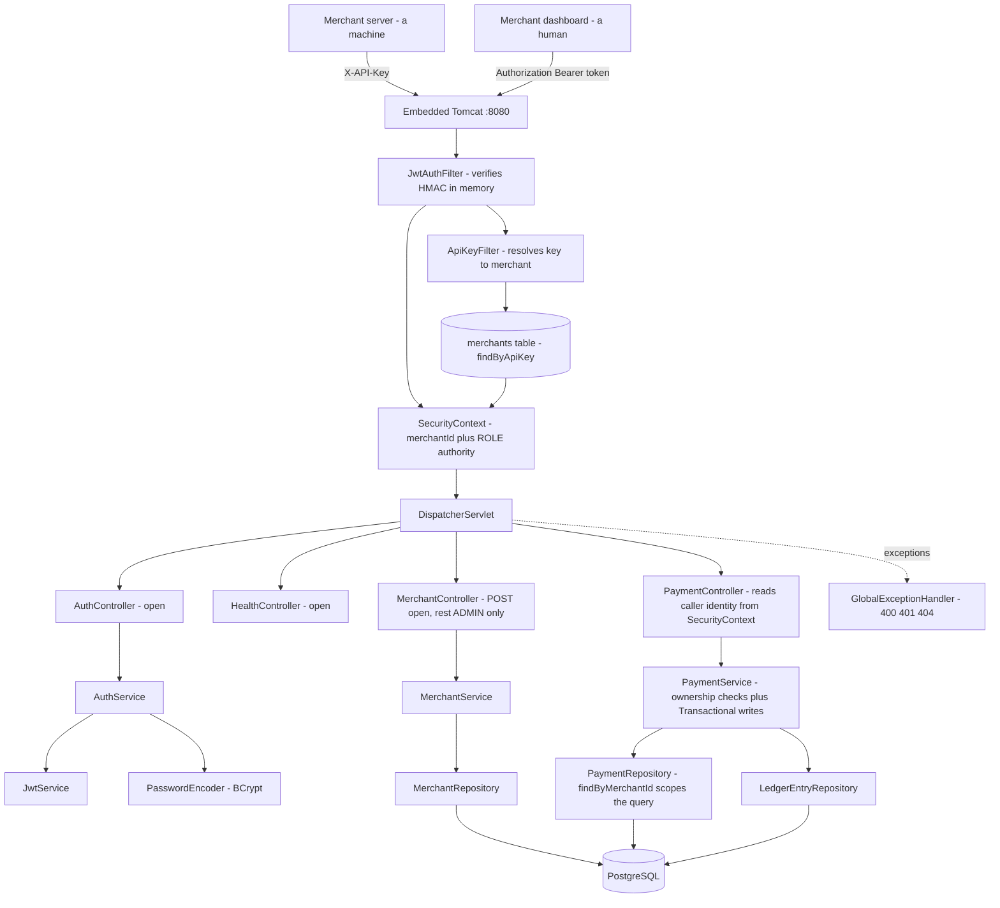

# Transakt Architecture

## Current: v0.9 — Ownership authorization (Day 9)

**How a request flows:** Tomcat parses the HTTP request. Two filters run before any controller. `JwtAuthFilter` looks for an `Authorization: Bearer` header and, if the signature verifies and the token has not expired, records the caller's merchant ID and role in the SecurityContext — with no database access at all. `ApiKeyFilter` then looks for `X-API-Key` and, if the SecurityContext is still empty, resolves the key to a merchant row and does the same. Neither filter ever rejects a request; refusal is `SecurityConfig`'s job. The DispatcherServlet routes to the right controller. Controllers read the caller's identity from the SecurityContext and hand it to services as plain values, so services stay free of Spring Security types. `PaymentService` is `@Transactional` on writes: creating a payment writes the payment row plus two balancing ledger entries as one atomic unit.

**Three layers of authorization (v0.9):** the system now answers three separate questions, and each needed its own mechanism. *Who are you* is authentication — a signed token or a valid API key. *What kind of user are you* is role authorization — `hasRole("ADMIN")` on a path. *Is this record yours* is ownership authorization, and neither of the first two touches it. Before v0.9 a merchant with a perfectly valid token and a correct MERCHANT role could read any payment in the system by ID.

**Identity is never taken from the request body (v0.9):** `CreatePaymentRequest` has no `merchantId` field. The controller takes an `Authentication` parameter — resolved by Spring MVC directly from the SecurityContext — and sets the merchant ID from `getName()`. A client that sends a forged `merchantId` gets a 200 and a payment filed under its own account, because Jackson has nowhere to bind the key and drops it. The lie is not rejected; it is impossible. This required first unifying the principal: `JwtAuthFilter` previously set the email while `ApiKeyFilter` set the UUID, so `getName()` returned different shapes depending on which door the caller used. Merchant ID won, because emails change.

**Reads return 404, not 403 (v0.9):** when a merchant requests a payment that is not theirs, `PaymentService` throws `ResourceNotFoundException` with the same message it uses for a genuinely missing row. A 403 would confirm the ID is real, which is exactly the signal an attacker enumerating IDs is looking for. Stripe and GitHub behave the same way. The ledger endpoint delegates to `getById` before fetching entries, so the ownership rule lives in exactly one method — necessary because a `LedgerEntry` knows its `paymentId` but not its merchant, and before v0.9 that endpoint never touched the payments table at all.

**Collections are scoped, not filtered (v0.9):** `GET /api/v1/payments` returns `findByMerchantId(caller)` for a merchant and `findAll()` for an admin. There is no filtering step — rows the caller may not see are never loaded. For a single resource, fetch-then-check is fine; for a collection, checking after the fact would mean pulling every payment into memory and discarding most of it, which is both slower and a data-handling risk.

**Two authentication paths, on purpose (v0.8):** an API key belongs to a machine — the merchant's server, which sends the same permanent credential forever. A JWT belongs to a human, expires in an hour, and carries a role. The API-key path must query `merchants` on every request to answer "is this credential real?"; the JWT path answers the same question by recomputing an HMAC in memory, so authentication cost stays flat as merchant count grows. The trade-off is revocation: a JWT cannot be invalidated before it expires, which is why the lifetime is one hour.

**Passwords and roles (v0.8):** merchants have a BCrypt-hashed password, cost factor 10 — deliberately slow, automatically salted, and annotated `@JsonProperty(WRITE_ONLY)` so it is accepted on input and never serialised out. Every merchant has a `MerchantRole` of `MERCHANT` or `ADMIN`, defaulted by a field initialiser so a client cannot choose its own permission level. The role travels as a token claim and becomes a Spring authority named `ROLE_ADMIN` or `ROLE_MERCHANT` — the prefix is mandatory, since `hasRole("ADMIN")` prepends it when checking.

**Validation and error handling (v0.6):** clients send DTOs exposing only the fields they may set. Bean Validation enforces rules such as "amount must be positive". A single `GlobalExceptionHandler` turns every exception into small, consistent JSON with the correct status code — 400 for validation, 401 for bad credentials, 404 for missing or inaccessible resources — so stack traces never leak.

**The double-entry ledger (v0.5):** a payment never updates a stored balance. It appends two `LedgerEntry` rows — a CREDIT to the merchant account and an equal DEBIT from the gateway account. The two are equal and opposite, so the books always net to zero. Entries are append-only. Money is stored as integer paise, never a decimal.

**Known limitations:**

- **No pagination.** `GET /api/v1/payments` returns every matching row. Real APIs paginate; Spring Data supports it directly via `Page<Payment>` and a `Pageable` parameter.
- **API keys are stored in plain text.** Hashing them is not symmetric with hashing passwords: verifying a key means *finding* the row it belongs to, and a hash cannot be indexed. The fix is a lookup prefix — `tk_live_<lookup>_<secret>` — indexing the lookup half and hashing only the secret half.
- **Schema changes are manual.** Adding the `NOT NULL` role column failed under `ddl-auto: update` and required a hand-written backfill. Production would use Flyway.
- **No merchant-scoped ledger listing.** Ledger entries are reachable only through their parent payment.
- `POST /api/v1/merchants` returns 200; REST convention is 201 with a `Location` header. There is no password-change endpoint.

## Version log
| Version | Day | What changed |
|---------|-----|--------------|
| v0.1 | 1 | Repository and tooling. No code. |
| v0.2 | 2 | Spring Boot application running; first REST endpoint. |
| v0.3 | 3 | Merchant domain: controller, service, in-memory store. |
| v0.4 | 4 | PostgreSQL + Spring Data JPA. Data now durable. |
| v0.5 | 5 | Payments + double-entry ledger, atomic transactional writes. |
| v0.6 | 6 | DTO validation + global exception handling. |
| v0.7 | 7 | API key authentication via a Spring Security filter. |
| v0.8 | 8 | BCrypt passwords, JWT login, a second auth filter, and role-based access control. |
| v0.9 | 9 | Ownership authorization: identity taken from the token, 404 on foreign resources, scoped collection queries. |
