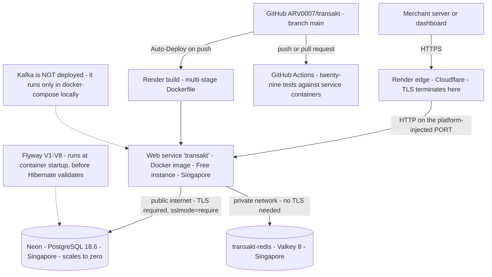
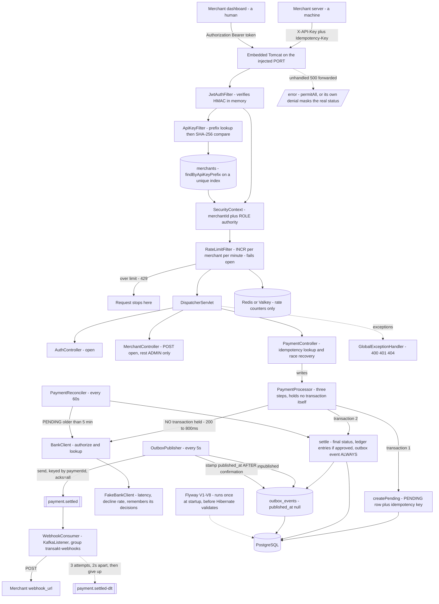
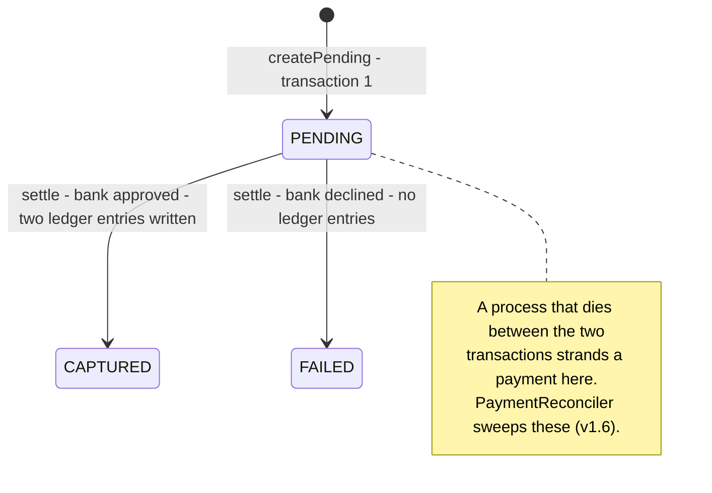

# Transakt Architecture

## Current: v1.7 — the database moves off-platform (Days 13–23)

**Live at https://transakt.onrender.com**

### Deployment topology



The app and the Key Value store sit in the same Render region and talk over private networking,
which is per-region — an internal hostname resolves only from inside it. Since v1.7 the database
is no longer one of them: Neon is a separate provider reached over the public internet, so that
connection is encrypted rather than merely internal. Two of the three are still invisible to the
outside world.

### Application internals



**How a request flows:** Tomcat parses the HTTP request. Three filters run before any controller. `JwtAuthFilter` looks for an `Authorization: Bearer` header and, if the signature verifies and the token has not expired, records the caller's merchant ID and role in the SecurityContext with no database access. `ApiKeyFilter` then looks for `X-API-Key` and, if the context is still empty, takes the key's first eight characters as a lookup prefix, finds the single matching merchant row through a unique index, and compares the SHA-256 of the whole key against the stored hash before recording the same identity. `RateLimitFilter` runs last of the three — deliberately, because it needs an identity to count against — and refuses the request outright with 429 if that merchant has exceeded its per-minute allowance. The DispatcherServlet then routes to a controller. Controllers read the caller's identity from the SecurityContext and hand services plain values, so services stay free of Spring Security types. Creating a payment is no longer one transaction: `PaymentProcessor` opens one to record the attempt, closes it, calls the bank, then opens a second to record the outcome. Each half is still atomic — the payment row and its idempotency key together, then the final status, both ledger entries and the outbox event together — but the two halves are not atomic with each other, and that is deliberate.

**The bank seam, and why one transaction became two (v1.5):** payments now go through an acquiring bank. `BankClient` is an interface; `FakeBankClient` implements it with a configurable latency between two hundred and eight hundred milliseconds and a configurable decline rate. Nothing above the interface knows that today's implementation flips a weighted coin, which is the whole reason for putting it there — a real acquirer is a second adapter behind the same port rather than a rewrite of the payment path.

The interesting consequence is not the bank call but where it had to go. `PaymentService.create` was a single `@Transactional` method, and a `@Transactional` method holds a pooled database connection from entry until commit. Putting an eight-hundred-millisecond call to a third party inside it makes connection hold time *database work plus somebody else's network*, where the second term dominates and is entirely outside this system's control. The pool is small on purpose. Under concurrency every in-flight payment occupies a connection while waiting on a remote server, the pool drains, and requests that never touch payments start failing on connection acquisition. **A slow bank becomes an unavailable database, and the outage surfaces on endpoints that have nothing to do with banks.**

So `create` was split. `createPending` opens a transaction, writes the payment row as `PENDING` along with its idempotency key, and commits. The bank call then happens with **no transaction open and no connection held**. `settle` opens a second transaction and records the outcome. `PaymentProcessor` runs the three steps in order.

That processor is a separate bean rather than a third method on `PaymentService`, and the reason is mechanical rather than stylistic. Spring implements `@Transactional` with a proxy wrapping the bean; a call from inside the same object reaches the object directly and never passes through the proxy, so the annotation does nothing and nothing warns you. **Self-invocation defeats proxy-based annotations, silently** — the same trap that pushed the Day 10 idempotency orchestration up into the controller.

**Ledger entries belong to the approved branch (v1.5).** They are written inside `settle`, only when the bank approves. Before Day 18 a payment appended its CREDIT and DEBIT pair as part of being created, which was harmless while every payment succeeded by construction and wrong the moment one could fail. A ledger row asserts that money moved. A declined payment moved nothing, so it writes nothing, and its ledger is legitimately empty.

**Payment status is a state machine now (v1.5):**



**What the split costs.** Atomicity was doing real work and now it is not. One transaction meant a payment either fully existed or fully did not. Two means there is an observable state in between: a row at `PENDING` with no outcome recorded. That gap cannot be closed by rearranging code. It is the price of not blocking, and every real payment system pays it. The standard answer is a reconciliation job that sweeps `PENDING` rows past some age, asks the bank what actually happened, and settles them. Since v1.6 this one has it.

It is also what gave Kafka an honest motivation. Once the outcome legitimately arrives separately from the request, publishing an event and letting a consumer act on it stops being a resume line and becomes the obvious shape of the problem — realised in v1.6.

**Reconciling what the bank never answered (v1.6):** Day 18's write-up called the stranded `PENDING` payment a crash scenario. Reading the code showed that was too generous. `bankClient.authorize` was not wrapped in a try/catch, so any exception — timeout, connection reset — propagated out of `process`, past `settle`, to the caller as a 500. But `createPending` had **already committed**. Stranding was not rare; it was the ordinary behaviour of a bank timeout.

Worse, the idempotency key made it unrecoverable: a retry carrying the same key returns the stranded payment rather than starting a fresh attempt. **The mechanism that prevents double charges also prevented recovery.**

`BankClient` gained a second method, `lookup(paymentId)`, and `PaymentReconciler` is a `@Scheduled` sweep that finds `PENDING` payments older than five minutes, asks the bank what happened, and hands the answer to the **existing** `settle`. Not a copy of the settlement logic — the same method the happy path uses. Two code paths that both write ledger entries is how a ledger comes to disagree with itself.

Three decisions inside it are worth naming. The catch on `authorize` returns the payment untouched rather than marking it `FAILED`: when the call throws you know the payment exists and you sent it, but **not** whether the bank acted, and recording a timeout as failure would tell a merchant nothing happened while the customer's money may already be gone. `lookup` returning null means the bank has no record, and the sweeper leaves the payment alone — doing nothing is a valid outcome for a reconciler, because a transient lookup failure is indistinguishable from a genuine absence. And no fourth status was needed: `PENDING` already means *the outcome is not known*, which is exactly true whether the call hasn't happened or blew up.

`V6__add_pending_payments_index.sql` supports the sweep with a **partial index**: `ON payments (created_at) WHERE status = 'PENDING'`. Postgres indexes only matching rows, so it stays the size of the stuck backlog rather than the table. The catch is that Postgres uses it only when the query's WHERE implies the index's — a query without `status = 'PENDING'` silently gets a sequential scan. This only works because `@Enumerated(EnumType.STRING)` stores the literal text; under the ORDINAL default the column would hold integers and the predicate would match nothing.

**The outbox: events that cannot be lost (v1.6).** When a payment settles, someone needs telling. The naive answer is to publish to Kafka after the transaction commits — and it leaves a window where the payment is settled and the event was never sent. For most systems that's an acceptable risk. Here the event drives **webhook delivery to the merchant**: a lost event means a merchant is never told their payment settled, so they don't ship, the customer has been charged, and nothing in the system looks wrong. That is the same failure the reconciler was built to eliminate, arriving through a different door.

So `V7__add_outbox_events.sql` creates a table and `settle` writes a row into it **inside its own transaction**, alongside the payment and its ledger entries. Either both commit or neither does.

The table has no `status` column. `published_at` is nullable: null means unpublished, a timestamp means published, and you get *when* for free. `aggregate_id` rather than `payment_id`, because the table does not know it holds payment events — `event_type` says which kind, and a later refund or merchant event uses the same mechanism. No foreign key to `payments`, because an outbox is a log of things that happened and a log should not break because a row was deleted elsewhere. A second partial index covers `created_at WHERE published_at IS NULL`, same reasoning as V6.

**Publishing (v1.6):** `OutboxPublisher` is a `@Scheduled(fixedDelayString = "PT5S")` sweep — the same shape as the reconciler, pointed at a different table. It reads unpublished rows oldest-first, sends each payload to the `payment.settled` topic, and stamps `publishedAt`.

Deliberately **not** `@Transactional`: the send is an external call, and holding a pooled connection across one is the mistake Day 18 fixed.

Three properties carry the weight.

*The stamp happens only after the broker confirms.* `send(...).get(10s)` waits, and `acks: all` means that confirmation is a durable one. Stamping first would let a failed send look published — the exact loss the outbox exists to prevent.

*Records are keyed by `aggregateId`.* Kafka guarantees ordering within a partition, not across a topic. Keying by payment id puts every event for one payment on the same partition, so a settled-then-refunded sequence can never arrive backwards. Without a key, records round-robin and ordering is gone.

*A failed send stops the sweep rather than skipping.* Continuing past a failure would publish later events before earlier ones, defeating the key. The row stays unpublished whatever went wrong, and the next sweep retries.

The honest limit is **at-least-once**. If the send succeeds but the process dies before the stamp commits, the next sweep publishes again. Two systems cannot be made atomic; you choose which side to fail on, and sending twice beats losing it. Consumers must tolerate duplicates.

**Webhook delivery (v1.6):** `WebhookConsumer` is a `@KafkaListener` on `payment.settled`, consumer group `transakt-webhooks`. It reads `merchantId` from the payload, looks up the merchant's `webhook_url` (`V8`, nullable — a merchant without one is simply not called), and POSTs the payload.

`merchantId` was added to the event payload for this. The consumer could have queried the payments table, but a consumer reading the producer's database is exactly what events exist to avoid. **An event carries everything its consumer needs.**

This is where Kafka stops being demonstrative. A merchant's endpoint is a third party that can be slow or down, and calling it inline would put their uptime on the payment request path — the same mistake as an unguarded bank call, one layer further out. On a consumer thread, a merchant whose server is dead blocks nothing.

**The listener throws on failure on purpose.** `KafkaConfig` registers a `DefaultErrorHandler` with `FixedBackOff(2000, 2)` and a `DeadLetterPublishingRecoverer`: three attempts two seconds apart, then the record is republished to **`payment.settled-dlt`** (Spring's default suffix is `-dlt`, lowercase). The listener is written as if delivery always succeeds; the error handler owns the failure policy.

Two properties pull against each other and the dead letter satisfies both. Retries must be **bounded**, because Kafka delivers a partition in order and one record retrying forever stops every other merchant behind it. Failures must **not be dropped**, because giving up silently means nobody knows. So: give up after three attempts, but give up into a place you can look at. A DLT with records in it is an alert; a DLT you can replay is a recovery plan.

**Verified end to end, 6 Sep 2026.** A payment created through the API produced an event on `payment.settled` keyed by the payment id. With the merchant's `webhook_url` pointed at a server that rejects POST, the retries ran and `payment.settled-dlt` was created.

**Kafka runs in compose, not on Render (v1.6).** Render offers no managed Kafka on any tier, and the development network blocks `*.aivencloud.com` at DNS — including external resolvers, so an Aiven cluster was unreachable. Kafka moved into `docker-compose.yml` as `apache/kafka:4.0.0` in **KRaft mode**: no ZooKeeper, one container acting as both broker and controller. Most tutorials still show a separate `zookeeper` service; that is the pre-4.x architecture.

The configuration detail that matters is **two listeners**. Containers on the compose network reach the broker at `kafka:29092`; the Mac reaches it at `localhost:9092`. A broker hands clients its *advertised* address, so one address cannot serve both — get it wrong and the client connects, is told to go somewhere it cannot reach, and hangs. The consequence for deployment is that the live Render instance has no broker: `OutboxPublisher` runs there and finds nothing to send, because nothing settles without a Kafka to publish to. **The event pipeline is currently a local-only capability.**

**One artifact, three environments (v1.3):** every external address in `application.yaml` is now `${VAR:sensible-default}` — database host, name, user, password and SSL mode; Redis host, port and password; the Kafka bootstrap servers; the HTTP port; the JWT secret; the rate limit. The same jar and the same image run on a MacBook, inside docker-compose, and in Singapore. Only the environment differs.

The defaults are not laziness, they are the thing that keeps local development at zero setup: with no variables set at all, the app looks for Postgres, Redis and Kafka on localhost, which is exactly where they are on the development machine. Compose overrides the hosts with service names. Render overrides them with managed hostnames. Nothing branches on an environment name, and there is no `application-prod.yaml` — a profile would be a fourth thing to keep in sync, and every value it would hold is already a variable.

`server.port: ${PORT:8080}` sits at the top level as a sibling of `spring:`, because the platform decides which port to route to and tells the container. Binding a hardcoded port is a contract the platform never agreed to. Worth recording that this key was **nested inside `flyway:` from Day 14 until Day 22** and therefore never read at all — invisible because Tomcat defaults to 8080 anyway and Render's port auto-detection covered for it. A misspelled YAML key fails loudly; a misplaced one fails silently, and a value that is correct by accident looks identical to one that is correct by design.

**Containerised (v1.3):** the `Dockerfile` is multi-stage. The first stage is `maven:3.9-eclipse-temurin-21` and produces the jar; the second is `eclipse-temurin:21-jre` and runs it. The build needs Maven, a full JDK and roughly two hundred megabytes of downloaded dependencies; the runtime needs a JRE and one jar. Shipping the first to production means shipping a compiler and a package manager to a machine that should only execute code.

Instruction order inside the build stage is a design decision rather than a formatting one. `COPY pom.xml` and `mvn dependency:go-offline` come before `COPY src`, because Docker caches each instruction and invalidates everything beneath the first change. With the source copied first, a one-character edit re-downloads every dependency. Split, that layer took 154.9 seconds once and has taken zero since.

`docker-compose.yml` runs four services since v1.6 — `postgres:18`, `redis:8-alpine`, `apache/kafka:4.0.0` and the app. Two details matter. Service names are hostnames inside the compose network, so the app reaches the database at `postgres`; `localhost` inside a container means *that container*, not the host. And `depends_on` alone is not enough, because it waits for the container to exist rather than for Postgres to accept connections — the app boots in three seconds and would lose that race routinely. Healthchecks with `condition: service_healthy` are load-bearing. Only Postgres gets a named volume; Redis and Kafka deliberately don't, because their contents are development scratch. Only the app and Kafka publish ports, which keeps the data stores invisible to the host and avoids colliding with Postgres.app on 5432.

Compose still runs its own Postgres after v1.7. Local development does not point at Neon and should not: a container that starts in two seconds and can be thrown away is better for development than a shared remote database, and the whole point of parameterised config is that the same image works against either.

The first containerised run was also the clearest proof of Day 12a's value: V1 through V4 applied as real SQL against a completely empty Postgres that had never seen this project, with no baselining, on infrastructure nobody had configured.

**Deployed (v1.3, revised v1.7):** Render, free tier. Originally three resources — a Docker web service, managed PostgreSQL 18, and a managed Key Value store. Since v1.7 the database sits elsewhere and Render holds two. The Key Value store runs **Valkey 8**, the fork created after Redis changed its licence; it is wire-compatible, so Lettuce and Spring Data Redis needed no changes at all.

Auto-Deploy watches `main` on GitHub and rebuilds on push, which means the deployed artifact is whatever is *pushed* rather than whatever is saved locally — a distinction that cost a day. Flyway is what makes redeployment cheap: the schema builds itself from eight migration files on any database, so a fresh instance needs no manual SQL and losing a database costs demo data rather than the ability to run. **That claim stopped being theoretical on Day 23**, when the entire schema was rebuilt on a different provider by changing five environment variables.

Two properties of the free tier are worth stating rather than discovering. The web service spins down after fifteen minutes idle, and the first request afterwards has been measured at **over two minutes**, not the fifty seconds advertised — so a link shared for review needs that caveat attached. And the managed Postgres expired thirty days after creation, with a fourteen-day grace period, which is what forced v1.7.

One asymmetry was worth auditing rather than inheriting: the managed Postgres shipped with an inbound rule of `0.0.0.0/0`, accepting connections from the entire internet with only a password in front of it, while the Key Value store shipped blocking all external traffic. Same platform, two opposite defaults, neither of them a decision anyone made.

**The database moves off-platform (v1.7).** Render's free Postgres expires thirty days after creation. Recreating it monthly is a recurring chore with a deletion at the end of it if forgotten, so the database moved to **Neon**, whose free tier does not expire.

The migration was almost entirely configuration, and that is the point. Five environment variables changed on Render, one line changed in `application.yaml`, and Flyway rebuilt all eight tables on first boot against a database that had never seen the project. **No data was moved**, because there was nothing worth moving — the deployed rows were demo merchants recreatable with two curl commands, and the schema is not data, it is eight files in version control.

The one code change was SSL. The URL template read `jdbc:postgresql://${DB_HOST}:5432/${DB_NAME}` with no encryption parameter, which was fine when the database sat on Render's private network and is not fine across the public internet — Neon refuses unencrypted connections outright. It became:

```
jdbc:postgresql://${DB_HOST:localhost}:5432/${DB_NAME:transakt}?sslmode=${DB_SSLMODE:prefer}
```

`prefer` is what keeps one artifact working in three places. The driver attempts SSL and falls back if the server does not offer it, so the Mac and compose are untouched. Render sets `DB_SSLMODE=require`, which removes the fallback and refuses to connect in the clear. Same pattern as every other value in the file: a default that makes local development work with no setup, an override where production needs something stricter.

Two trade-offs came with it, and both are real. Every query now crosses the public internet rather than staying inside a Singapore datacentre — correctness is unaffected and TLS makes it safe, but latency is worse than a private hop. And Neon's free tier **scales compute to zero after five minutes idle**, so the first query after a quiet period pays a wake-up cost on top of Render's own cold start. For a demo that sleeps most of the day, both are acceptable; for anything with real traffic, neither would be.

**Continuous integration (Day 15):** `.github/workflows/ci.yml` runs the full suite on every push and every pull request to `main`. The runner starts `postgres:18` and `redis:8-alpine` as health-checked service containers, sets up Temurin 21 with a cached Maven repository, and runs `./mvnw test` — under a minute, green on the first run. The one real catch was invisible until both config files were read against each other: `application-test.yaml` sets only the JDBC URL, so username and password fall through to `application.yaml`'s defaults, and Postgres.app trusts local connections without a password while the container demands one. A step-level `DB_PASSWORD` closes it.

What CI proves goes beyond the assertions. The runner's database is empty and the test profile sets `baseline-on-migrate: false`, so V1 through V8 execute as real SQL on every push and Hibernate then validates the result against the entity mappings. **Every push is a proof that the migrations build a working schema on a machine that has never seen this project.**

**The Kafka listener is disarmed in tests (Day 23).** v1.6 left a trap: every `@SpringBootTest` starts the `@KafkaListener`, which connects to `localhost:9092`, and the CI runner has no broker. The pipeline had not gone red yet — a listener that cannot reach a broker retries in the background without failing the context — but it was one timeout away from doing so. `spring.kafka.listener.auto-startup: false` in the test profile creates the listener container and leaves it stopped. Nothing loses coverage: the only test that exercises publishing is a unit test with a mocked `KafkaTemplate`, and no test covers the consumer at all.

**The same read found a fourth misplaced key, and this one had been distorting every run.** `application-test.yaml` had its `bank:` block indented two spaces, nesting it under `ratelimit:`. Spring read it as `ratelimit.bank.decline-rate` and nothing consumed that, so `FakeBankClient` fell back to its defaults: a random decline rate and two hundred to eight hundred milliseconds of simulated latency, on every test that created a payment.

The consequences were quiet and separate. The suite spent about twenty seconds per run sleeping for a bank that was configured to be instantaneous — un-indenting one block took it from roughly forty-five seconds to twenty-five. And bank decisions were **non-deterministic in tests that had nothing to do with bank decisions**: `IdempotencyIntegrationTest` logs showed APPROVED and DECLINED interleaved across a run whose assertions concern neither.

What hid it is worth naming. The two tests that genuinely care about the decision — `ApprovedPaymentIntegrationTest` and `DeclinedPaymentIntegrationTest` — set the rate themselves rather than trusting the profile. So the tests that were explicit stayed correct, and the tests that were indifferent absorbed the randomness without ever failing. **A test that does not assert on a value will not tell you the value is wrong.**

Fourth occurrence of the same failure mode in this project, after `server.port` inside `flyway:`, `spring.kafka` inside `jpa.properties.hibernate`, and this. The pattern is now well enough established to state as a rule: **when adding a key to a YAML file, verify the value is actually read, not merely that the application starts.**

**A 403 can hide a 500 (Day 16):** with Redis unreachable, every authenticated request returned an empty-bodied 403 — which reads as a permissions problem and is not one. Nothing was catching the `RedisConnectionFailureException`. Tomcat set 500 and dispatched internally to `/error`, and because Spring Boot registers the security filter chain for the `ERROR` dispatch as well — while `OncePerRequestFilter.shouldNotFilterErrorDispatch()` returns true by default, so the custom filters skip it — that dispatch arrived unauthenticated and `anyRequest().authenticated()` denied it. **The error page, whose entire job is reporting failures, was failing its own permissions check, and its 403 overwrote the real status.** `.requestMatchers("/error").permitAll()` as the first matcher fixes it. Any application with a catch-all `authenticated()` rule needs that line, or every unhandled exception surfaces as an authorization failure.

**A startup hook is not free (v1.3):** a `@Bean CommandLineRunner` runs *after* the context refreshes and Tomcat binds — and if it throws, `SpringApplication.run` treats the whole startup as failed, closes the context and exits non-zero. That ordering is the trap: the image builds, the database connects, the migrations apply and the server starts, every time, and then a single line at the very end takes the process down. Debug scaffolding that touches an external service is therefore not neutral; it converts an optional dependency into a hard startup requirement. Redis is optional for booting this application by design, and one such runner made it mandatory for three days.

**Schema is versioned, not inferred (v1.2):** the database shape is now defined by numbered SQL migrations in `db/migration` rather than derived from the entity classes at startup. Hibernate runs in `validate` mode — it compares entities against the schema and refuses to start on a mismatch, but never builds anything. All construction is Flyway's. This closes a real gap: `ddl-auto: update` cannot add a `NOT NULL` column to a populated table, so the fix on Day 8 was a hand-run `ALTER TABLE` that existed only on one laptop and was recorded nowhere. Every schema change is now a reviewable file with a checksum, replayable on any machine. Flyway runs inside application startup, which means a failed boot performs no migration at all and leaves the database exactly as it was.

The existing development database was **baselined** rather than rebuilt: `baseline-on-migrate` writes a marker row and skips everything at or below version 1, because those tables already existed. The test database, created empty, runs V1 for real — making `./mvnw test` the only place the initial migration actually executes, and therefore the proof that it is correct. The test profile deliberately sets `baseline-on-migrate: false`, so a test database left in an unexpected state fails the build loudly rather than silently baselining and skipping a migration. A side effect worth knowing: the dev database reports one more migration than the test database, because the baseline marker counts.

The Neon database created in v1.7 is the third to be built this way, after the compose container and the CI runner, and the only one where it mattered in production.

**Collections are paginated (v1.2):** `GET /api/v1/payments` returns a page rather than every matching row — twenty by default, newest first, with a server-enforced ceiling of one hundred. Without that cap the parameter is a suggestion rather than a protection, since a client could simply ask for a million. Spring Data rewrites the query to add `LIMIT`/`OFFSET`, and the resulting `WHERE merchant_id = ? ORDER BY created_at DESC` is exactly what the index added in the same day's first migration was built for. The response is serialised through `PagedModel` rather than as a raw `PageImpl`, because `PageImpl`'s field layout is a framework implementation detail and publishing it would make a library refactor a breaking API change. The known ceiling is offset depth: `OFFSET 100000` makes Postgres walk and discard a hundred thousand rows, which is why cursor-based pagination exists.

**API keys are stored hashed (v1.2):** the plaintext `api_key` column is gone. Each merchant now has an `api_key_prefix` — the first eight characters, indexed, unique, not secret — and an `api_key_hash`, the SHA-256 of the whole key. Hashing an API key is not symmetric with hashing a password, and the asymmetry is the design driver: a password lookup is identified by an email first, so a salted hash can be compared against one known row. An API key has no such identifier — the key *is* the identity — so a salted hash would force a comparison against every row in the table. Splitting the key gives one indexed lookup plus one comparison, constant time regardless of merchant count. This is why Stripe's `sk_live_...` and GitHub's `ghp_...` keys are shaped the way they are.

SHA-256 rather than BCrypt is deliberate. Slow hashing defends against guessable inputs; a 256-bit random key is not guessable at any speed, so BCrypt would add latency to every request to prevent an attack that cannot occur. Comparison uses `MessageDigest.isEqual` for constant time. The entity keeps `apiKey` as a `@Transient` field, so a newly created merchant sees their key exactly once in the creation response and it exists nowhere afterwards.

The migration was performed as **expand and contract** across four steps: add the columns nullable and backfill them, start writing them on every signup, switch the reader, then enforce `NOT NULL` and drop the old column. Between the first and last step the database supported both shapes, so no intermediate state could lose data, and the only irreversible step was last and isolated. Two orderings inside that sequence are easy to get backwards and both matter: writers must switch before readers, or a merchant created in between has a key but no hash; and `NOT NULL` belongs to the contract phase, because during expand the entity does not yet map the columns and every insert would write null.

**The test suite (v1.1, twenty-nine tests since v1.6):** twenty-seven integration tests plus two unit tests, running against the full stack in about twenty-five seconds since the Day 23 config fix. `AuthIntegrationTest` covers signup, login and both failure paths. `OwnershipIntegrationTest` covers foreign payments and ledgers returning 404, list scoping, and the forged `merchantId` being ignored. `IdempotencyIntegrationTest` covers key reuse, key scoping per merchant, and the deliberate decision not to fingerprint the request body. `RateLimitIntegrationTest` covers the 429 threshold and the fact that one merchant hitting the ceiling does not affect another. All use `MockMvc`, which sends real requests through the entire filter chain and into a real database without opening a network port.

All five idempotency tests passed **unchanged** through the v1.4 rewrite, while the entire storage layer beneath them was replaced. That is the payoff for testing through the front door rather than mocking the service: the tests describe the contract, so they survive any implementation that still honours it.

`RateLimitServiceTest` is the exception that proves the rule — the project's first unit test, and correct precisely because the behaviour it covers is a single catch block. Exercising it requires Redis to fail *on demand*, which a mocked `StringRedisTemplate` does cleanly and a real one does not. Test at the level where the behaviour actually lives.

Day 18 added two tests pinning the payment state machine: `ApprovedPaymentIntegrationTest` asserts a payment ends `CAPTURED` with two balancing ledger entries, `DeclinedPaymentIntegrationTest` that it ends `FAILED` with none. Both set `FakeBankClient`'s decline rate explicitly — zero or one hundred — rather than letting it randomise. **A random decline rate is a feature by hand and a defect in CI.** Exploring manually, it shows you both branches without touching config. In a pipeline it makes a red build mean nothing, and a test that flips a coin trains you to re-run CI instead of reading it. That explicitness is also what kept them correct through three days of a broken test profile.

Days 19–21 added three more classes. `ReconcilerIntegrationTest` pins both sweeper outcomes, and the second is the one that earns its place: when the bank has no record, the payment must be left **completely alone** — status unchanged, ledger empty, count zero. Three positive assertions about absence, because "no exception was thrown" would pass against a reconciler that deleted the row. It guards the change someone will genuinely want to make: closing stuck rows as `FAILED` looks like housekeeping in a diff and is the most expensive bug a gateway can ship.

`OutboxIntegrationTest` asserts that settling writes exactly one event, on both branches. `hasSize(1)` rather than `isNotEmpty()`, because the transaction rolls back between tests and a duplicate would otherwise pass unnoticed.

`OutboxPublisherTest` is the project's second unit test, and a unit test for the same reason as the first: the rule worth pinning is *stamp only after the broker confirms*, and proving it requires the send to **fail on demand**, which a mocked `KafkaTemplate` does cleanly and a real broker does not.

Two things are unpinned by design and both should be. `WebhookConsumer` has no test, and neither does the dead-letter path — the proof is a manual run, and manual runs do not execute in CI.

**Why integration rather than unit tests (v1.1):** almost everything interesting in this system lives in the wiring — a three-filter chain, first-match-wins path rules, ownership checks that depend on who authenticated, idempotency and rate limiting that depend on external stores. A unit test of `PaymentService` with mocked repositories would pass happily while `SecurityConfig` was wide open, because it never touches a filter. Testing through the front door is what makes the security model verifiable at all. The tests worth having are the ones guarding failures that would be **silent** in production: removing `@JsonProperty(WRITE_ONLY)` from the password field, changing one login error message and reopening email enumeration, adding `merchantId` back to the request DTO, or dropping the merchant ID out of an idempotency or rate-limit key. Each is a one-word change that looks harmless in a diff.

The clearest evidence arrived on Day 12. Making `apiKey` transient caused signup to return null, because Spring Data calls `merge()` rather than `persist()` for an entity whose ID is already assigned — and `merge()` copies only persistent state onto a new instance. The failure surfaced in a test written on Day 11 to check something entirely unrelated: that signup never leaks the password hash. A test's value is not the bugs it catches on the day it is written.

**Test isolation is per-store (v1.1, updated v1.4):** the `test` profile points at a separate `transakt_test` database. It no longer uses `create-drop` — the schema is now built by the same Flyway migrations that build production, under `ddl-auto: validate`, which is a stronger check: it verifies that the migrations and the entity mappings genuinely agree. `@Transactional` on each test class rolls back after every test, so tests cannot see each other's data. That rollback now covers idempotency keys and outbox events too, since they are rows in Postgres — only `RateLimitIntegrationTest` still flushes Redis in `@BeforeEach`, because counters survive a database rollback. Tests use Redis database 1 while the application uses 0 — sixteen numbered databases share one server with entirely separate keyspaces, so no second install is needed. The rate-limit class raises its own low limit through `@TestPropertySource`, which forces Spring to build a separate application context for that class alone.

Day 20 added a corollary: **a field on a singleton bean is a store too.** `FakeBankClient` remembers its decisions in a `ConcurrentHashMap`, and that map survives between tests in the same context, so `reset()` in `@BeforeEach` is required for the same reason `flushDb()` is. `@Transactional` rolls back Postgres. It does not roll back Redis, and it does not roll back a map living in a Spring bean.

**Three stores, each holding what it is good at (v1.6):** PostgreSQL holds everything durable — merchants, payments, ledger entries, idempotency keys and outbox events. Redis holds one thing: rate-limit counters, which expire themselves after sixty seconds and whose loss is harmless. Kafka holds events in flight between the publisher and the consumers, with the outbox table as the durable record behind it.

That last division is the point of the outbox. Kafka is not the source of truth for whether a payment settled — Postgres is. Kafka is the transport, and the outbox row is what makes losing a message survivable.

That division moved once before, in v1.4. Idempotency keys previously lived in Redis on the reasoning that they mattered intensely for 24 hours and then never again, with the durability trade accepted knowingly — the v1.0 note said outright that systems which cannot tolerate a lost key store it in the database under a unique index and pay the latency. This is now one of those systems, because the tolerance was smaller than it looked: a lost key does not merely weaken a guarantee, it double-charges a customer.

**Idempotency is a unique constraint, not a lock (v1.4):** `POST /api/v1/payments` accepts an optional `Idempotency-Key` header. The controller looks the key up in `idempotency_keys` first, and a hit returns the original payment. A miss creates the payment row and the key row together **in a single transaction** — `createPending`, since v1.5 — guarded by `UNIQUE (merchant_id, idempotency_key)`. The ledger entries follow in the second transaction, and only on approval. A retry carrying the same key gets the original payment back — same id, same `createdAt` — rather than creating a second one.

Two simultaneous requests race at the database rather than in application code: the second blocks on the constraint until the first commits, then fails with `DataIntegrityViolationException`. The controller catches that, re-reads the key, and returns the winner's payment. **The race is detected and recovered from rather than prevented**, which is strictly better than a lock the application maintains, because the database is already the thing that serialises writes. Keys stay scoped by merchant because clients choose their own key strings and two merchants could independently pick the same one.

The design this replaced reserved the key as `IN_PROGRESS` before the payment existed and overwrote it with the payment id afterwards — an atomic `SET NX EX`, but spanning two stores that fail independently and, crucially, spanning the transaction boundary rather than sitting inside it. `tryReserve` ran before `PaymentService.create` was entered and `storeResult` ran after it returned, so the claim and the payment were never atomic even in principle. If Redis lost data a retry became a second payment; if the process died between the two writes the key stayed reserved for its full 24-hour TTL, locking the merchant out of a payment they had already been charged for. Both failures disappear when the key row commits with the payment.

The state machine disappeared with them. There is no `IN_PROGRESS`, because inside one transaction there is no moment where a claim exists without a payment. There is no `release()`, because that was the compensating action for a two-phase commit hand-rolled across two databases, and rollback does it now. There is no **409 Conflict**, because a concurrent duplicate no longer errors — it blocks, then receives the original payment, which is better behaviour than the code it replaced. `IdempotencyConflictException` and its handler were deleted as unreachable. Four service methods became one.

**The lookup lives in the controller, the write lives in the service (v1.4):** the key lookup and the constraint-violation recovery are HTTP concerns and stay in `PaymentController`; the key row itself is written inside `PaymentService.createPending`, which since v1.5 is where the first transaction is. The catch *must* be outside that method — once a constraint fires the transaction is marked rollback-only, so catching it inside would poison every subsequent query. Catching in the controller means Spring has already rolled back cleanly and the re-read runs in a fresh transaction.

Narrowing that catch without string-matching is worth noting: `DataIntegrityViolationException` covers any constraint violation, not only this one. Rather than parsing constraint names out of the message, the handler asks the database whether the key is present now. If it is, we lost a race — return the winner's payment. If it is not, it was a different violation entirely, and the original exception is rethrown.

A trap the v1.0 design was avoiding remains real: a service method calling its own `@Transactional` method bypasses Spring's proxy entirely and runs with no transaction at all. Self-invocation defeats proxy-based annotations, silently.

**Rate limiting (v1.0):** `RateLimitService` uses `INCR` on `rate:<merchantId>:<epochMinute>` with a 60-second TTL set only on the first increment, since overwriting a Redis value clears its expiry. Because the current minute is part of the key name, a new window creates a fresh counter automatically and the old one expires itself — there is no reset logic in the code. Past twenty requests per minute the filter returns **429 Too Many Requests**. Unlike the authentication filters, this one rejects rather than merely recording, and it writes its JSON response by hand: filters run before the DispatcherServlet, so `@RestControllerAdvice` cannot catch anything they throw. The counter is per merchant per *minute* across every authenticated endpoint — not per endpoint — so a payment creation and a list request draw from the same allowance.

When Redis is unreachable the limiter **fails open by design (v1.4)**: `isAllowed` catches `RedisConnectionFailureException` specifically, logs a warning naming the merchant, and returns true. A control that exists to protect availability must not itself become the cause of an outage, and Redis is the least durable component in the system. The catch is narrow on purpose — `catch (Exception e)` would also swallow a bug in the key-building code and leave a limiter that has silently stopped limiting. The warning is what makes the degradation visible rather than silent, and a unit test asserts the behaviour so it cannot be quietly reverted.

Idempotency takes the opposite answer for the opposite reason, and the asymmetry is the point: letting a request past a dead rate limiter costs a burst of traffic, while letting a retry past a dead idempotency check charges a customer twice. Same infrastructure, same failure mode, opposite correct answers — which is why the second one moved into Postgres.

**Three layers of authorization (v0.9):** the system answers three separate questions, and each needed its own mechanism. *Who are you* is authentication — a signed token or a valid API key. *What kind of user are you* is role authorization — `hasRole("ADMIN")` on a path. *Is this record yours* is ownership authorization, and neither of the first two touches it. `CreatePaymentRequest` has no `merchantId` field at all, so a client cannot file a payment under another account — the lie has nowhere to land. Reads of a foreign payment return **404 rather than 403**, because a 403 would confirm the ID is real and hand an enumerator exactly the signal they want; both cases return an identical message, which is what makes it work. Collections are **scoped rather than filtered**: `findByMerchantId(caller)` for a merchant, `findAll()` for an admin, so unauthorised rows never load. This required first unifying the principal: `JwtAuthFilter` previously set the email while `ApiKeyFilter` set the UUID, so `getName()` returned different shapes depending on which door the caller used. Merchant ID won, because emails change.

**Two authentication paths, on purpose (v0.8):** an API key belongs to a machine that sends the same permanent credential forever; a JWT belongs to a human, expires in an hour, and carries a role. The API-key path queries `merchants` on every request — one indexed lookup on the prefix, then one in-memory hash comparison — while the JWT path recomputes an HMAC in memory with no database access at all. Both stay flat as merchant count grows. The trade-off is revocation: a JWT cannot be invalidated before it expires, which is why the lifetime is short.

`JwtAuthFilter` catches `JwtException` and `IllegalArgumentException` and nothing wider. Both mean the same thing — the token is unusable — and jjwt throws the second for a null or empty token string, which does not extend the first. A broader `catch (Exception e)` would also swallow a genuine bug in the filter's own code and silently deauthenticate a valid caller: the same class of mistake as a rate limiter that has quietly stopped limiting.

**Passwords and roles (v0.8):** BCrypt at cost factor 10 — deliberately slow, automatically salted, and annotated `@JsonProperty(WRITE_ONLY)` so it is accepted on input and never serialised out. Every merchant has a `MerchantRole` defaulted by a field initialiser, carried as a token claim, and converted into a Spring authority named `ROLE_ADMIN` or `ROLE_MERCHANT` — the prefix is mandatory, since `hasRole("ADMIN")` prepends it when checking.

**Validation and error handling (v0.6):** clients send DTOs exposing only the fields they may set. Bean Validation enforces rules such as "amount must be positive". A single `GlobalExceptionHandler` turns every exception into consistent JSON with the right status code — 400 validation, 401 bad credentials, 404 missing or inaccessible — so stack traces never leak. The 409 idempotency conflict handler was removed in v1.4; that state is now unreachable.

**The double-entry ledger (v0.5):** a payment never updates a stored balance. It appends two `LedgerEntry` rows — a CREDIT to the merchant account and an equal DEBIT from the gateway account. They are equal and opposite, so the books always net to zero and corruption is detectable. Entries are append-only. Money is integer paise, never a decimal. Since v1.5 those rows are appended inside `settle` and only when the bank approves, so a declined payment has no ledger entries at all.

**Known limitations:**

- **The event pipeline is local-only.** Kafka runs in docker-compose; Render has no broker and the development network blocks Aiven at DNS. The deployed instance accumulates unpublished outbox rows.
- **`@Scheduled` runs on every instance.** `PaymentReconciler` and `OutboxPublisher` both sweep on every running copy of the app. One instance on Render today, so it works; two would sweep the same rows simultaneously. `SELECT ... FOR UPDATE SKIP LOCKED` or ShedLock is the fix.
- **Webhook delivery is at-least-once with no event id.** A duplicate send is possible and merchants have nothing to deduplicate on. Stripe includes an event id for exactly this; Transakt does not.
- **`WebhookConsumer` and the dead-letter path are untested.** Verified by hand, not by CI.
- **A stranded payment is still not fully recoverable by retry.** The reconciler resolves it, but the idempotency key written in transaction one means a retry with the same key returns the stranded payment rather than starting a fresh attempt.
- **Outbox rows are never deleted.** Published events accumulate forever, same shape of leak as the idempotency keys.
- **Idempotency keys never expire.** Redis expired them after 24 hours for free; Postgres has no TTL. Rows accumulate indefinitely, growing the table and its unique index without bound. A scheduled delete of rows older than 24 hours is the fix — until then this is a slow leak, traded knowingly for durability.
- **The idempotency race path is untested.** `IdempotencyIntegrationTest` is `@Transactional`, so a constraint violation would poison the test's own transaction and the recovery block never runs. It does not fire in practice either, because the lookup catches duplicates before any insert is attempted. Exercising it needs two genuinely concurrent requests against a committed database.
- **The database is no longer on the same private network as the app (v1.7).** Every query crosses the public internet under TLS rather than staying inside Render's Singapore network. Correctness is unaffected and `sslmode=require` makes it safe, but latency is worse than a private hop and there is one more provider in the failure path.
- **Neon scales compute to zero after five minutes idle.** The first query after a quiet period pays a wake-up cost on top of Render's own cold start. Fine for a demo, wrong for anything with real traffic.
- **The Neon free tier caps at 0.5 GB of storage and 100 compute-hours per month.** Neither is close today, and neither produces a warning before it bites.
- **Dependency CVEs are unaudited.** Spring Boot 3.4.1 pulls transitive versions with known advisories. Fixing means a parent bump with its own testing.
- **Redis repository scanning logs five WARNs on every boot**, because `spring-boot-starter-data-redis` tries to claim the JPA repositories. Harmless, noisy, fixable with one annotation.
- **The free web service spins down after fifteen minutes idle.** A measured cold start exceeded two minutes. Any shared link needs that caveat.
- **Unauthenticated traffic is not rate limited.** The filter guards on an existing identity, so brute-forcing `/auth/login` hits no ceiling. Production gateways add an IP-keyed limiter.
- **Fixed-window rate limiting allows a boundary burst** — twenty requests either side of a minute boundary is forty in two seconds. Sliding windows via sorted sets fix it at more complexity.
- **Idempotency keys are not fingerprinted against the request body.** Reusing a key with a different amount returns the original payment silently; Stripe returns 422 instead. This limitation is itself covered by a test, so changing it cannot happen unnoticed.
- **The API key prefix carries only about twenty bits of entropy.** `tk_` occupies three of the eight prefix characters, leaving five hex digits. The birthday bound puts a meaningful collision chance somewhere near a thousand merchants, at which point the unique index would begin rejecting legitimate signups. The fix is a longer dedicated random segment in the key format rather than slicing the prefix off the front.
- **Offset pagination degrades with depth.** `OFFSET 100000` scans and discards every skipped row. Cursor pagination keyed on `(created_at, id)` is the standard answer.
- **Only one foreign key constraint exists.** `idempotency_keys.payment_id` references `payments(id)`, added in V5. `Payment` still holds `merchantId` and `LedgerEntry` holds `paymentId` as plain scalar columns rather than JPA associations, so Hibernate generated none for those. `outbox_events.aggregate_id` has none by design. The database will accept a payment referencing a merchant that does not exist; only the service layer prevents it.
- **Signup does not require a password.** The hashing step is guarded on the field being non-null, so a merchant can be created that can never log in. `@NotBlank` on the request would close it.
- **No merchant-scoped ledger listing.** Ledger entries are reachable only through their parent payment.
- **There is no ADMIN account on the deployed instance.** Role is server-controlled at signup, so every merchant created through the public API is a MERCHANT and `/api/v1/merchants/**` is unreachable in production. Correct behaviour, but it means the admin paths are only exercised locally and by the test suite.
- **There is no endpoint to set `webhook_url`.** It is set directly in the database. A `PATCH /api/v1/merchants/me` would close it.
- `POST /api/v1/merchants` returns 200; REST convention is 201 with a `Location` header. There is no password-change endpoint and no `Retry-After` on 429s.

## Version log
| Version | Day | What changed |
|---------|-----|--------------|
| v0.1 | 1 | Repository and tooling. No code. |
| v0.2 | 2 | Spring Boot application running; first REST endpoint. |
| v0.3 | 3 | Merchant domain: controller, service, in-memory store. |
| v0.4 | 4 | PostgreSQL + Spring Data JPA. Data now durable. |
| v0.5 | 5 | Payments + double-entry ledger, atomic transactional writes. |
| v0.6 | 6 | DTO validation + global exception handling. |
| v0.7 | 7 | API key authentication via a Spring Security filter. |
| v0.8 | 8 | BCrypt passwords, JWT login, a second auth filter, and role-based access control. |
| v0.9 | 9 | Ownership authorization: identity taken from the token, 404 on foreign resources, scoped collection queries. |
| v1.0 | 10 | Redis. Idempotency keys prevent double charges; per-merchant rate limiting. |
| v1.1 | 11 | Integration test suite — nineteen tests across auth, ownership, idempotency and rate limiting. |
| v1.2 | 12 | Flyway migrations replace ddl-auto; paginated payment listing; API keys stored as a lookup prefix plus SHA-256 hash. |
| v1.3 | 13–14 | Multi-stage Docker image and docker-compose; every external address parameterised; deployed to Render with managed PostgreSQL and Valkey, live over HTTPS. |
| v1.4 | 15–17 | CI on every push; `/error` permitted so failures report their real status; rate limiter fails open by design; idempotency keys moved into Postgres under a unique constraint, written inside the payment transaction. |
| v1.5 | 18 | A `BankClient` port with a fake adapter; payment creation split into two transactions with the bank call in the gap; ledger entries written only on approval; `PENDING` becomes a real state. |
| v1.6 | 19–22 | Reconciler for stranded payments; transactional outbox; scheduled Kafka publisher stamping only on confirmation; webhook consumer with retry and a dead-letter topic; Kafka in docker-compose under KRaft. |
| **v1.7** | **23** | **Kafka listener disarmed in tests so CI no longer needs a broker; a misplaced `bank:` block in the test profile found and fixed, making bank decisions deterministic and the suite twice as fast; PostgreSQL moved from expiring Render free tier to Neon, with `sslmode` parameterised so one artifact still runs in three places.** |